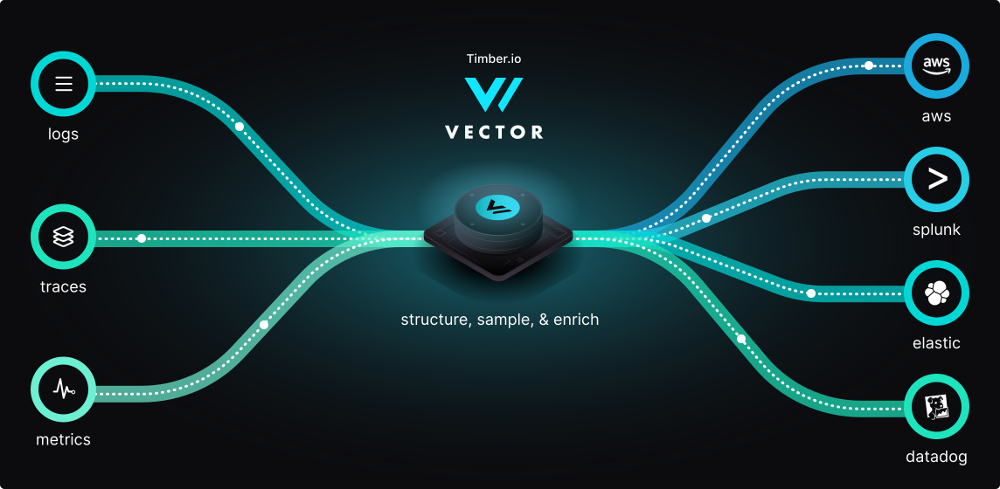

  <strong>
    <a href="https://vector.dev/guides/getting-started/">Get Started<a/>&nbsp;&nbsp;&bull;&nbsp;&nbsp;
    <a href="https://vector.dev/docs/">Docs<a/>&nbsp;&nbsp;&bull;&nbsp;&nbsp;
    <a href="https://vector.dev/guides/">Guides<a/>&nbsp;&nbsp;&bull;&nbsp;&nbsp;
    <a href="https://vector.dev/components/">Integrations<a/>&nbsp;&nbsp;&bull;&nbsp;&nbsp;
    <a href="https://chat.vector.dev">Chat<a/>&nbsp;&nbsp;&bull;&nbsp;&nbsp;
    <a href="https://vector.dev/releases/latest/download/">Download<a/>
  </strong>

  

## What is Vector?

Vector is a high-performance, end-to-end (agent & aggregator) observability data
platform that puts you in control of your observability data.
[Collect][docs.sources], [transform][docs.transforms], and [route][docs.sinks]
all your logs, metrics, and traces to any vendors you want today and any other
vendors you may want tomorrow. Vector enables cost reduction, novel data
enrichment, and data security when you need it, not when is most convenient for
your vendors. 100% open source and up to 10x faster than every alternative.

To get started, follow our [**getting started guides**][urls.getting_started]
or [**install Vector**][docs.installation].

### Principles

* **Reliable** - Built in [Rust][urls.rust], Vector's primary design goal is reliability.
* **End-to-end** - Deploys as an [agent][docs.roles#agent] or [aggregator][docs.roles#aggregator]. Vector is a complete platform.
* **Unified** - [Logs][docs.data-model.log], [metrics][docs.data-model.metric], and traces (coming soon). One tool for all of your data.

### Use cases

* Reduce total observability costs.
* Transition vendors without disrupting workflows.
* Enhance data quality and improve insights.
* Consolidate agents and eliminate agent fatigue.
* Improve overall observability performance and reliability.

### Community

* Vector is relied on by startups and enterprises like **Atlassian**, **T-Mobile**,
  **Comcast**, **Zendesk**, **Discord**, **Fastly**, **CVS**, **Trivago**,
  **Tuple**, **Douban**, **Visa**, **Mambu**, **Blockfi**, **Claranet**,
  **Instacart**, **Forcepoint**, and [many more][urls.production_users].
* Vector is **downloaded over 100,000 times per day**.
* Vector's largest user **processes over 30TB daily**.
* Vector has **over 100 contributors** and growing.

## [Documentation](https://vector.dev/docs/)

### About

* [**Concepts**][docs.concepts]
* [**Guarantees**][docs.guarantees]
* [**Architecture**][docs.architecture] - [data model][docs.data-model] ([log][docs.data-model.log], [metric][docs.data-model.metric]), [topology model][docs.topology-model], [concurrency model][docs.concurrency-model], [runtime model][docs.runtime-model]

### Setup

* [**Installation**][docs.installation] - [operating systems][docs.operating_systems], [package managers][docs.package_managers], [platforms][docs.platforms] ([Kubernetes][docs.kubernetes]), [manual][docs.manual]
* [**Configuration**][docs.setup.configuration]
* [**Deployment**][docs.deployment] - [roles][docs.roles], [topologies][docs.topologies]

### Reference

* **Configuration**
  * [**Sources**][docs.sources] - [docker_logs][docs.sources.docker_logs], [file][docs.sources.file], [http][docs.sources.http], [journald][docs.sources.journald], [kafka][docs.sources.kafka], [socket][docs.sources.socket], and [dozens more...][docs.sources]
  * [**Transforms**][docs.transforms] - [filter][docs.transforms.filter], [json_parser][docs.transforms.json_parser], [log_to_metric][docs.transforms.log_to_metric], [logfmt_parser][docs.transforms.logfmt_parser], [lua][docs.transforms.lua], [regex_parser][docs.transforms.regex_parser], and [dozens more...][docs.transforms]
  * [**Sinks**][docs.sinks] - [aws_cloudwatch_logs][docs.sinks.aws_cloudwatch_logs], [aws_s3][docs.sinks.aws_s3], [clickhouse][docs.sinks.clickhouse], [elasticsearch][docs.sinks.elasticsearch], [gcp_cloud_storage][docs.sinks.gcp_cloud_storage], and [dozens more...][docs.sinks]
  * [**Vector Remap Language**][docs.remap]
  * [**Unit tests**][docs.unit-tests]
* [**API**][docs.api]
* [**CLI**][docs.cli]

### Administration

* [**Process management**][docs.process-management]
* [**Monitoring & observing**][docs.monitoring]
* [**Updating**][docs.updating]
* [**Validating**][docs.validating]

### Resources

* [**Community**][urls.vector_community] - [chat][urls.vector_chat], [@vectordotdev][urls.vector_twitter]
* [**Releases**][urls.vector_releases] - [latest][urls.latest]
* [**Roadmap**][urls.vector_roadmap] - [vote on new features][urls.vote_feature]
* **Policies** - [Security][urls.vector_security_policy], [Privacy][urls.vector_privacy_policy], [Code of Conduct][urls.vector_code_of_conduct]

## Comparisons

### Performance

The following performance tests demonstrate baseline performance between
common protocols with the exception of the Regex Parsing test.

|                                                                                                               Test |     Vector      | Filebeat |    FluentBit    |  FluentD  | Logstash  |    SplunkUF     | SplunkHF |
|-------------------------------------------------------------------------------------------------------------------:|:---------------:|:--------:|:---------------:|:---------:|:---------:|:---------------:|:--------:|
| [TCP to Blackhole](https://github.com/timberio/vector-test-harness/tree/master/cases/tcp_to_blackhole_performance) |  _**86mib/s**_  |   n/a    |    64.4mib/s    | 27.7mib/s | 40.6mib/s |       n/a       |   n/a    |
|           [File to TCP](https://github.com/timberio/vector-test-harness/tree/master/cases/file_to_tcp_performance) | _**76.7mib/s**_ | 7.8mib/s |     35mib/s     | 26.1mib/s | 3.1mib/s  |    40.1mib/s    | 39mib/s  |
|       [Regex Parsing](https://github.com/timberio/vector-test-harness/tree/master/cases/regex_parsing_performance) |    13.2mib/s    |   n/a    | _**20.5mib/s**_ | 2.6mib/s  | 4.6mib/s  |       n/a       | 7.8mib/s |
|           [TCP to HTTP](https://github.com/timberio/vector-test-harness/tree/master/cases/tcp_to_http_performance) | _**26.7mib/s**_ |   n/a    |    19.6mib/s    |  <1mib/s  | 2.7mib/s  |       n/a       |   n/a    |
|             [TCP to TCP](https://github.com/timberio/vector-test-harness/tree/master/cases/tcp_to_tcp_performance) |    69.9mib/s    |  5mib/s  |    67.1mib/s    | 3.9mib/s  |  10mib/s  | _**70.4mib/s**_ | 7.6mib/s |

To learn more about our performance tests, please see the [Vector test harness][urls.vector_test_harness].

### Correctness

The following correctness tests are not exhaustive, but they demonstrate
fundamental differences in quality and attention to detail:

|                                                                                                                             Test | Vector | Filebeat | FluentBit | FluentD | Logstash | Splunk UF | Splunk HF |
|---------------------------------------------------------------------------------------------------------------------------------:|:------:|:--------:|:---------:|:-------:|:--------:|:---------:|:---------:|
| [Disk Buffer Persistence](https://github.com/timberio/vector-test-harness/tree/master/cases/disk_buffer_persistence_correctness) | **✓**  |    ✓     |           |         |    ⚠     |     ✓     |     ✓     |
|         [File Rotate (create)](https://github.com/timberio/vector-test-harness/tree/master/cases/file_rotate_create_correctness) | **✓**  |    ✓     |     ✓     |    ✓    |    ✓     |     ✓     |     ✓     |
| [File Rotate (copytruncate)](https://github.com/timberio/vector-test-harness/tree/master/cases/file_rotate_truncate_correctness) | **✓**  |          |           |         |          |     ✓     |     ✓     |
|                   [File Truncation](https://github.com/timberio/vector-test-harness/tree/master/cases/file_truncate_correctness) | **✓**  |    ✓     |     ✓     |    ✓    |    ✓     |     ✓     |     ✓     |
|                         [Process (SIGHUP)](https://github.com/timberio/vector-test-harness/tree/master/cases/sighup_correctness) | **✓**  |          |           |         |    ⚠     |     ✓     |     ✓     |
|                     [JSON (wrapped)](https://github.com/timberio/vector-test-harness/tree/master/cases/wrapped_json_correctness) | **✓**  |    ✓     |     ✓     |    ✓    |    ✓     |     ✓     |     ✓     |

To learn more about our correctness tests, please see the [Vector test harness][urls.vector_test_harness].

### Features

Vector is an end-to-end, unified, open data platform.

|                     | **Vector** | Beats | Fluentbit | Fluentd | Logstash | Splunk UF | Splunk HF |
|--------------------:|:----------:|:-----:|:---------:|:-------:|:--------:|:---------:|:---------:|
|      **End-to-end** |   **✓**    |       |           |         |          |           |           |
|               Agent |   **✓**    |   ✓   |     ✓     |         |          |     ✓     |           |
|          Aggregator |   **✓**    |       |           |    ✓    |    ✓     |           |     ✓     |
|         **Unified** |   **✓**    |       |           |         |          |           |           |
|                Logs |   **✓**    |   ✓   |     ✓     |    ✓    |    ✓     |     ✓     |     ✓     |
|             Metrics |   **✓**    |   ⚠   |     ⚠     |    ⚠    |    ⚠     |     ⚠     |     ⚠     |
|              Traces |     🚧      |       |           |         |          |           |           |
|            **Open** |   **✓**    |       |     ✓     |    ✓    |          |           |           |
|         Open-source |   **✓**    |   ✓   |     ✓     |    ✓    |    ✓     |           |           |
|      Vendor-neutral |   **✓**    |       |     ✓     |    ✓    |          |           |           |
|     **Reliability** |   **✓**    |       |           |         |          |           |           |
|         Memory-safe |   **✓**    |       |           |         |          |           |           |
| Delivery guarantees |   **✓**    |       |           |         |          |     ✓     |     ✓     |
|          Multi-core |   **✓**    |   ✓   |           |    ✓    |    ✓     |     ✓     |     ✓     |

⚠ = Not interoperable, metrics are represented as structured logs

---

  Developed with ❤️ by <strong><a href="https://timber.io">Timber.io</a></strong> - <a href="https://github.com/timberio/vector/security/policy">Security Policy</a> - <a href="https://github.com/timberio/vector/blob/master/PRIVACY.md">Privacy Policy</a>

[docs.administration.process-management]: https://vector.dev/docs/administration/process-management/
[docs.administration.validating]: https://vector.dev/docs/administration/validating/
[docs.api]: https://vector.dev/docs/reference/api/
[docs.architecture]: https://vector.dev/docs/about/under-the-hood/architecture/
[docs.cli]: https://vector.dev/docs/reference/cli/
[docs.concepts]: https://vector.dev/docs/about/concepts/
[docs.concurrency-model]: https://vector.dev/docs/about/under-the-hood/architecture/concurrency-model/
[docs.setup.configuration]: https://vector.dev/docs/setup/configuration/
[docs.data-model]: https://vector.dev/docs/about/under-the-hood/architecture/data-model/
[docs.data-model.log#timestamps]: https://vector.dev/docs/about/under-the-hood/architecture/data-model/log/#timestamps
[docs.data-model.log#types]: https://vector.dev/docs/about/under-the-hood/architecture/data-model/log/#types
[docs.data-model.log]: https://vector.dev/docs/about/under-the-hood/architecture/data-model/log/
[docs.data-model.metric#aggregated_histogram]: https://vector.dev/docs/about/under-the-hood/architecture/data-model/metric/#aggregated_histogram
[docs.data-model.metric#aggregated_summary]: https://vector.dev/docs/about/under-the-hood/architecture/data-model/metric/#aggregated_summary
[docs.data-model.metric]: https://vector.dev/docs/about/under-the-hood/architecture/data-model/metric/
[docs.data_model]: https://vector.dev/docs/about/under-the-hood/architecture/data-model/
[docs.deployment]: https://vector.dev/docs/setup/deployment/
[docs.global-options#log_schema]: https://vector.dev/docs/reference/global-options/#log_schema
[docs.guarantees]: https://vector.dev/docs/about/guarantees/
[docs.installation]: https://vector.dev/docs/setup/installation/
[docs.kubernetes]: https://vector.dev/docs/setup/installation/platforms/kubernetes/
[docs.manual]: https://vector.dev/docs/setup/installation/manual/
[docs.monitoring]: https://vector.dev/docs/administration/monitoring/
[docs.operating_systems]: https://vector.dev/docs/setup/installation/operating-systems/
[docs.package_managers]: https://vector.dev/docs/setup/installation/package-managers/
[docs.platforms]: https://vector.dev/docs/setup/installation/platforms/
[docs.process-management#reloading]: https://vector.dev/docs/administration/process-management/#reloading
[docs.process-management#starting]: https://vector.dev/docs/administration/process-management/#starting
[docs.process-management]: https://vector.dev/docs/administration/process-management/
[docs.reference.templating]: https://vector.dev/docs/reference/templating/
[docs.remap]: https://vector.dev/docs/reference/remap/
[docs.roles#agent]: https://vector.dev/docs/setup/deployment/roles/#agent
[docs.roles#aggregator]: https://vector.dev/docs/setup/deployment/roles/#aggregator
[docs.roles#sidecar]: https://vector.dev/docs/setup/deployment/roles/#sidecar
[docs.roles]: https://vector.dev/docs/setup/deployment/roles/
[docs.runtime-model]: https://vector.dev/docs/about/under-the-hood/architecture/runtime-model/
[docs.sinks.aws_cloudwatch_logs]: https://vector.dev/docs/reference/sinks/aws_cloudwatch_logs/
[docs.sinks.aws_s3#partitioning]: https://vector.dev/docs/reference/sinks/aws_s3/#partitioning
[docs.sinks.aws_s3]: https://vector.dev/docs/reference/sinks/aws_s3/
[docs.sinks.clickhouse]: https://vector.dev/docs/reference/sinks/clickhouse/
[docs.sinks.elasticsearch]: https://vector.dev/docs/reference/sinks/elasticsearch/
[docs.sinks.gcp_cloud_storage]: https://vector.dev/docs/reference/sinks/gcp_cloud_storage/
[docs.sinks.gcp_pubsub]: https://vector.dev/docs/reference/sinks/gcp_pubsub/
[docs.sinks]: https://vector.dev/docs/reference/sinks/
[docs.sources.docker_logs]: https://vector.dev/docs/reference/sources/docker_logs/
[docs.sources.file#multiline]: https://vector.dev/docs/reference/sources/file/#multiline
[docs.sources.file]: https://vector.dev/docs/reference/sources/file/
[docs.sources.http]: https://vector.dev/docs/reference/sources/http/
[docs.sources.journald]: https://vector.dev/docs/reference/sources/journald/
[docs.sources.kafka]: https://vector.dev/docs/reference/sources/kafka/
[docs.sources.socket]: https://vector.dev/docs/reference/sources/socket/
[docs.sources]: https://vector.dev/docs/reference/sources/
[docs.topologies]: https://vector.dev/docs/setup/deployment/topologies/
[docs.topology-model]: https://vector.dev/docs/about/under-the-hood/architecture/topology-model/
[docs.transforms.filter]: https://vector.dev/docs/reference/transforms/filter/
[docs.transforms.grok_parser]: https://vector.dev/docs/reference/transforms/grok_parser/
[docs.transforms.json_parser]: https://vector.dev/docs/reference/transforms/json_parser/
[docs.transforms.log_to_metric]: https://vector.dev/docs/reference/transforms/log_to_metric/
[docs.transforms.logfmt_parser]: https://vector.dev/docs/reference/transforms/logfmt_parser/
[docs.transforms.lua]: https://vector.dev/docs/reference/transforms/lua/
[docs.transforms.regex_parser#types]: https://vector.dev/docs/reference/transforms/regex_parser/#types
[docs.transforms.regex_parser]: https://vector.dev/docs/reference/transforms/regex_parser/
[docs.transforms.route]: https://vector.dev/docs/reference/transforms/route/
[docs.transforms]: https://vector.dev/docs/reference/transforms/
[docs.unit-tests]: https://vector.dev/docs/reference/tests/
[docs.updating]: https://vector.dev/docs/administration/updating/
[docs.validating]: https://vector.dev/docs/administration/validating/
[docs.what-is-vector]: https://vector.dev/docs/about/what-is-vector/
[guides.advanced.unit-testing]: https://vector.dev/guides/advanced/unit-testing/
[pages.releases]: https://vector.dev/releases/
[urls.getting_started]: https://vector.dev/guides/getting-started/
[urls.issue_1802]: https://github.com/timberio/vector/issues/1802
[urls.latest]: https://vector.dev/releases/latest/
[urls.pr_721]: https://github.com/timberio/vector/pull/721
[urls.production_users]: https://github.com/timberio/vector/issues/790
[urls.rust]: https://www.rust-lang.org/
[urls.rust_memory_safety]: https://hacks.mozilla.org/2019/01/fearless-security-memory-safety/
[urls.vector_chat]: https://chat.vector.dev
[urls.vector_code_of_conduct]: https://github.com/timberio/vector/blob/master/CODE_OF_CONDUCT.md
[urls.vector_community]: https://vector.dev/community/
[urls.vector_download]: https://vector.dev/releases/latest/download/
[urls.vector_enriching_transforms]: https://vector.dev/components/?functions%5B%5D=enrich
[urls.vector_highlights]: https://vector.dev/highlights/
[urls.vector_parsing_transforms]: https://vector.dev/components/?functions%5B%5D=parse
[urls.vector_performance]: https://vector.dev/#performance
[urls.vector_privacy_policy]: https://github.com/timberio/vector/blob/master/PRIVACY.md
[urls.vector_releases]: https://vector.dev/releases/latest/
[urls.vector_repo]: https://github.com/timberio/vector
[urls.vector_roadmap]: https://roadmap.vector.dev
[urls.vector_security_policy]: https://github.com/timberio/vector/security/policy
[urls.vector_test_harness]: https://github.com/timberio/vector-test-harness/
[urls.vector_twitter]: https://twitter.com/vectordotdev
[urls.vote_feature]: https://github.com/timberio/vector/issues?q=is%3Aissue+is%3Aopen+sort%3Areactions-%2B1-desc
