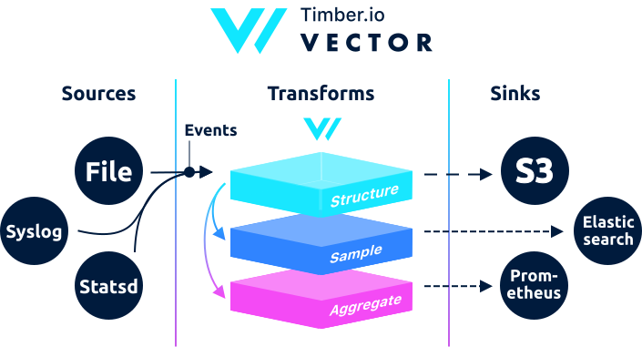

<p align="center">
  <strong>
    <a href="https://vector.dev/community">Chat/Forum<a/>&nbsp;&nbsp;&bull;&nbsp;&nbsp;<a href="https://vector.dev/mailing_list/">Mailing List<a/>&nbsp;&nbsp;&bull;&nbsp;&nbsp;<a href="https://docs.vector.dev/setup/installation">Install 0.5.0<a/>
  </strong>
</p>

---

<!--
     THIS FILE IS AUTOGENERATED!

     To make changes please edit the template located at:

     README.md.erb
-->

<p align="center">
  
</p>

Vector is a [high-performance][docs.performance] observability data router. It
makes [collecting][docs.sources], [transforming][docs.transforms], and
[sending][docs.sinks] logs, metrics, and events easy. It decouples data
collection & routing from your services, giving you control and data ownership,
among [many other benefits][docs.use_cases].

Built in [Rust][urls.rust], Vector places high-value on
[performance][docs.performance], [correctness][docs.correctness], and [operator
friendliness][docs.administration]. It compiles to a single static binary and is
designed to be [deployed][docs.deployment] across your entire infrastructure,
serving both as a light-weight [agent][docs.roles.agent] and a highly efficient
[service][docs.roles.service], making the process of getting data from A to B
simple and unified.


## [Documentation](https://docs.vector.dev/)

#### About

* [**Concepts**][docs.concepts]
* [**Data model**][docs.data_model] - [log event][docs.data-model.log], [metric event][docs.data-model.metric]
* [**Guarantees**][docs.guarantees]

#### Setup

* [**Installation**][docs.installation] - [containers][docs.containers], [operating systems][docs.operating_systems], [package managers][docs.package_managers], [from archives][docs.from-archives], [from source][docs.from-source]
* [**Configuration**][docs.configuration]
* [**Deployment**][docs.deployment] - [topologies][docs.topologies], [roles][docs.roles]
* [**Guides**][docs.guides] - [getting started][docs.guides.getting_started]

#### Reference

* [**Sources**][docs.sources] - [docker][docs.sources.docker], [file][docs.sources.file], [journald][docs.sources.journald], [kafka][docs.sources.kafka], [syslog][docs.sources.syslog], [tcp][docs.sources.tcp], and [4 more...][docs.sources]
* [**Transforms**][docs.transforms] - [json_parser][docs.transforms.json_parser], [log_to_metric][docs.transforms.log_to_metric], [lua][docs.transforms.lua], [regex_parser][docs.transforms.regex_parser], [sampler][docs.transforms.sampler], [tokenizer][docs.transforms.tokenizer], and [8 more...][docs.transforms]
* [**Sinks**][docs.sinks] - [aws_cloudwatch_logs][docs.sinks.aws_cloudwatch_logs], [aws_s3][docs.sinks.aws_s3], [clickhouse][docs.sinks.clickhouse], [elasticsearch][docs.sinks.elasticsearch], [http][docs.sinks.http], [kafka][docs.sinks.kafka], [prometheus][docs.sinks.prometheus], and [11 more...][docs.sinks]

#### Administration

* [**Process management**][docs.process-management]
* [**Monitoring**][docs.monitoring]
* [**Updating**][docs.updating]
* [**Validating**][docs.validating]

#### Resources

* [**Community**][urls.vector_community] - [chat/forum][urls.vector_chat], [mailing list][urls.mailing_list]
* [**Releases**][urls.vector_releases] - [v0.5.0][urls.v0.5.0], [changelog][urls.vector_changelog]
* [**Roadmap**][urls.vector_roadmap] - [vote on new features][urls.vote_feature]


## Features

* ***Fast*** - Built in [Rust][urls.rust], Vector is [fast and memory efficient][docs.performance]. No runtime. No garbage collector.
* **Correct** - Obsessed with [getting the details right][docs.correctness].
* **Vendor Neutral** - Does not favor a specific storage. Fair, open, with the user's best interest in mind.
* **Agent or Service** - One simple tool to get data from A to B. Deploys as an [agent][docs.roles.agent] or [service][docs.roles.service].
* **Logs, Metrics, or Events** - [Logs][docs.data-model.log], [metrics][docs.data-model.metric], and [events][docs.data_model]. Collect, unify, and ship all observability data.
* **Correlate Logs & Metrics** - [Derive metrics from logs][docs.transforms.log_to_metric], add shared context with [transforms][docs.transforms].
* **Clear Guarantees** - A [guarantee support matrix][docs.guarantees] helps you understand your tradeoffs.
* **Easy To Deploy** - Cross-compiles to [a single static binary][docs.archives] with no runtime.
* **Hot Reload** - [Reload configuration on the fly][docs.process-management#reloading], without skipping a beat.


## Performance

| Test | Vector | Filebeat | FluentBit | FluentD | Logstash | SplunkUF | SplunkHF |
| ---: | :---: | :---: | :---: | :---: | :---: | :---: | :---: |
| [TCP to Blackhole](https://github.com/timberio/vector-test-harness/tree/master/cases/tcp_to_blackhole_performance) | _**86mib/s**_ | n/a | 64.4mib/s | 27.7mib/s | 40.6mib/s | n/a | n/a |
| [File to TCP](https://github.com/timberio/vector-test-harness/tree/master/cases/file_to_tcp_performance) | _**76.7mib/s**_ | 7.8mib/s | 35mib/s | 26.1mib/s | 3.1mib/s | 40.1mib/s | 39mib/s |
| [Regex Parsing](https://github.com/timberio/vector-test-harness/tree/master/cases/regex_parsing_performance) | 13.2mib/s | n/a | _**20.5mib/s**_ | 2.6mib/s | 4.6mib/s | n/a | 7.8mib/s |
| [TCP to HTTP](https://github.com/timberio/vector-test-harness/tree/master/cases/tcp_to_http_performance) | _**26.7mib/s**_ | n/a | 19.6mib/s | <1mib/s | 2.7mib/s | n/a | n/a |
| [TCP to TCP](https://github.com/timberio/vector-test-harness/tree/master/cases/tcp_to_tcp_performance) | 69.9mib/s | 5mib/s | 67.1mib/s | 3.9mib/s | 10mib/s | _**70.4mib/s**_ | 7.6mib/s |

To learn more about our performance tests, please see the [Vector test harness][urls.test_harness].


## Correctness

| Test | Vector | Filebeat | FluentBit | FluentD | Logstash | Splunk UF | Splunk HF |
| ---: | :---: | :---: | :---: | :---: | :---: | :---: | :---: |
| [Disk Buffer Persistence](https://github.com/timberio/vector-test-harness/tree/master/cases/disk_buffer_persistence_correctness) | ✅ | ✅ | ❌ | ❌ | ⚠️ | ✅ | ✅ |
| [File Rotate (create)](https://github.com/timberio/vector-test-harness/tree/master/cases/file_rotate_create_correctness) | ✅ | ✅ | ✅ | ✅ | ✅ | ✅ | ✅ |
| [File Rotate (copytruncate)](https://github.com/timberio/vector-test-harness/tree/master/cases/file_rotate_truncate_correctness) | ✅ | ❌ | ❌ | ❌ | ❌ | ✅ | ✅ |
| [File Truncation](https://github.com/timberio/vector-test-harness/tree/master/cases/file_truncate_correctness) | ✅ | ✅ | ✅ | ✅ | ✅ | ✅ | ✅ |
| [Process (SIGHUP)](https://github.com/timberio/vector-test-harness/tree/master/cases/sighup_correctness) | ✅ | ❌ | ❌ | ❌ | ⚠️ | ✅ | ✅ |
| [JSON (wrapped)](https://github.com/timberio/vector-test-harness/tree/master/cases/wrapped_json_correctness) | ✅ | ✅ | ❌ | ✅ | ✅ | ✅ | ✅ |

To learn more about our performance tests, please see the [Vector test harness][urls.test_harness].


## Installation

Run the following in your terminal, then follow the on-screen instructions.

```bash
curl --proto '=https' --tlsv1.2 -sSf https://sh.vector.dev | sh
```

Or view [platform specific installation instructions][docs.installation].

---

<p align="center">
  Developed with ❤️ by <strong><a href="https://timber.io">Timber.io</a></strong>
</p>


[docs.administration]: https://vector.dev/docs/administration
[docs.archives]: https://vector.dev/docs/setup/installation/manual/from-archives
[docs.concepts]: https://vector.dev/docs/about/concepts
[docs.configuration]: https://vector.dev/docs/setup/configuration
[docs.containers]: https://vector.dev/docs/setup/installation/containers
[docs.correctness]: https://vector.dev/docs/about/correctness
[docs.data-model.log]: https://vector.dev/docs/about/data-model/log
[docs.data-model.metric]: https://vector.dev/docs/about/data-model/metric
[docs.data_model]: https://vector.dev/docs/about/data-model
[docs.deployment]: https://vector.dev/docs/setup/deployment
[docs.from-archives]: https://vector.dev/docs/setup/installation/manual/from-archives
[docs.from-source]: https://vector.dev/docs/setup/installation/manual/from-source
[docs.guarantees]: https://vector.dev/docs/about/guarantees
[docs.guides.getting_started]: https://vector.dev/docs/setup/guides/getting-started
[docs.guides]: https://vector.dev/docs/setup/guides
[docs.installation]: https://vector.dev/docs/setup/installation
[docs.monitoring]: https://vector.dev/docs/administration/monitoring
[docs.operating_systems]: https://vector.dev/docs/setup/installation/operating-systems
[docs.package_managers]: https://vector.dev/docs/setup/installation/package-managers
[docs.performance]: https://vector.dev/docs/about/performance
[docs.process-management#reloading]: https://vector.dev/docs/administration/process-management#reloading
[docs.process-management]: https://vector.dev/docs/administration/process-management
[docs.roles.agent]: https://vector.dev/docs/setup/deployment/roles/agent
[docs.roles.service]: https://vector.dev/docs/setup/deployment/roles/service
[docs.roles]: https://vector.dev/docs/setup/deployment/roles
[docs.sinks.aws_cloudwatch_logs]: https://vector.dev/docs/reference/sinks/aws_cloudwatch_logs
[docs.sinks.aws_s3]: https://vector.dev/docs/reference/sinks/aws_s3
[docs.sinks.clickhouse]: https://vector.dev/docs/reference/sinks/clickhouse
[docs.sinks.elasticsearch]: https://vector.dev/docs/reference/sinks/elasticsearch
[docs.sinks.http]: https://vector.dev/docs/reference/sinks/http
[docs.sinks.kafka]: https://vector.dev/docs/reference/sinks/kafka
[docs.sinks.prometheus]: https://vector.dev/docs/reference/sinks/prometheus
[docs.sinks]: https://vector.dev/docs/reference/sinks
[docs.sources.docker]: https://vector.dev/docs/reference/sources/docker
[docs.sources.file]: https://vector.dev/docs/reference/sources/file
[docs.sources.journald]: https://vector.dev/docs/reference/sources/journald
[docs.sources.kafka]: https://vector.dev/docs/reference/sources/kafka
[docs.sources.syslog]: https://vector.dev/docs/reference/sources/syslog
[docs.sources.tcp]: https://vector.dev/docs/reference/sources/tcp
[docs.sources]: https://vector.dev/docs/reference/sources
[docs.topologies]: https://vector.dev/docs/setup/deployment/topologies
[docs.transforms.json_parser]: https://vector.dev/docs/reference/transforms/json_parser
[docs.transforms.log_to_metric]: https://vector.dev/docs/reference/transforms/log_to_metric
[docs.transforms.lua]: https://vector.dev/docs/reference/transforms/lua
[docs.transforms.regex_parser]: https://vector.dev/docs/reference/transforms/regex_parser
[docs.transforms.sampler]: https://vector.dev/docs/reference/transforms/sampler
[docs.transforms.tokenizer]: https://vector.dev/docs/reference/transforms/tokenizer
[docs.transforms]: https://vector.dev/docs/reference/transforms
[docs.updating]: https://vector.dev/docs/administration/updating
[docs.use_cases]: https://vector.dev/docs/use_cases
[docs.validating]: https://vector.dev/docs/administration/validating
[urls.mailing_list]: https://vector.dev/mailing_list/
[urls.rust]: https://www.rust-lang.org/
[urls.test_harness]: https://github.com/timberio/vector-test-harness/
[urls.v0.5.0]: https://github.com/timberio/vector/releases/tag/v0.5.0
[urls.vector_changelog]: https://github.com/timberio/vector/blob/master/CHANGELOG.md
[urls.vector_chat]: https://chat.vector.dev
[urls.vector_community]: https://vector.dev/community
[urls.vector_releases]: https://github.com/timberio/vector/releases
[urls.vector_roadmap]: https://github.com/timberio/vector/milestones?direction=asc&sort=due_date&state=open
[urls.vote_feature]: https://github.com/timberio/vector/issues?q=is%3Aissue+is%3Aopen+sort%3Areactions-%2B1-desc+label%3A%22Type%3A+New+Feature%22
