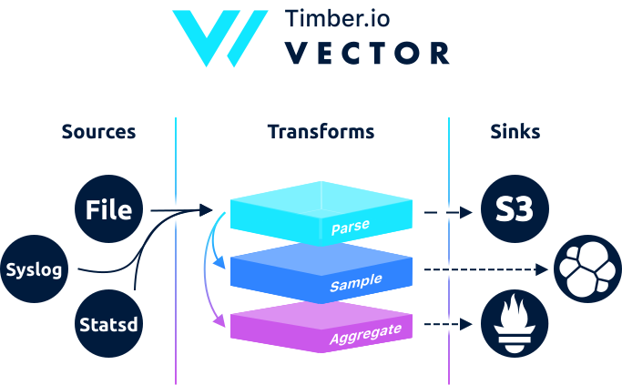

<p align="center">
  
</p>

<p align="center">
  <a href="LICENSE"></a>
  <a href="https://circleci.com/gh/timberio/vector"></a>
  <a href="https://slack.linkerd.io/badge.svg"></a>
</p>

Vector is a high-performance log and metrics router. It's designed to be deployed across your entire infrastructure, serving both as a [light-weight agent][agent] that collects logs and metrics data and a [highly efficient centralized service][centralized_service] for aggregation and routing.

Vector is designed with a *keen* focus on [performance][benchmarks] and operator friendliness. Its purpose is to decouple routing from the underlying components, giving you complete flexibility to adopt the tools of your choice, among [many other benefits][use_cases].

---

* [**Installation**][installation]
* [**Configuration**][configuration]
* [**Administration**][administration]
* [**Use cases**][use_cases]
* [**Guides**][guides]
* [**Benchmarks**][benchmarks]

---

## Development

### Sample Logs

We use `flog` to build a sample set of log files to test sending logs from a file. This can
be done with the following commands on mac with homebrew.

``` bash
brew tap mingrammer/flog
brew install flog
$ flog --bytes $((100 * 1024 * 1024)) > sample.log
```

This will create a `100MB` sample log file in the `sample.log` file.

### Building

Vector compiles with Rust 1.34.0 (stable) or newer. In general, Vector tracks the latest stable release of the Rust compiler.

Building is very easy, all you need to do is use `cargo`:

``` bash
cargo build
```


### Testing

Testing is a bit more complicated, this because to test all the sinks we need to stand
up local mock versions of the sources we send logs too. To do this we use `docker` and 
`docker-compose` to stand up this environment. To run the full test suit you can run

```bash
# Test everything that does not require docker
cargo test

# Test everything that can also be tested with docker
cargo test --features docker
```

### Code Style

We use `rustfmt` on `stable` to format our code and CI will verify that your code follows
this format style. To run the following command make sure `rustfmt` has been installed on
the stable toolchain locally.

``` bash
cargo fmt
```

Once that's all passing and you're happy with your change, go ahead and commit.
For small, unobtrusive changes, committing to directly to master is fine. For
anything that merits more discussion or visibility, committing to a branch and
opening a pull request is preferred. Just use your best judgement and if you're
unsure, open a pull request.

---

<p align="center">
  Developed with ❤️ by <strong><a href="https://timber.io">Timber.io</a></strong>
</p>

[administration]: https://docs.vectorproject.io/usage/administration
[agent]: https://docs.vectorproject.io/setup/deployment/as_an_agent
[benchmarks]: https://docs.vectorproject.io/benchmarks
[centralized_service]: https://docs.vectorproject.io/setup/deployment/as_a_centralized_service
[configuration]: https://docs.vectorproject.io/usage/configuration
[guides]: https://docs.vectorproject.io/usage/guides
[installation]: https://docs.vectorproject.io/setup/installation
[use_cases]: https://docs.vectorproject.io/usage/use_cases
