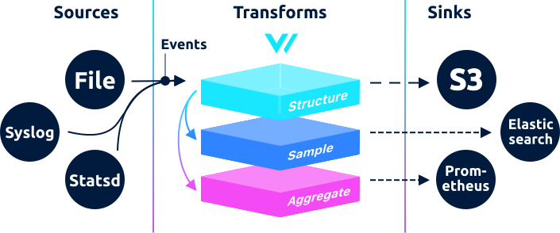

# Concepts

Before you begin, it's useful to become familiar with the basic concepts that comprise Vector. These concepts are used throughout the documentation and are helpful to understand as you proceed. They are ordered by their natural progression.

## Sources

The purpose of Vector is to collect data from various sources in various shapes. Vector is designed to pull _and_ receive data from these sources depending on the source type. As Vector ingests data it proceeds to normalize that data into a [record](concepts.md#records) \(see next section\). This sets the stage for easy and consistent processing of your data. Examples of sources include [`file`](../usage/configuration/sources/file.md), [`syslog`](../usage/configuration/sources/syslog.md), [`tcp`](../usage/configuration/sources/tcp.md), and [`stdin`](../usage/configuration/sources/stdin.md).



## Transforms

A "transform" is anything that modifies an event or the stream as a whole, such as a parser, filter, sampler, or aggregator. This term is purposefully generic to help simplify the concepts Vector is built on.



## Sinks

A sink is a destination for [events](data-model.md#event). Each sink's design and transmission method is dictated by the downstream service it is interacting with. For example, the [`tcp` sink](../usage/configuration/sinks/tcp.md) will stream individual records, while the [`s3` sink](../usage/configuration/sinks/aws_s3.md) will buffer and flush data.



