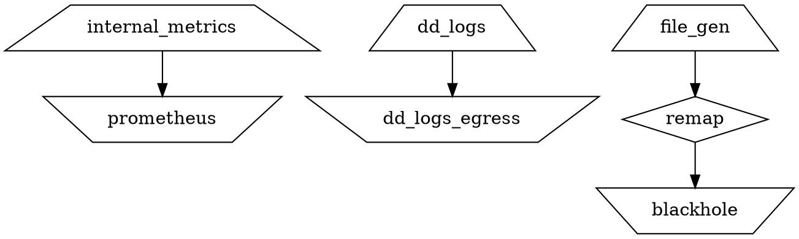

This release adds a new subcommand `vector graph` to output the topology specified by you Vector configuration as
a graph in [DOT][DOT] format. This output can then be visualized using [Graphviz] to produce an image.

For example, if you had a config, `vector.toml`, like:

```toml
##
## Sources
##

[sources.internal_metrics]
type = "internal_metrics"

[sources.dd_logs]
type = "datadog_logs" # required
acknowledgements = false # optional, default
address = "0.0.0.0:8282" # required

[sources.file_gen]
type = "file"
include = ["/var/log/file_gen/**/*.log"]
read_from = "beginning"

##
## Transforms
##

[transforms.remap]
type = "remap"
inputs = ["file_gen"]
source = '''
.agent_name = "vector"
parsed, err = parse_json(.message)
if err == null {
    .message = parsed
    .format = "json"
} else {
    .format = "ascii"
}
matches = parse_regex!(.file, r'.*/(?P<num>\d+)-(?P<name>\w+).log')
.origin, err = .host + "/" + matches.name + "/" + matches.num
if err != null {
    log("Failed to parse origin from file name", level: "error")
}
'''

##
## Sinks
##

[sinks.prometheus]
type = "prometheus_exporter"
inputs = ["internal_metrics"]
address = "0.0.0.0:9598"

[sinks.dd_logs_egress]
type = "datadog_logs"
inputs = ["dd_logs"]
default_api_key = ""
encoding.codec = "json"
request.concurrency = "adaptive"
batch.max_bytes = 5242880
request.rate_limit_num = 1000


[sinks.blackhole]
type = "blackhole"
inputs = ["remap"]
```

And you ran the new `vector graph --config vector.toml` you would see:



To render this, if you have [Graphviz] installed, you could do:

```shell
vector graph --config vector.toml | dot -Tpng > graph.png
```

To get an image that looks like:


If you don't have [Graphviz] installed, you can also visualize online at [webgraphviz.com](http://www.webgraphviz.com/).

[DOT]: https://graphviz.org/doc/info/lang.html
[Graphviz]: https://graphviz.org
