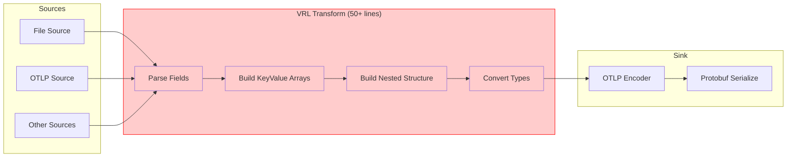
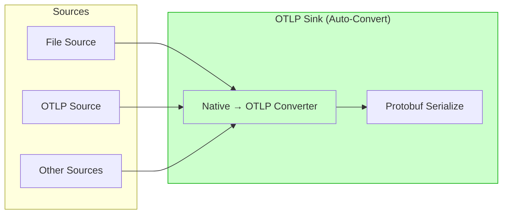
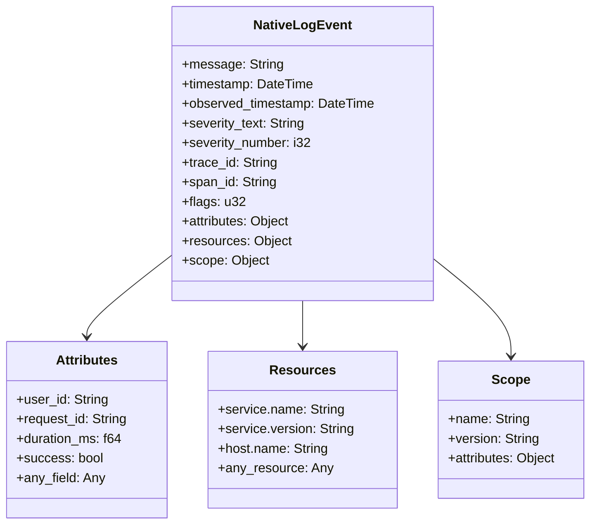
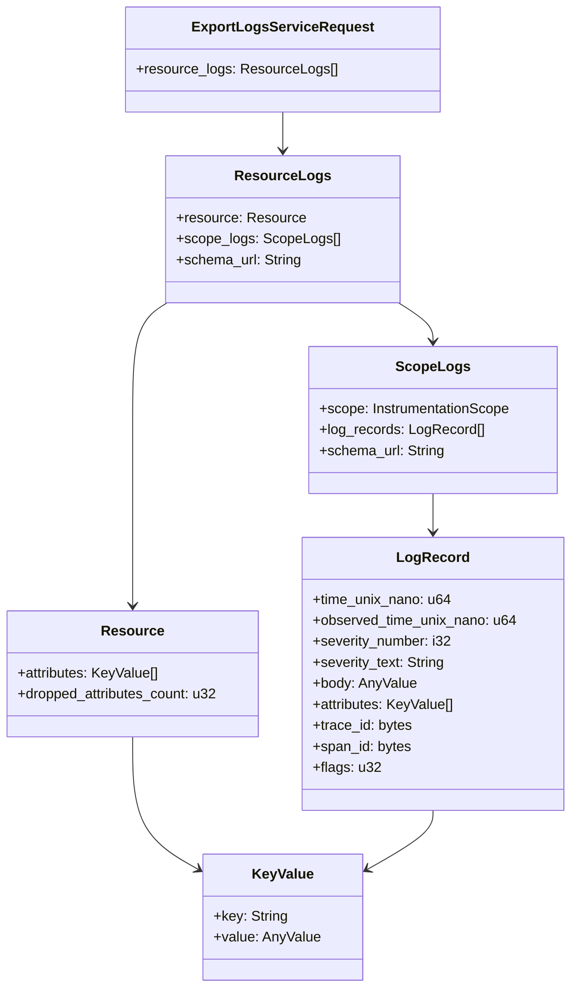
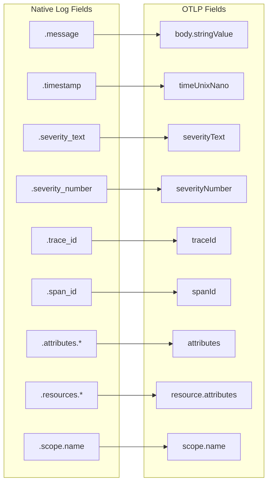

# OTLP Native Log Conversion

This document explains the automatic native-to-OTLP conversion feature.

## Architecture Overview

### OLD Approach (Before This PR)



### NEW Approach (After This PR)



## Data Flow

### Native Log Event Structure



### OTLP Output Structure



## Configuration Comparison

### BEFORE: Complex VRL Required

```yaml
# vector.yaml - OLD approach
sources:
  app_logs:
    type: file
    include: ["/var/log/app/*.log"]

  otel_source:
    type: opentelemetry
    grpc:
      address: 0.0.0.0:4317

transforms:
  # THIS WAS REQUIRED - 50+ lines of complex VRL
  build_otlp_structure:
    type: remap
    inputs: ["app_logs", "otel_source.logs"]
    source: |
      # Build resource attributes array
      resource_attrs = []
      if exists(.resources) {
        for_each(object!(.resources)) -> |k, v| {
          resource_attrs = push(resource_attrs, {
            "key": k,
            "value": { "stringValue": to_string(v) ?? "" }
          })
        }
      }

      # Build log attributes array
      log_attrs = []
      if exists(.attributes) {
        for_each(object!(.attributes)) -> |k, v| {
          attr_value = if is_boolean(v) {
            { "boolValue": v }
          } else if is_integer(v) {
            { "intValue": to_string!(v) }
          } else if is_float(v) {
            { "doubleValue": v }
          } else {
            { "stringValue": to_string(v) ?? "" }
          }
          log_attrs = push(log_attrs, { "key": k, "value": attr_value })
        }
      }

      # Build nested OTLP structure
      .resource_logs = [{
        "resource": { "attributes": resource_attrs },
        "scopeLogs": [{
          "scope": {
            "name": .scope.name ?? "",
            "version": .scope.version ?? ""
          },
          "logRecords": [{
            "timeUnixNano": to_string(to_unix_timestamp(.timestamp, unit: "nanoseconds")),
            "severityText": .severity_text ?? "INFO",
            "severityNumber": .severity_number ?? 9,
            "body": { "stringValue": .message ?? "" },
            "attributes": log_attrs,
            "traceId": .trace_id ?? "",
            "spanId": .span_id ?? ""
          }]
        }]
      }]

sinks:
  otel_collector:
    type: opentelemetry
    inputs: ["build_otlp_structure"]
    endpoint: http://collector:4317
    encoding:
      codec: otlp
```

### AFTER: Zero VRL Required

```yaml
# vector.yaml - NEW approach
sources:
  app_logs:
    type: file
    include: ["/var/log/app/*.log"]

  otel_source:
    type: opentelemetry
    grpc:
      address: 0.0.0.0:4317

sinks:
  otel_collector:
    type: opentelemetry
    inputs: ["app_logs", "otel_source.logs"]
    endpoint: http://collector:4317
    encoding:
      codec: otlp  # Auto-converts native logs!
```

## Performance Comparison

```mermaid
xychart-beta
    title "Throughput Comparison (MiB/s) - Higher is Better"
    x-axis ["Single Event", "Batch 100"]
    y-axis "Throughput (MiB/s)" 0 --> 300
    bar [10.2, 288]
    bar [9.5, 61]
```



### Benchmark Results

| Scenario | NEW (Auto-Convert) | OLD (VRL + Encode) | Improvement |
|----------|--------------------|--------------------|-------------|
| **Single Event** | 352 µs / 10.2 MiB/s | 378 µs / 9.5 MiB/s | **7.4% faster** |
| **Batch 100** | 575 µs / 288 MiB/s | 2,718 µs / 61 MiB/s | **4.7x faster** |
| Passthrough only | 374 µs / 9.6 MiB/s | - | Baseline |
| Large (70 attrs) | 360 µs / 17.9 MiB/s | - | - |

## Supported Input Formats

### 1. Native OTLP Log (Flat Format)

```json
{
  "message": "User login successful",
  "timestamp": "2024-01-15T10:30:00Z",
  "severity_text": "INFO",
  "severity_number": 9,
  "trace_id": "0123456789abcdef0123456789abcdef",
  "span_id": "fedcba9876543210",
  "attributes": {
    "user_id": "user-12345",
    "duration_ms": 42.5,
    "success": true
  },
  "resources": {
    "service.name": "auth-service",
    "host.name": "prod-server-01"
  },
  "scope": {
    "name": "auth-module",
    "version": "1.0.0"
  }
}
```

### 2. Simple Application Log

```json
{
  "message": "Application started",
  "level": "info",
  "timestamp": "2024-01-15T10:30:00Z"
}
```

## Field Mapping Reference



### Type Conversion

| Native Type | OTLP AnyValue |
|-------------|---------------|
| String/Bytes | `stringValue` |
| Integer | `intValue` |
| Float | `doubleValue` |
| Boolean | `boolValue` |
| Array | `arrayValue` |
| Object | `kvlistValue` |
| Timestamp | `stringValue` (RFC3339) |

### Severity Inference

When `severity_number` is not set, it's inferred from `severity_text`:

| Text | Number |
|------|--------|
| TRACE | 1-4 |
| DEBUG | 5-8 |
| INFO, NOTICE | 9-12 |
| WARN, WARNING | 13-16 |
| ERROR | 17-20 |
| FATAL, CRITICAL | 21-24 |

## Use Case Examples

### File Logs → OTLP

```yaml
sources:
  nginx:
    type: file
    include: ["/var/log/nginx/*.log"]

transforms:
  parse:
    type: remap
    inputs: ["nginx"]
    source: |
      . = parse_nginx_log!(.message)
      .severity_text = "INFO"
      .resources."service.name" = "nginx"

sinks:
  otel:
    type: opentelemetry
    inputs: ["parse"]
    endpoint: http://collector:4317
    encoding:
      codec: otlp
```

### OTLP → Enrich → OTLP

```yaml
sources:
  otel_in:
    type: opentelemetry
    grpc:
      address: 0.0.0.0:4317

transforms:
  enrich:
    type: remap
    inputs: ["otel_in.logs"]
    source: |
      .attributes.processed_by = "vector"
      .resources."deployment.region" = "us-west-2"

sinks:
  otel_out:
    type: opentelemetry
    inputs: ["enrich"]
    endpoint: http://destination:4317
    encoding:
      codec: otlp
```

## Error Handling

Invalid fields are handled gracefully:

| Invalid Input | Behavior |
|---------------|----------|
| Malformed hex trace_id | Empty (with warning) |
| Wrong type for severity | Default to 0 |
| Negative timestamp | Use 0 |
| Invalid UTF-8 | Lossy conversion |

The pipeline never breaks due to malformed data.
