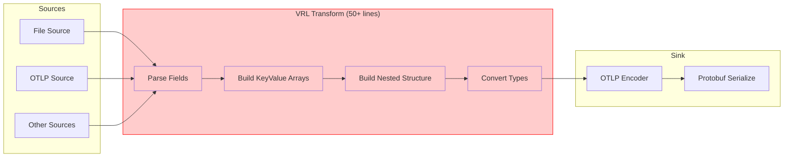
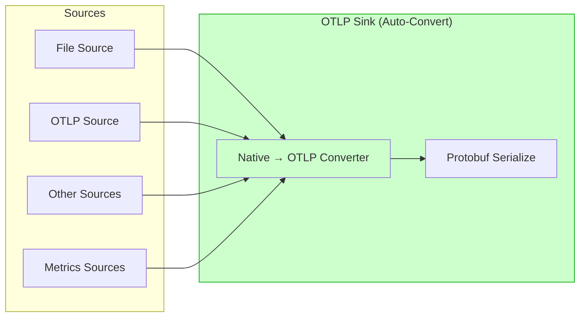
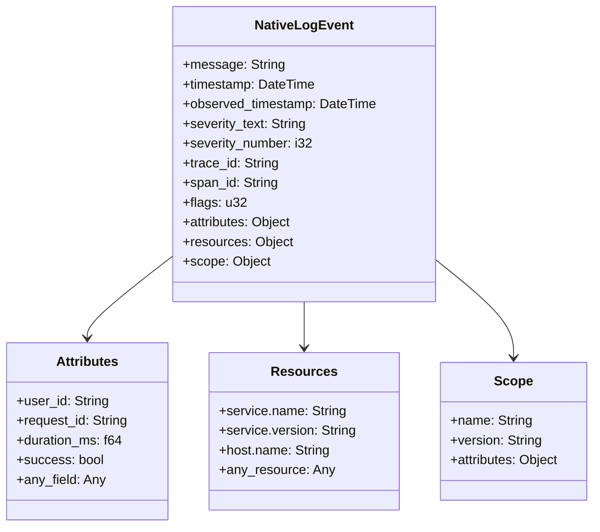
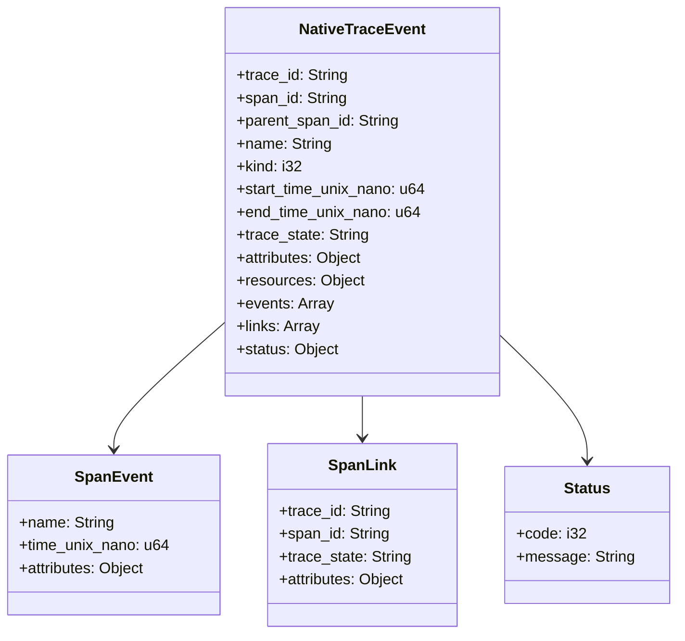
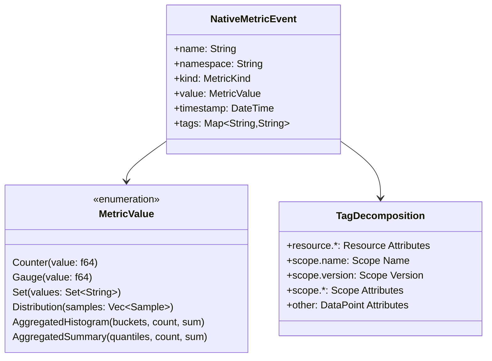
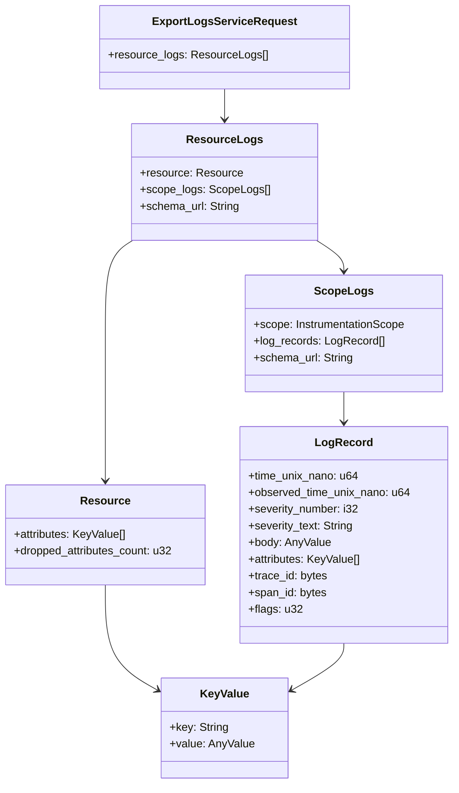
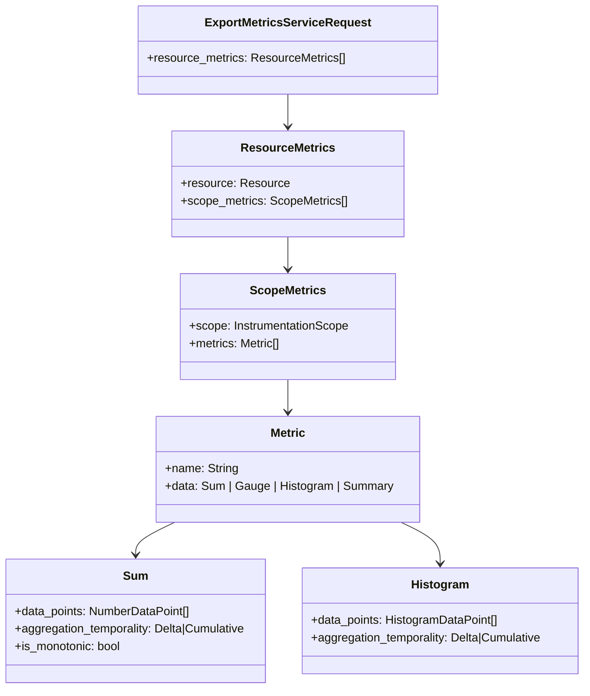
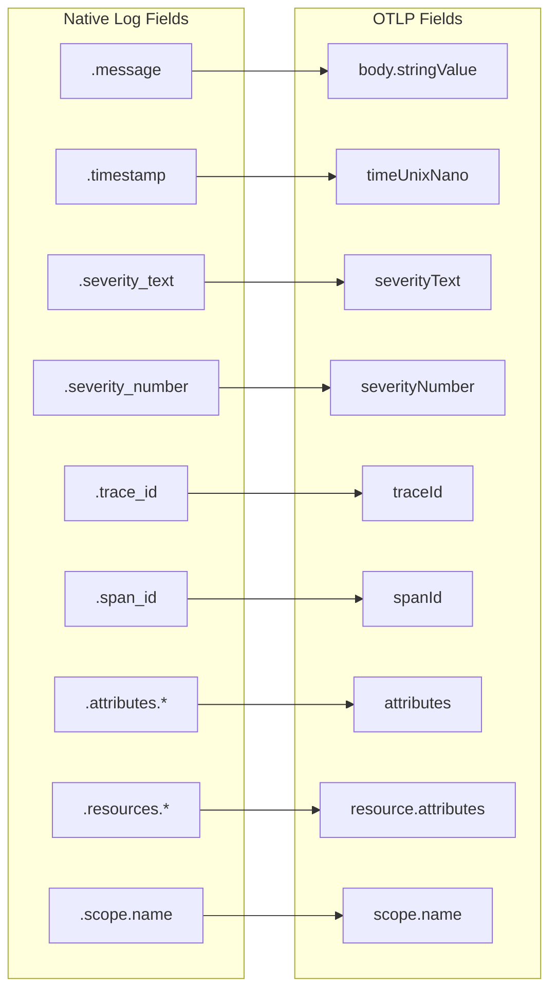

# OTLP Native Conversion

This document explains the automatic native-to-OTLP conversion feature.

> **Scope:** Auto-conversion supports **logs**, **traces**, and **metrics**. Native Vector
> metrics (Counter, Gauge, Histogram, Summary, Distribution, Set) are automatically converted
> to OTLP protobuf format with tag prefix decomposition for resource/scope/data-point attributes.
> Pre-formatted OTLP events (from `use_otlp_decoding: true`) are passed through unchanged.

## Architecture overview

### Previous approach

For Vector version 0.55.0 and older, the approach is:


```mermaid
flowchart LR
    subgraph Sources
        A[File Source]
        B[OTLP Source]
        C[Other Sources]
    end

    subgraph Transform ["VRL Transform (50+ lines)"]
        D[Parse Fields]
        E[Build KeyValue Arrays]
        F[Build Nested Structure]
        G[Convert Types]
    end

    subgraph Sink
        H[OTLP Encoder]
        I[Protobuf Serialize]
    end

    A --> D
    B --> D
    C --> D
    D --> E --> F --> G --> H --> I

    style Transform fill:#ffcccc,stroke:#ff0000
    style D fill:#ffcccc
    style E fill:#ffcccc
    style F fill:#ffcccc
    style G fill:#ffcccc
```

### Current approach

For Vector v0.55.0 and later, the approach is:


```mermaid
flowchart LR
    subgraph Sources
        A[File Source]
        B[OTLP Source]
        C[Other Sources]
        D[Metrics Sources]
    end

    subgraph Sink ["OTLP Sink (Auto-Convert)"]
        H[Native → OTLP Converter]
        I[Protobuf Serialize]
    end

    A --> H
    B --> H
    C --> H
    D --> H
    H --> I

    style Sink fill:#ccffcc,stroke:#00aa00
    style H fill:#ccffcc
```

## Data flow

### Native log event structure


```mermaid
classDiagram
    class NativeLogEvent {
        +message: String
        +timestamp: DateTime
        +observed_timestamp: DateTime
        +severity_text: String
        +severity_number: i32
        +trace_id: String
        +span_id: String
        +flags: u32
        +attributes: Object
        +resources: Object
        +scope: Object
    }

    class Attributes {
        +user_id: String
        +request_id: String
        +duration_ms: f64
        +success: bool
        +any_field: Any
    }

    class Resources {
        +service.name: String
        +service.version: String
        +host.name: String
        +any_resource: Any
    }

    class Scope {
        +name: String
        +version: String
        +attributes: Object
    }

    NativeLogEvent --> Attributes
    NativeLogEvent --> Resources
    NativeLogEvent --> Scope
```

### Native trace event structure


```mermaid
classDiagram
    class NativeTraceEvent {
        +trace_id: String
        +span_id: String
        +parent_span_id: String
        +name: String
        +kind: i32
        +start_time_unix_nano: u64
        +end_time_unix_nano: u64
        +trace_state: String
        +attributes: Object
        +resources: Object
        +events: Array
        +links: Array
        +status: Object
    }

    class SpanEvent {
        +name: String
        +time_unix_nano: u64
        +attributes: Object
    }

    class SpanLink {
        +trace_id: String
        +span_id: String
        +trace_state: String
        +attributes: Object
    }

    class Status {
        +code: i32
        +message: String
    }

    NativeTraceEvent --> SpanEvent
    NativeTraceEvent --> SpanLink
    NativeTraceEvent --> Status
```

### Native metric event structure

Native Vector metrics use a flat tag model. Tags with special prefixes are decomposed back
into the OTLP resource/scope/data-point attribute hierarchy during conversion.


```mermaid
classDiagram
    class NativeMetricEvent {
        +name: String
        +namespace: String
        +kind: MetricKind
        +value: MetricValue
        +timestamp: DateTime
        +tags: Map~String,String~
    }

    class MetricValue {
        <<enumeration>>
        Counter(value: f64)
        Gauge(value: f64)
        Set(values: Set~String~)
        Distribution(samples: Vec~Sample~)
        AggregatedHistogram(buckets, count, sum)
        AggregatedSummary(quantiles, count, sum)
    }

    class TagDecomposition {
        +resource.*: Resource Attributes
        +scope.name: Scope Name
        +scope.version: Scope Version
        +scope.*: Scope Attributes
        +other: DataPoint Attributes
    }

    NativeMetricEvent --> MetricValue
    NativeMetricEvent --> TagDecomposition
```

### OTLP output structure


```mermaid
classDiagram
    class ExportLogsServiceRequest {
        +resource_logs: ResourceLogs[]
    }

    class ResourceLogs {
        +resource: Resource
        +scope_logs: ScopeLogs[]
        +schema_url: String
    }

    class Resource {
        +attributes: KeyValue[]
        +dropped_attributes_count: u32
    }

    class ScopeLogs {
        +scope: InstrumentationScope
        +log_records: LogRecord[]
        +schema_url: String
    }

    class LogRecord {
        +time_unix_nano: u64
        +observed_time_unix_nano: u64
        +severity_number: i32
        +severity_text: String
        +body: AnyValue
        +attributes: KeyValue[]
        +trace_id: bytes
        +span_id: bytes
        +flags: u32
    }

    class KeyValue {
        +key: String
        +value: AnyValue
    }

    ExportLogsServiceRequest --> ResourceLogs
    ResourceLogs --> Resource
    ResourceLogs --> ScopeLogs
    Resource --> KeyValue
    ScopeLogs --> LogRecord
    LogRecord --> KeyValue
```

### OTLP metric output structure


```mermaid
classDiagram
    class ExportMetricsServiceRequest {
        +resource_metrics: ResourceMetrics[]
    }

    class ResourceMetrics {
        +resource: Resource
        +scope_metrics: ScopeMetrics[]
    }

    class ScopeMetrics {
        +scope: InstrumentationScope
        +metrics: Metric[]
    }

    class Metric {
        +name: String
        +data: Sum | Gauge | Histogram | Summary
    }

    class Sum {
        +data_points: NumberDataPoint[]
        +aggregation_temporality: Delta|Cumulative
        +is_monotonic: bool
    }

    class Histogram {
        +data_points: HistogramDataPoint[]
        +aggregation_temporality: Delta|Cumulative
    }

    ExportMetricsServiceRequest --> ResourceMetrics
    ResourceMetrics --> ScopeMetrics
    ScopeMetrics --> Metric
    Metric --> Sum
    Metric --> Histogram
```

## Configuration comparison

### Previous: Complex VRL required

For Vector version 0.55.0 and older, the following complex VRL transform is required:

```yaml
# vector.yaml - before v0.55.0
sources:
  app_logs:
    type: file
    include: ["/var/log/app/*.log"]

  otel_source:
    type: opentelemetry
    grpc:
      address: 0.0.0.0:4317

transforms:
  # THIS WAS REQUIRED - 50+ lines of complex VRL
  build_otlp_structure:
    type: remap
    inputs: ["app_logs", "otel_source.logs"]
    source: |
      # Build resource attributes array
      resource_attrs = []
      if exists(.resources) {
        for_each(object!(.resources)) -> |k, v| {
          resource_attrs = push(resource_attrs, {
            "key": k,
            "value": { "stringValue": to_string(v) ?? "" }
          })
        }
      }

      # Build log attributes array
      log_attrs = []
      if exists(.attributes) {
        for_each(object!(.attributes)) -> |k, v| {
          attr_value = if is_boolean(v) {
            { "boolValue": v }
          } else if is_integer(v) {
            { "intValue": to_string!(v) }
          } else if is_float(v) {
            { "doubleValue": v }
          } else {
            { "stringValue": to_string(v) ?? "" }
          }
          log_attrs = push(log_attrs, { "key": k, "value": attr_value })
        }
      }

      # Build nested OTLP structure
      .resource_logs = [{
        "resource": { "attributes": resource_attrs },
        "scopeLogs": [{
          "scope": {
            "name": .scope.name ?? "",
            "version": .scope.version ?? ""
          },
          "logRecords": [{
            "timeUnixNano": to_string(to_unix_timestamp(.timestamp, unit: "nanoseconds")),
            "severityText": .severity_text ?? "INFO",
            "severityNumber": .severity_number ?? 9,
            "body": { "stringValue": .message ?? "" },
            "attributes": log_attrs,
            "traceId": .trace_id ?? "",
            "spanId": .span_id ?? ""
          }]
        }]
      }]

sinks:
  otel_collector:
    type: opentelemetry
    inputs: ["build_otlp_structure"]
    endpoint: http://collector:4317
    encoding:
      codec: otlp
```

### Current: VRL is not required

For Vector version 0.55.0 and later, VRL is not required:

```yaml
# vector.yaml - v0.55.0+
sources:
  app_logs:
    type: file
    include: ["/var/log/app/*.log"]

  otel_source:
    type: opentelemetry
    grpc:
      address: 0.0.0.0:4317

sinks:
  otel_collector:
    type: opentelemetry
    inputs: ["app_logs", "otel_source.logs"]
    endpoint: http://collector:4317
    encoding:
      codec: otlp  # Auto-converts native logs!
```

## Supported input formats

### 1. Native OTLP log (flat format)

```json
{
  "message": "User login successful",
  "timestamp": "2024-01-15T10:30:00Z",
  "severity_text": "INFO",
  "severity_number": 9,
  "trace_id": "0123456789abcdef0123456789abcdef",
  "span_id": "fedcba9876543210",
  "attributes": {
    "user_id": "user-12345",
    "duration_ms": 42.5,
    "success": true
  },
  "resources": {
    "service.name": "auth-service",
    "host.name": "prod-server-01"
  },
  "scope": {
    "name": "auth-module",
    "version": "1.0.0"
  }
}
```

### 2. Simple application log

```json
{
  "message": "Application started",
  "level": "info",
  "timestamp": "2024-01-15T10:30:00Z"
}
```

### 3. Native trace event

```json
{
  "trace_id": "0123456789abcdef0123456789abcdef",
  "span_id": "fedcba9876543210",
  "parent_span_id": "abcdef0123456789",
  "name": "HTTP GET /api/users",
  "kind": 2,
  "start_time_unix_nano": 1705312200000000000,
  "end_time_unix_nano": 1705312200042000000,
  "attributes": {
    "http.method": "GET",
    "http.status_code": 200
  },
  "resources": {
    "service.name": "api-gateway",
    "host.name": "gateway-01"
  },
  "status": {
    "code": 1,
    "message": "OK"
  },
  "events": [
    {
      "name": "request.start",
      "time_unix_nano": 1705312200000000000,
      "attributes": { "component": "handler" }
    }
  ],
  "links": []
}
```

### 4. Native Vector metric

Native Vector metrics are automatically converted. Tags with special prefixes control
OTLP attribute placement:

```yaml
# Example: Counter metric with tag decomposition
name: "http.request.count"
kind: incremental
value:
  counter: 42.0
tags:
  resource.service.name: "api-gateway"      # → resource.attributes
  resource.host.name: "prod-01"             # → resource.attributes
  scope.name: "http-client"                 # → scope.name
  scope.version: "1.0.0"                    # → scope.version
  http.method: "GET"                        # → data point attributes
  http.status_code: "200"                   # → data point attributes
```

## Field mapping reference

### Log field mapping


```mermaid
flowchart LR
    subgraph Native["Native Log Fields"]
        A[.message]
        B[.timestamp]
        C[.severity_text]
        D[.severity_number]
        E[.trace_id]
        F[.span_id]
        G[.attributes.*]
        H[.resources.*]
        I[.scope.name]
    end

    subgraph OTLP["OTLP Fields"]
        J[body.stringValue]
        K[timeUnixNano]
        L[severityText]
        M[severityNumber]
        N[traceId]
        O[spanId]
        P[attributes]
        Q[resource.attributes]
        R[scope.name]
    end

    A --> J
    B --> K
    C --> L
    D --> M
    E --> N
    F --> O
    G --> P
    H --> Q
    I --> R
```

### Trace field mapping

| Native Field | OTLP Field | Notes |
|--------------|------------|-------|
| `.trace_id` | `traceId` | Hex string to 16 bytes |
| `.span_id` | `spanId` | Hex string to 8 bytes |
| `.parent_span_id` | `parentSpanId` | Hex string to 8 bytes |
| `.name` | `name` | Span operation name |
| `.kind` | `kind` | SpanKind enum (0-5) |
| `.start_time_unix_nano` | `startTimeUnixNano` | Nanosecond timestamp |
| `.end_time_unix_nano` | `endTimeUnixNano` | Nanosecond timestamp |
| `.trace_state` | `traceState` | W3C trace state string |
| `.attributes.*` | `attributes[]` | Object to KeyValue array |
| `.resources.*` | `resource.attributes[]` | Object to KeyValue array |
| `.events[]` | `events[]` | Span events (name, time, attributes) |
| `.links[]` | `links[]` | Span links (trace_id, span_id, attributes) |
| `.status.code` | `status.code` | StatusCode enum |
| `.status.message` | `status.message` | Status description |
| `.dropped_attributes_count` | `droppedAttributesCount` | |
| `.dropped_events_count` | `droppedEventsCount` | |
| `.dropped_links_count` | `droppedLinksCount` | |

### Metric type mapping

| Vector MetricValue | OTLP Data Type | Notes |
|--------------------|----------------|-------|
| Counter (Incremental) | Sum (monotonic, Delta) | Single NumberDataPoint |
| Counter (Absolute) | Sum (monotonic, Cumulative) | Single NumberDataPoint |
| Gauge | Gauge | Single NumberDataPoint |
| AggregatedHistogram (Incremental) | Histogram (Delta) | Bucket counts, sum, count |
| AggregatedHistogram (Absolute) | Histogram (Cumulative) | Bucket counts, sum, count |
| AggregatedSummary | Summary | Quantile values, sum, count |
| Distribution | Histogram (Delta) | Samples converted to buckets |
| Set | Gauge | Cardinality (unique value count) |

### Metric tag decomposition

| Tag Pattern | OTLP Destination | Example |
|-------------|------------------|---------|
| `resource.*` | `resource.attributes[]` | `resource.service.name` to `service.name` |
| `scope.name` | `scope.name` | Instrumentation scope name |
| `scope.version` | `scope.version` | Instrumentation scope version |
| `scope.*` (other) | `scope.attributes[]` | `scope.language` to `language` |
| All other tags | Data point `attributes[]` | `http.method` stays as-is |

### Type conversion

| Native Type | OTLP AnyValue |
|-------------|---------------|
| String/Bytes | `stringValue` |
| Integer | `intValue` |
| Float | `doubleValue` |
| Boolean | `boolValue` |
| Array | `arrayValue` |
| Object | `kvlistValue` |
| Timestamp | `stringValue` (RFC3339) |

### Severity inference

When `severity_number` is not set, it's inferred from `severity_text`:

| Text | Number |
|------|--------|
| TRACE | 1-4 |
| DEBUG | 5-8 |
| INFO, NOTICE | 9-12 |
| WARN, WARNING | 13-16 |
| ERROR | 17-20 |
| FATAL, CRITICAL | 21-24 |

## Use case examples

### File logs to OTLP

```yaml
sources:
  nginx:
    type: file
    include: ["/var/log/nginx/*.log"]

transforms:
  parse:
    type: remap
    inputs: ["nginx"]
    source: |
      . = parse_nginx_log!(.message)
      .severity_text = "INFO"
      .resources."service.name" = "nginx"

sinks:
  otel:
    type: opentelemetry
    inputs: ["parse"]
    endpoint: http://collector:4317
    encoding:
      codec: otlp
```

### OTLP to Enrich to OTLP (logs)

```yaml
sources:
  otel_in:
    type: opentelemetry
    grpc:
      address: 0.0.0.0:4317

transforms:
  enrich:
    type: remap
    inputs: ["otel_in.logs"]
    source: |
      .attributes.processed_by = "vector"
      .resources."deployment.region" = "us-west-2"

sinks:
  otel_out:
    type: opentelemetry
    inputs: ["enrich"]
    endpoint: http://destination:4317
    encoding:
      codec: otlp
```

### OTLP traces to Enrich to OTLP

```yaml
sources:
  otel_in:
    type: opentelemetry
    grpc:
      address: 0.0.0.0:4317

transforms:
  enrich_traces:
    type: remap
    inputs: ["otel_in.traces"]
    source: |
      .attributes.processed_by = "vector"
      .resources."deployment.environment" = "production"

sinks:
  otel_out:
    type: opentelemetry
    inputs: ["enrich_traces"]
    endpoint: http://destination:4317
    encoding:
      codec: otlp  # Native traces auto-converted to OTLP protobuf
```

### Native metrics to OTLP

Vector metrics from any source are automatically converted to OTLP format.
Tags with `resource.*` and `scope.*` prefixes are decomposed into the proper
OTLP hierarchy.

```yaml
sources:
  host_metrics:
    type: host_metrics
    collectors: [cpu, memory, disk]

  internal_metrics:
    type: internal_metrics

transforms:
  tag_resources:
    type: remap
    inputs: ["host_metrics", "internal_metrics"]
    source: |
      # Add resource-level tags (will become OTLP resource attributes)
      .tags."resource.service.name" = "vector"
      .tags."resource.host.name" = get_hostname!()
      # Add scope info
      .tags."scope.name" = "host-monitoring"
      .tags."scope.version" = "1.0.0"

sinks:
  otel_out:
    type: opentelemetry
    inputs: ["tag_resources"]
    endpoint: http://collector:4317
    encoding:
      codec: otlp  # Native metrics auto-converted to OTLP protobuf
```

### OTLP metrics roundtrip

Metrics received via the OTLP source can be enriched and sent back out:

```yaml
sources:
  otel_in:
    type: opentelemetry
    grpc:
      address: 0.0.0.0:4317

transforms:
  enrich_metrics:
    type: remap
    inputs: ["otel_in.metrics"]
    source: |
      # Tags with resource.* prefix are preserved as resource attributes
      .tags."resource.deployment.environment" = "production"

sinks:
  otel_out:
    type: opentelemetry
    inputs: ["enrich_metrics"]
    endpoint: http://destination:4317
    encoding:
      codec: otlp
```

## Error handling

Invalid fields are handled gracefully:

| Invalid Input | Behavior |
|---------------|----------|
| Malformed hex trace_id | Empty (with warning) |
| Wrong-length trace_id/span_id | Empty (with warning) |
| Wrong type for severity | Default to 0 |
| Severity number out of range | Clamped to 0-24 |
| Negative timestamp | Use 0 |
| Invalid UTF-8 | Lossy conversion |
| Unsupported metric type (Sketch) | Metric dropped with warning logged |

The pipeline does not break due to malformed data.
