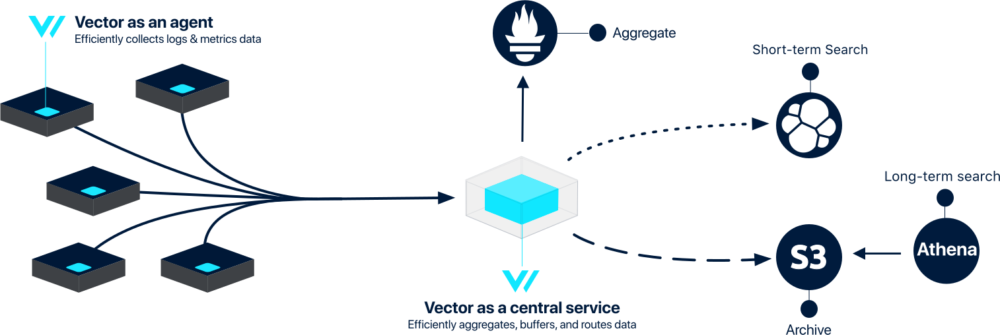

# Deployment

This section will cover deploying Vector. Vector is designed to deploy across your entire infrastructure, serving both as an [agent](roles/agent.md) and a [service](roles/service.md). You combine these roles to form [topologies](topologies.md), enabling Vector to serve the simplest and most complex use cases.

Start by becoming familiar with the possible [topologies](topologies.md) and then take a closer look at the [roles](roles/) used to form these topologies.

