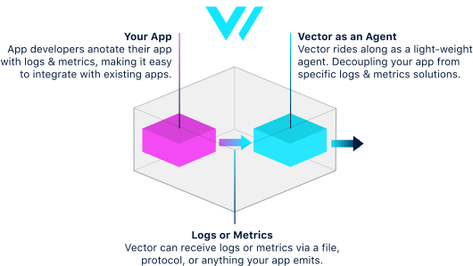

# Agent Role

When Vector serves as an agent, its purpose is to efficiently and quietly collect data. In this scenario, Vector is typically sharing a host with a more important service. Therefore, it is critically important that Vector is a good citizen, limiting its resource usage and efficiently forwarding data.

## Vector Configuration

### Collecting Data

#### In a platform context

If you're deploying Vector in a [platform context](../../installation/platforms/), such as [Kubernetes](../../installation/platforms/kubernetes.md) or [Docker](../../installation/platforms/docker.md), then data collection is handled for you as part of installation, please proceed to the next section.

#### Not in a platform context

If you are not deploying Vector in a platform context, then data collection must be achieved through more generic means, such as [journald](), a [file](../../../usage/configuration/sources/file.md), or [stdin](../../../usage/configuration/sources/stdin.md). The method you use depends on your setup. In general, we recommend avoiding stdin unless reducing disk usage is top priority. Stdin is limiting, in that it is coupled with a single input stream, meaning you cannot restart Vector independently, and you cannot accept data from multiple streams at the same time. This makes it more difficult to manage.

### Sending Data

#### Forwarding to a downstream Vector service

If you're forwarding data to a downstream [Vector service](service.md), then you should use the [`vector` sink](../../../usage/configuration/sinks/vector.md). The downstream Vector service should use the [`vector` source](../../../usage/configuration/sources/vector.md). This handles communication between Vector instances.



#### Not forwarding to a downstream Vector service

If you are not forwarding data to a downstream Vector service then you can choose [any sink you'd like](../../../usage/configuration/sinks/), but be cognizant of how many sinks you're using, as more sinks usually means more resource usage. If you find that Vector is hogging resources, then you should provision additional resources, or consider a [centralized](../topologies.md#centralized) or [stream-based](../topologies.md#stream-based) topology to push resource usage downstream.

#### Hybrid forwarding

There is nothing that prevents you from sending data to both a downstream Vector service and another independent service. Often times this makes the most sense if the downstream service is designed for streaming, as it takes load off of the downstream Vector service. For example, you might want to take advantage of [Big Query's streaming inserts](https://cloud.google.com/bigquery/streaming-data-into-bigquery). This feature is designed for rapid streaming and it has the added benefit of making data quickly available for querying. To implement this, you can forgo using a centralized Vector service entirely and stream data directly from your client nodes.

## System Configuration

### Limiting Resources

Vector is designed to be [_highly_ efficient](../../../performance.md), but this does not preclude Vector from consuming an excess amount of resources in certain scenarios. This is not ideal as an agent where priority should be given to the primary service on the host. Therefore, it is recommended to limit Vector resource usage. We strongly believe resource limiting should be achieved at higher levels, and depending on your platform this can be achieved through a variety of means. For example:

* [Limiting resources with Systemd](https://www.freedesktop.org/software/systemd/man/systemd.resource-control.html)
* [Limiting resources with cgroups](https://the.binbashtheory.com/control-resources-cgroups/)
* [Limiting resources with Kubernetes](https://kubernetes.io/docs/tasks/configure-pod-container/assign-cpu-resource/)

If none of the above links are relevant, please refer to your platform's documentation on limiting resources.

#### Resource limit recommendations

In general, we recommend the following  minimum limitations:

* CPU &gt;= 5%
* Memory &gt;= 256mb

A good resource manager will allow Vector to use more CPU and memory when available. You should not have to provide any additional limitations.

## Administration

### Configuration Changes

Vector can be [reloaded](../../../usage/administration/reloading.md) to apply configuration changes. This is the recommended strategy and should be used instead of restarting whenever possible.

### Updating Vector

To [update](../../../usage/administration/updating.md) Vector you'll need to restart the process. This is why we recommend using sources that use the disk as a buffer, as it decouples the Vector process from the source process. This allows other processes to continue running while Vector restarts. When Vector is restarted, it can resume where it left off.

