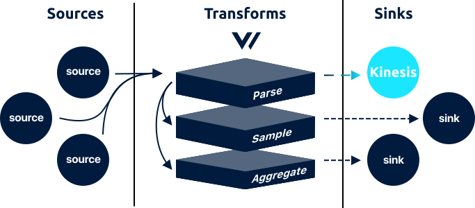

# aws\_kinesis\_streams sink



The `aws_kinesis_streams` sink streams [`log`](../../../about/data-model.md#log) events to the [AWS Kinesis Data Streams](https://aws.amazon.com/kinesis/data-streams/) service via the [`PutRecords` endpoint](https://docs.aws.amazon.com/kinesis/latest/APIReference/API_PutRecords.html).

## Example



```coffeescript
[sinks.<sink-id>]
    # REQUIRED
    inputs      = ["{<source-id> | <transform-id>}", [ ... ]]
    type        = "aws_kinesis_streams"
    region      = "<region>"
    stream_name = "<stream-name>"
    
    # OPTIONAL - Generic
    encoding = "json"    

    # OPTIONAL - Batch
    batch_size    = 1049000 # 1mib, max allowed
    batch_timeout = 1 # 1 second
    
    # OPTIONAL - Request
    request_in_flight_limit          = 5
    request_timeout_secs             = 30
    request_rate_limit_duration_secs = 1
    request_rate_limit_num           = 5
    request_retry_attempts           = 5
    request_retry_backoff_secs       = 1
    
    # OPTIONAL - Buffer
    [sinks.<sink-id>.buffer]
        type      = "memory"
        num_items = 1000
        when_full = "block"
```



## Options

<table>
  <thead>
    <tr>
      <th style="text-align:left">Key</th>
      <th style="text-align:center">Type</th>
      <th style="text-align:left">Description</th>
    </tr>
  </thead>
  <tbody>
    <tr>
      <td style="text-align:left"><b>REQUIRED</b>
      </td>
      <td style="text-align:center"></td>
      <td style="text-align:left"></td>
    </tr>
    <tr>
      <td style="text-align:left"><code>region</code>
      </td>
      <td style="text-align:center"><code>string</code>
      </td>
      <td style="text-align:left">
        <p>The <a href="https://docs.aws.amazon.com/general/latest/gr/rande.html#ak_region">AWS region</a> the
          Kinesis stream resides.</p>
        <p><code>example: &quot;us-east-1&quot;</code>
        </p>
      </td>
    </tr>
    <tr>
      <td style="text-align:left"><code>stream_name</code>
      </td>
      <td style="text-align:center"><code>string</code>
      </td>
      <td style="text-align:left">
        <p>The name of the Kinesis stream.</p>
        <p><code>example: &quot;my-stream&quot;</code>
        </p>
      </td>
    </tr>
    <tr>
      <td style="text-align:left"><b>OPTIONAL </b>- Generic</td>
      <td style="text-align:center"></td>
      <td style="text-align:left"></td>
    </tr>
    <tr>
      <td style="text-align:left"><code>encoding</code>
      </td>
      <td style="text-align:center"><code>string</code>
      </td>
      <td style="text-align:left">
        <p>The encoding format used to serialize the event before flushing. See
          <a
          href="aws_cloudwatch_logs.md#encoding">Encoding</a>below for more info.
            <br /><code>enum: &quot;text&quot;, &quot;json&quot;</code>
        </p>
        <p><code>no default</code>
        </p>
      </td>
    </tr>
    <tr>
      <td style="text-align:left"><b>OPTIONAL</b> - Batch</td>
      <td style="text-align:center"></td>
      <td style="text-align:left"></td>
    </tr>
    <tr>
      <td style="text-align:left"><code>batch_size</code>
      </td>
      <td style="text-align:center"><code>int</code>
      </td>
      <td style="text-align:left">
        <p>The maximum size of a <a href="./#batches">batch</a>, in bytes, before
          it is flushed. Cannot exceed <code>1049000</code> as per the <a href="https://docs.aws.amazon.com/streams/latest/dev/service-sizes-and-limits.html">service limits</a>.</p>
        <p><code>default: 1049000</code> (max allowed)</p>
      </td>
    </tr>
    <tr>
      <td style="text-align:left"><code>batch_timeout</code>
      </td>
      <td style="text-align:center"><code>int</code>
      </td>
      <td style="text-align:left">
        <p>The maximum age of a <a href="./#batches">batch</a>, in seconds, before
          it is flushed. See <a href="aws_kinesis_streams.md#batching">Batching</a> below
          for more info.</p>
        <p><code>default: 1</code>
        </p>
      </td>
    </tr>
    <tr>
      <td style="text-align:left"><b>OPTIONAL </b>- Request</td>
      <td style="text-align:center"></td>
      <td style="text-align:left"></td>
    </tr>
    <tr>
      <td style="text-align:left"><code>request_in_flight_limit</code>
      </td>
      <td style="text-align:center"><code>int</code>
      </td>
      <td style="text-align:left">
        <p>The maximum number of in-flight requests allowed at any given time. See
          <a
          href="aws_cloudwatch_logs.md#rate-limiting">Rate Limiting</a>below for more info.</p>
        <p><code>default: 5</code>
        </p>
      </td>
    </tr>
    <tr>
      <td style="text-align:left"><code>request_timeout_secs</code>
      </td>
      <td style="text-align:center"><code>int</code>
      </td>
      <td style="text-align:left">
        <p>The maximum time a request can take before being aborted. See <a href="aws_kinesis_streams.md#timeouts">Timeouts</a> below
          for more info.</p>
        <p><code>default: 30</code>
        </p>
      </td>
    </tr>
    <tr>
      <td style="text-align:left"><code>rate_limit_duration</code>
      </td>
      <td style="text-align:center"><code>int</code>
      </td>
      <td style="text-align:left">
        <p>The window, in seconds, used for the <code>request_rate_limit_num</code> option.
          See <a href="aws_kinesis_streams.md#rate-limiting">Rate Limiting</a> below
          for more info.</p>
        <p><code>default: 1</code>
        </p>
      </td>
    </tr>
    <tr>
      <td style="text-align:left"><code>rate_limit_num</code>
      </td>
      <td style="text-align:center"><code>int</code>
      </td>
      <td style="text-align:left">
        <p>The maximum number of requests allowed within the <code>rate_limit_duration</code> window.
          See <a href="aws_kinesis_streams.md#rate-limiting">Rate Limiting</a> below
          for more info.</p>
        <p><code>default: 5</code>
        </p>
      </td>
    </tr>
    <tr>
      <td style="text-align:left"><code>retry_attempts</code>
      </td>
      <td style="text-align:center"><code>int</code>
      </td>
      <td style="text-align:left">
        <p>The maximum number of retries to make for failed requests. See <a href="aws_kinesis_streams.md#retry-policy">Retry Policy</a> below
          for more info.</p>
        <p><code>default: 5</code>
        </p>
      </td>
    </tr>
    <tr>
      <td style="text-align:left"><code>retry_backoff_secs</code>
      </td>
      <td style="text-align:center"><code>int</code>
      </td>
      <td style="text-align:left">
        <p>The amount of time, in seconds, to wait before attempting a failed request
          again. See <a href="aws_kinesis_streams.md#retry-policy">Retry Policy</a> below
          for more info.</p>
        <p><code>default: 1</code>
        </p>
      </td>
    </tr>
    <tr>
      <td style="text-align:left"><b>OPTIONAL</b> - Buffer</td>
      <td style="text-align:center"></td>
      <td style="text-align:left"></td>
    </tr>
    <tr>
      <td style="text-align:left">&lt;code&gt;&lt;/code&gt;<a href="buffer.md"><code>buffer.*</code></a>&lt;code&gt;&lt;/code&gt;</td>
      <td
      style="text-align:center"><code>table</code>
        </td>
        <td style="text-align:left">A table that configures the sink specific buffer. See the <a href="buffer.md">*.buffer document</a>.</td>
    </tr>
  </tbody>
</table>## Tuning

Because AWS Kinesis streams can come in many sizes it's important that you adjust the following settings appropriately for your stream.



```coffeescript
request_in_flight_limit = <shard-count> / <vector-instance-count>
rate_limit_num = <shard-count> / <vector-instance-count>
```



We divide the `<shard-count>` variable by the number of Vector instances to ensure we divide the available resources. If you are running 1 Vector instance you can set these settings to equal `<shard-count>`.

## Input

The `aws_kinesis_streams` sink accepts [`log`](../../../about/data-model.md#log) events only from a [source](../sources/) or [transform](../transforms/).

## Output

The `aws_kinesis_streams` batches [events](../../../about/data-model.md#event) up to the `batch_size` or `batch_timeout` [options](aws_kinesis_streams.md#options). When flushed, Vector will produce a HTTP request to the Kinesis Data Streams [`PutRecords` endpoint](https://docs.aws.amazon.com/kinesis/latest/APIReference/API_PutRecords.html). The encoding is dictated by the `encoding` option \(see [Encoding](aws_kinesis_streams.md#encoding)\), each encoding is demonstrated below:


The `Data` keys are Base64 encoded since Kinesis requires this.




```http
POST / HTTP/1.1
Host: kinesis.<region>.<domain>
Content-Length: <PayloadSizeBytes>
Content-Type: application/x-amz-json-1.1
Connection: Keep-Alive 
X-Amz-Target: Kinesis_20131202.PutRecords
{
    "Records": [
        {
            "Data": "MzAuMTYzLjgyLjE0MCAtIFN0cmFja2U4MzYyIDkxNCBbMjAxOS0wNS0xNVQxMToxNzo1Ny0wNDowMF0gIkdFVCAvcm9pL2V2b2x2ZS9lbWJyYWNlL3RyYW5zcGFyZW50Igo=",
            "PartitionKey": "YBTVXNB0WWKWIPYM"
        },
        {
            "Data": "eyJ0aW1lc3RhbXAiOiAxNTU3OTMzNTQ4LCAibWVzc2FnZSI6ICJQVVQgL3ZhbHVlLWFkZGVkL2IyYiIsICJob3N0IjogIldpemEyNDU4IiwgInByb2Nlc3NfaWQiOiA3NzUsICJyZW1vdGVfYWRkciI6ICIzMC4xNjMuODIuMTQwIiwgInJlc3BvbnNlX2NvZGUiOiA1MDMsICJieXRlcyI6IDk0Njh9Cg==",
            "PartitionKey": "0QRGXO65UIIW0I5Z"
        },
        {
            "Data": "eyJ0aW1lc3RhbXAiOiAxNTU3OTMzNzQyLCAibWVzc2FnZSI6ICJERUxFVEUgL3JlaW52ZW50L2ludGVyZmFjZXMiLCAiaG9zdCI6ICJIZXJtYW4zMDg3IiwgInByb2Nlc3NfaWQiOiA3NzUsICJyZW1vdGVfYWRkciI6ICI0My4yNDYuMjIxLjI0NyIsICJyZXNwb25zZV9jb2RlIjogNTAzLCAiYnl0ZXMiOiA5NzAwfQo=",
            "PartitionKey": "NPOMFIP9W9QVMIAI"
        }
    ],
    "StreamName": "<stream_name>"
}
```



```http
POST / HTTP/1.1
Host: kinesis.<region>.<domain>
Content-Length: <PayloadSizeBytes>
Content-Type: application/x-amz-json-1.1
Connection: Keep-Alive 
X-Amz-Target: Kinesis_20131202.PutRecords
{
    "Records": [
        {
            "Data": "MzAuMTYzLjgyLjE0MCAtIFN0cmFja2U4MzYyIDkxNCBbMjAxOS0wNS0xNVQxMToxNzo1Ny0wNDowMF0gIkdFVCAvcm9pL2V2b2x2ZS9lbWJyYWNlL3RyYW5zcGFyZW50IiA1MDQgMjk3NjMK",
            "PartitionKey": "YBTVXNB0WWKWIPYM"
        },
        {
            "Data": "MTkwLjIxOC45Mi4yMTkgLSBXaXphMjQ1OCA3NzUgWzIwMTktMDUtMTVUMTE6MTc6NTctMDQ6MDBdICJQVVQgL3ZhbHVlLWFkZGVkL2IyYiIgNTAzIDk0NjgK",
            "PartitionKey": "0QRGXO65UIIW0I5Z"
        },
        {
            "Data": "NDMuMjQ2LjIyMS4yNDcgLSBIZXJtYW4zMDg3IDI5NCBbMjAxOS0wNS0xNVQxMToxNzo1Ny0wNDowMF0gIkRFTEVURSAvcmVpbnZlbnQvaW50ZXJmYWNlcyIgNTAzIDk3MDAK",
            "PartitionKey": "NPOMFIP9W9QVMIAI"
        }
    ],
    "StreamName": "<stream_name>"
}
```



The above examples are purposefully small for demonstration purposes. You can read more about encoding in the [Encoding](aws_kinesis_streams.md#encoding) section.

## How It Works

### Authentication

Vector checks for AWS credentials in the following order:

1. Environment variables `AWS_ACCESS_KEY_ID` and `AWS_SECRET_ACCESS_KEY`
2. \`\`[`credential_process` command](https://docs.aws.amazon.com/cli/latest/userguide/cli-configure-sourcing-external.html) in the AWS config file, usually located at `~/.aws/config`.
3. [AWS credentials file](https://docs.aws.amazon.com/cli/latest/userguide/cli-configure-files.html). Usually located at `~/.aws/credentials`.
4. [IAM instance profile](https://docs.aws.amazon.com/IAM/latest/UserGuide/id_roles_use_switch-role-ec2_instance-profiles.html). Will only work if running on an EC2 instance with an instance profile/role.

If credentials are not found the [healtcheck](aws_cloudwatch_logs.md#healthchecks) will fail and an error will be logged.

#### Obtaining an access key

In general, we recommend using instance profiles/roles whenever possible. In cases where this is not possible you can generate an AWS access key for any user within your AWS account. AWS provides a [detailed guide](https://docs.aws.amazon.com/IAM/latest/UserGuide/id_credentials_access-keys.html) on how to do this.

### Batching

Kinesis is designed for streaming but does benefit from small batches via the [`PutRecords` endpoint](https://docs.aws.amazon.com/kinesis/latest/APIReference/API_PutRecords.html). Vector defaults to falling within this endpoint's limits.

### Encoding

The `aws_kinesis_streams` sink encodes [events](../../../about/data-model.md#event) before flushing them to Kinesis. Kinesis records include a single [`Data` key](https://docs.aws.amazon.com/kinesis/latest/APIReference/API_PutRecordsRequestEntry.html#Streams-Type-PutRecordsRequestEntry-Data) that contains a blob of data. This blob is encoded via the `encoding` option. Each type is described in more detail below.

#### text

When encoding [events](../../../about/data-model.md#event) to `text` Vector will use the raw value of the `"message"` field.

#### json

When encoding events to `json`, Vector will encode the entire [event](../../../about/data-model.md#event) to JSON.

#### nil \(default\)

If left unspecified, Vector will dynamically choose the appropriate encoding. If an [event](../../../about/concepts.md#events) is explicitly structured then it will be encoded as `json`, if it is not, it will be encoded as `text`. This provides the path of least surprise for different [pipelines](../../../about/concepts.md#pipelines).

For example, take the simple [`tcp` source](../sources/tcp.md) to `aws_kinesis` sink pipeline. The data coming from the `tcp` source is raw text lines, therefore, if you connected it directly to this sink you would expect to see those same raw text lines. Alternatively, if you parsed that data with a [transform](../transforms/), you would expect to see encoded structured data.

### Partitioning

Currently, Vector generates random 16 byte partition keys for even distribution across Kinesis shards.

### Rate Limiting

Vector offers a few levers to control the rate and volume of requests. Please note, that Kinesis implements it's [own rate limits](https://docs.aws.amazon.com/streams/latest/dev/service-sizes-and-limits.html) and Vector's defaults are inline with those limits. If you need to change these anyway, then we recommend starting with the `rate_limit_duration` and `rate_limit_num` options to ensure Vector does not exceed the specified number of requests in the specified window. You can further control the pace at which this window is saturated with the `request_in_flight_limit` option, which will guarantee no more than the specified number of requests are in-flight at any given time.

### Retry Policy

Vector will retry failed requests \(status `== 429`, `>= 500`, and `!= 501`\). Other responses will not be retried. You can control the number of retry attempts and backoff rate with the `retry_attempts` and `retry_backoff_secs` options.

#### Partial Failures

Because Vector uses the `PutRecords` endpoint there is possibility for [partial failures](https://docs.aws.amazon.com/kinesis/latest/APIReference/API_PutRecordsResultEntry.html). Currently, Vector does not retry individual failed records. We have [plans to address this](https://github.com/timberio/vector/issues/359) in the future.

### Service Limits

Vector defaults to operating within the [Kinesis service limits](https://docs.aws.amazon.com/streams/latest/dev/service-sizes-and-limits.html). You can adjust how Vector behave if your limits deviate from the service defaults.

### Timeouts

The default `request_timeout_secs` is based on Kinesis' service timeout as well as how AWS configures its libraries. It is highly recommended that you do not lower this, as this could create orphaned requests and pile on retries.

## Resources

* [Source code](https://github.com/timberio/vector/blob/master/src/sinks/kinesis.rs)
* [Issues](https://github.com/timberio/vector/labels/Sink%3A%20AWS%20Kinesis%20Data%20Streams)
* [Vendor Website](https://aws.amazon.com/kinesis/data-streams/)

