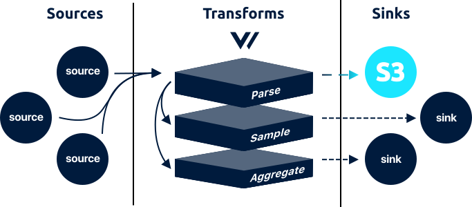

<!---
!!!WARNING!!!!

This file is autogenerated! Please do not manually edit this file.
Instead, please modify the contents of `/.metadata.toml`.
-->


# aws_s3 sink




The `aws_s3` sink is in beta. Please see the current [enhancements](https://github.com/timberio/vector/issues?q=is%3Aopen+is%3Aissue+label%3A%22Sink%3A+aws_s3%22+label%3A%22Type%3A+Enhancement%22) and [bugs](https://github.com/timberio/vector/issues?q=is%3Aopen+is%3Aissue+label%3A%22Sink%3A+aws_s3%22+label%3A%22Type%3A+Bug%22) for known issues. We kindly ask that you [add any missing issues](https://github.com/timberio/vector/issues/new?labels=Sink%3A+aws_s3) as it will help shape the roadmap of this component.

The `aws_s3` sink batch and flushes [`log`][docs.log_event] events to [AWS S3][url.aws_s3] via the [`PutObject` API endpoint](https://docs.aws.amazon.com/AmazonS3/latest/API/RESTObjectPUT.html).

## Config File



```coffeescript
[sinks.my_aws_s3_sink_id]
  # REQUIRED - General
  type = "aws_s3" # must be: aws_s3
  inputs = ["\"my-source-id\""]
  bucket = "my-bucket"
  region = "us-east-1"

  # OPTIONAL - Batching
  batch_size = 10490000 # default, bytes
  batch_timeout = 300 # default, bytes

  # OPTIONAL - Object Names
  filename_append_uuid = true # default
  filename_time_format = "%s" # default
  key_prefix = "date=%F/" # default

  # OPTIONAL - Requests
  compression = "gzip" # no default, must be: gzip
  encoding = "ndjson" # no default, enum: ndjson, text
  gzip = false # default
  rate_limit_duration = 1 # default, seconds
  rate_limit_num = 5 # default
  request_in_flight_limit = 5 # default
  request_timeout_secs = 30 # default, seconds
  retry_attempts = 5 # default
  retry_backoff_secs = 5 # default, seconds

  # OPTIONAL - Buffer
  [sinks.my_aws_s3_sink_id.buffer]
    type = "memory" # default, enum: memory, disk
    when_full = "block" # default, enum: block, drop_newest
    max_size = 104900000 # no default
    num_items = 500 # default
```


```coffeescript
[sinks.<sink-id>]
  # REQUIRED - General
  type = "aws_s3"
  inputs = ["<string>", ...]
  bucket = "<string>"
  region = "<string>"

  # OPTIONAL - Batching
  batch_size = <int>
  batch_timeout = <int>

  # OPTIONAL - Object Names
  filename_append_uuid = <bool>
  filename_time_format = "<string>"
  key_prefix = "<string>"

  # OPTIONAL - Requests
  compression = "gzip"
  encoding = {"ndjson" | "text"}
  gzip = <bool>
  rate_limit_duration = <int>
  rate_limit_num = <int>
  request_in_flight_limit = <int>
  request_timeout_secs = <int>
  retry_attempts = <int>
  retry_backoff_secs = <int>

  # OPTIONAL - Buffer
  [sinks.<sink-id>.buffer]
    type = {"memory" | "disk"}
    when_full = {"block" | "drop_newest"}
    max_size = <int>
    num_items = <int>
```


```coffeescript
[sinks.aws_s3]
  # REQUIRED - General

  # The component type
  #
  # * must be: aws_s3
  type = "aws_s3"

  # A list of upstream source for more info.
  inputs = ["\"my-source-id\""]

  # The S3 bucket name. Do not include a leading `s3://` or a trailing `/`.
  bucket = "my-bucket"

  # The AWS region of the target S3 bucket.
  region = "us-east-1"

  # OPTIONAL - Batching

  # The maximum size of a batch before it is flushed.
  #
  # * default: 10490000
  # * bytes
  batch_size = 10490000

  # The maximum age of a batch before it is flushed.
  #
  # * default: 300
  # * bytes
  batch_timeout = 300

  # OPTIONAL - Object Names

  # Whether or not to append a UUID v4 token to the end of the file. This ensures
  # there are no name collisions high volume use cases.
  #
  # * default: true
  filename_append_uuid = true

  # The format of the resulting object file name. `strftime` specifiers are
  # supported.
  #
  # * default: %s
  filename_time_format = "%s"

  # A prefix to apply to all object key names. This should be used to partition
  # your objects, and it's important to end this value with a `/` if you want
  # this to be the root S3 "folder". `strftime` specifiers are supported.
  #
  # * default: date=%F
  key_prefix = "date=%F/"
  key_prefix = "date=%F/hour=%H/"
  key_prefix = "year=%Y/month=%m/day=%d/"

  # OPTIONAL - Requests

  # The compression type to use before writing data.
  #
  # * no default
  # * must be: gzip
  compression = "gzip"

  # The encoding format used to serialize the events before flushing.
  #
  # * no default
  # * enum: ndjson, text
  encoding = "ndjson"
  encoding = "text"

  # Whether to Gzip the content before writing or not. Please note, enabling this
  # has a slight performance cost but significantly reduces bandwidth.
  #
  # * default: false
  gzip = false

  # The window used for the `request_rate_limit_num` option
  #
  # * default: 1
  # * seconds
  rate_limit_duration = 1

  # The maximum number of requests allowed within the `rate_limit_duration`
  # window.
  #
  # * default: 5
  rate_limit_num = 5

  # The maximum number of in-flight requests allowed at any given time.
  #
  # * default: 5
  request_in_flight_limit = 5

  # The maximum time a request can take before being aborted.
  #
  # * default: 30
  # * seconds
  request_timeout_secs = 30

  # The maximum number of retries to make for failed requests.
  #
  # * default: 5
  retry_attempts = 5

  # The amount of time to wait before attempting a failed request again.
  #
  # * default: 5
  # * seconds
  retry_backoff_secs = 5

  # OPTIONAL - Buffer
  [sinks.aws_s3.buffer]

    # The buffer's type / location. `disk` buffers are persistent and will be
    # retained between restarts.
    #
    # * default: memory
    # * enum: memory, disk
    type = "memory"
    type = "disk"

    # The behavior when the buffer becomes full.
    #
    # * default: block
    # * enum: block, drop_newest
    when_full = "block"
    when_full = "drop_newest"

    # Only relevant when `type` is `disk`. The maximum size of the buffer on the
    # disk.
    #
    # * no default
    max_size = 104900000

    # Only relevant when `type` is `memory`. The maximum number of events allowed
    # in the buffer.
    #
    # * default: 500
    num_items = 500
```



## Options

| Key  | Type  | Description |
| :--- | :---: | :---------- |
| **REQUIRED** - General | | |
| `type` | `string` | The component type See [Buffers](#buffers) for more info.<br />`required` `enum: "aws_s3"` |
| `inputs` | `[string]` | A list of upstream [source][docs.sources] or [transform][docs.transforms] IDs. See [Config Composition][docs.config_composition] for more info.<br />`required` `example: ["my-source-id"]` |
| `bucket` | `string` | The S3 bucket name. Do not include a leading `s3://` or a trailing `/`.<br />`required` `example: "my-bucket"` |
| `region` | `string` | The [AWS region][url.aws_s3_regions] of the target S3 bucket.<br />`required` `example: "us-east-1"` |
| **OPTIONAL** - Batching | | |
| `batch_size` | `int` | The maximum size of a batch before it is flushed. See [Buffers](#buffers) and [Batching](#batching) for more info.<br />`default: 10490000` `unit: bytes` |
| `batch_timeout` | `int` | The maximum age of a batch before it is flushed. See [Batching](#batching) for more info.<br />`default: 300` `unit: bytes` |
| **OPTIONAL** - Object Names | | |
| `filename_append_uuid` | `bool` | Whether or not to append a UUID v4 token to the end of the file. This ensures there are no name collisions high volume use cases. See [Object Naming](#object-naming) for more info.<br />`default: true` |
| `filename_time_format` | `string` | The format of the resulting object file name. [`strftime` specifiers][url.strftime_specifiers] are supported. See [Object Naming](#object-naming) for more info.<br />`default: "%s"` |
| `key_prefix` | `string` | A prefix to apply to all object key names. This should be used to partition your objects, and it's important to end this value with a `/` if you want this to be the root S3 "folder". [`strftime` specifiers][url.strftime_specifiers] are supported.  See [Object Naming](#object-naming) and [Partitioning](#partitioning) for more info.<br />`default: "date=%F"` |
| **OPTIONAL** - Requests | | |
| `compression` | `string` | The compression type to use before writing data. See [Compression](#compression) for more info.<br />`no default` `enum: "gzip"` |
| `encoding` | `string` | The encoding format used to serialize the events before flushing. See [Encodings](#encodings) for more info.<br />`no default` `enum: "ndjson", "text"` |
| `gzip` | `bool` | Whether to Gzip the content before writing or not. Please note, enabling this has a slight performance cost but significantly reduces bandwidth. See [Compression](#compression) for more info.<br />`default: false` |
| `rate_limit_duration` | `int` | The window used for the `request_rate_limit_num` option See [Rate Limiting](#rate-limiting) for more info.<br />`default: 1` `unit: seconds` |
| `rate_limit_num` | `int` | The maximum number of requests allowed within the `rate_limit_duration` window. See [Rate Limiting](#rate-limiting) for more info.<br />`default: 5` |
| `request_in_flight_limit` | `int` | The maximum number of in-flight requests allowed at any given time. See [Rate Limiting](#rate-limiting) for more info.<br />`default: 5` |
| `request_timeout_secs` | `int` | The maximum time a request can take before being aborted. See [Timeouts](#timeouts) for more info.<br />`default: 30` `unit: seconds` |
| `retry_attempts` | `int` | The maximum number of retries to make for failed requests. See [Retry Policy](#retry-policy) for more info.<br />`default: 5` |
| `retry_backoff_secs` | `int` | The amount of time to wait before attempting a failed request again. See [Retry Policy](#retry-policy) for more info.<br />`default: 5` `unit: seconds` |
| **OPTIONAL** - Buffer | | |
| `buffer.type` | `string` | The buffer's type / location. `disk` buffers are persistent and will be retained between restarts. See [Buffers](#buffers) for more info.<br />`default: "memory"` `enum: "memory", "disk"` |
| `buffer.when_full` | `string` | The behavior when the buffer becomes full. See [Buffers](#buffers) for more info.<br />`default: "block"` `enum: "block", "drop_newest"` |
| `buffer.max_size` | `int` | Only relevant when `type` is `disk`. The maximum size of the buffer on the disk.<br />`no default` `example: 104900000` |
| `buffer.num_items` | `int` | Only relevant when `type` is `memory`. The maximum number of [events][docs.event] allowed in the buffer.<br />`default: 500` |

## Examples

The `aws_s3` sink batches [`log`][docs.log_event] up to the `batch_size` or `batch_timeout` options. When flushed, Vector will write to [AWS S3][url.aws_s3] via the [`PutObject` API endpoint](https://docs.aws.amazon.com/AmazonS3/latest/API/RESTObjectPUT.html). The encoding is dictated by the `encoding` option. For example:

```http
POST / HTTP/1.1
Host: kinesis.<region>.<domain>
Content-Length: <byte_size>
Content-Type: application/x-amz-json-1.1
Connection: Keep-Alive 
X-Amz-Target: Kinesis_20131202.PutRecords
{
    "Records": [
        {
            "Data": "<base64_encoded_event>",
            "PartitionKey": "<partition_key>"
        },
        {
            "Data": "<base64_encoded_event>",
            "PartitionKey": "<partition_key>"
        },
        {
            "Data": "<base64_encoded_event>",
            "PartitionKey": "<partition_key>"
        },
    ],
    "StreamName": "<stream_name>"
}
```


## How It Works

### Authentication

Vector checks for AWS credentials in the following order:

1. Environment variables `AWS_ACCESS_KEY_ID` and `AWS_SECRET_ACCESS_KEY`.
​2. [`credential_process` command][url.aws_credential_process] in the AWS config file, usually located at `~/.aws/config`.
​3. [AWS credentials file][url.aws_credentials_file], usually located at `~/.aws/credentials`.
4. ​[IAM instance profile][url.iam_instance_profile]. Will only work if running on an EC2 instance with an instance profile/role.

If credentials are not found the [healtcheck](#healthchecks) will fail and an error will be [logged][docs.monitoring_logs].

#### Obtaining an access key

In general, we recommend using instance profiles/roles whenever possible. In cases where this is not possible you can generate an AWS access key for any user within your AWS account. AWS provides a [detailed guide][url.aws_access_keys] on how to do this.

### Batching

By default, the `aws_s3` sink flushes every 300 seconds to optimize cost and bandwidth. This is generally desired for the underlying service. This can be changed by adjusting the `batch_timeout` and `batch_size` options. Keep in mind that lowering this could have adverse effects with service stability and cost.

### Buffers

Vector couples buffers with each sink, this offers a number of advantages over a single shared global buffer. In general, you should configure your sink's buffer to exceed the `batch_size`. This is especially true when using on-disk buffers, as it ensures data is not lost in the event of restarts.

#### Buffer Types

The `buffer.type` option allows you to control buffer resource usage:

| Type | Description |
| :--- | :---------- |
| `memory` | Pros: Fast. Cons: Not persisted across restarts. Possible data loss in the event of a crash. Uses more memory. |
| `disk` | Pros: Persisted across restarts, durable. Uses much less memory. Cons: Slower, see below. |

#### Buffer Overflow

The `buffer.when_full` option allows you to control the behavior when the buffer overflows:

| Type | Description |
| :--- | :---------- |
| `block` | Applies back pressure until the buffer makes room. This will help to prevent data loss but will cause data to pile up on the edge. |
| `drop_newest` | Drops new data as it's received. This data is lost. This should be used when performance is the highest priority. |

### Columnar Formats

Vector has plans to support column formats, such as ORC and Parquet, in [`v0.6`][url.roadmap].

### Compression

The `aws_s3` sink compresses payloads before flushing. This helps to reduce the payload size, ultimately reducing bandwidth and cost. This is controlled via the `compression` option. Each compression type is described in more detail below:

| Compression | Description |
| :---------- | :---------- |
| `gzip` | The payload will be compressed in [Gzip][url.gzip] format before being sent. |

### Delivery Guarantee

This component offers an **at least once** delivery guarantee if your
[pipeline is configured to achieve this][docs.at_least_once_delivery].

### Encodings

The `aws_s3` sink encodes events before flushing. This is controlled via the `encoding` option. Each encoding type is described in more detail below:

| Encoding | Description |
| :------- | :---------- |
| `ndjson` | The payload will be encoded in new line delimited JSON payload, each line representing a JSON encoded event. |
| `text` | The payload will be encoded as new line delimited text, each line representing the value of the `"message"` key. |

### Health Checks

Vector will perform a simple health check against the underlying service before initializing this sink. This ensures that the service is reachable. You can require this check with the `--require-healthy` flag upon [starting][docs.starting] Vector:

```bash
vector --config /etc/vector/vector.toml --require-healthy
```

### Object Naming

By default, Vector will name your S3 objects in the following format:



```
<key_prefix><timestamp>-<uuidv4>.log
```


```
<key_prefix><timestamp>-<uuidv4>.log.gz
```



For example:



```
date=2019-06-18/1560886634-fddd7a0e-fad9-4f7e-9bce-00ae5debc563.log
```


```
date=2019-06-18/1560886634-fddd7a0e-fad9-4f7e-9bce-00ae5debc563.log.gz
```



Vector appends a [UUIDV4][url.uuidv4] token to ensure there are no name conflicts in the unlikely event 2 Vector instances are writing data at the same time.

You can control the resulting name via the `key_prefix`, `filename_time_format`, and `filename_append_uuid` options.

### Partitioning

Vector supports dynamic `key_prefix` values through [`strftime` specificiers][url.strftime_specifiers]. This allows you to create time based partitions based on the [event `timestamp`][docs.default_schema]. This is highly recommended for the logging use case since it allows for clean data segmentation, making it easy to prune and read data efficiently. Please see the [example specification](#example) for examples.

### Rate Limiting

Vector offers a few levers to control the rate and volume of requests. Start with the `rate_limit_duration` and `rate_limit_num` options to ensure Vector does not exceed the specified number of requests in the specified window. You can further control the pace at which this window is saturated with the `request_in_flight_limit` option, which will guarantee no more than the specified number of requests are in-flight at any given time.

Please note, Vector's defaults are carefully chosen and it should be rare that you need to adjust these.

### Retry Policy

Vector will retry failed requests (status == `429`, >= `500`, and != `501`). Other responses will not be retried. You can control the number of retry attempts and backoff rate with the `retry_attempts` and `retry_backoff_secs` options.

### Searching

Storing log data in S3 is a powerful strategy for persisting log data. Mainly because data on S3 is searchable. And [AWS Athena][url.aws_athena] makes this easier than ever.

#### Athena

1. Head over to the [Athena console][url.aws_athena_console].

2. Create a new table, replace the `<...>` variables as needed:

    ```sql
    CREATE EXTERNAL TABLE logs (
      timestamp string,
      message string,
      host string
    )   
    PARTITIONED BY (date string)
    ROW FORMAT  serde 'org.apache.hive.hcatalog.data.JsonSerDe'
    with serdeproperties ( 'paths'='timestamp, message, host' )
    LOCATION 's3://<region>.<key_prefix>';
    ```

3. Discover your partitions by running the following query:

    ```sql
    MSCK REPAIR TABLE logs
    ```

4. Query your data:

    ```sql
    SELECT host, COUNT(*)
    FROM logs
    GROUP BY host
    ```

Vector has plans to support [columnar formats](#columnar-formats) in [`v0.6`][url.roadmap] which will allows for very fast and efficient querying on S3.

### Timeouts

The default `request_timeout_secs` option is based on the underlying timeout. It is highly recommended that you do not lower this below the service's timeout, as this could create orphaned requests and pile on retries.

## Troubleshooting

The best place to start with troubleshooting is to check the
[Vector logs][docs.monitoring_logs]. This is typically located at
`/var/log/vector.log`, then proceed to follow the
[Troubleshooting Guide][docs.troubleshooting].

If the [Troubleshooting Guide][docs.troubleshooting] does not resolve your
issue, please:

1. Check for any [open sink issues](https://github.com/timberio/vector/issues?q=is%3Aopen+is%3Aissue+label%3A%22Sink%3A+aws_s3%22).
2. [Search the forum][url.search_forum] for any similar issues.
2. Reach out to the [community][url.community] for help.

## Resources

* [**Issues**](https://github.com/timberio/vector/issues?q=is%3Aopen+is%3Aissue+label%3A%22Sink%3A+aws_s3%22) - [enhancements](https://github.com/timberio/vector/issues?q=is%3Aopen+is%3Aissue+label%3A%22Sink%3A+aws_s3%22+label%3A%22Type%3A+Enhancement%22) - [bugs](https://github.com/timberio/vector/issues?q=is%3Aopen+is%3Aissue+label%3A%22Sink%3A+aws_s3%22+label%3A%22Type%3A+Bug%22)
* [**Source code**](https://github.com/timberio/vector/tree/master/src/sink/aws_s3.rs)
* [**Service Limits**](https://docs.aws.amazon.com/streams/latest/dev/service-sizes-and-limits.html)


[docs.at_least_once_delivery]: ../../../about/guarantees.md#at-least-once-delivery
[docs.config_composition]: ../../../usage/configuration/README.md#composition
[docs.default_schema]: ../../../about/data-model.md#default-schema
[docs.event]: ../../../about/data-model.md#event
[docs.log_event]: ../../../about/data-model.md#log
[docs.monitoring_logs]: ../../../usage/administration/monitoring.md#logs
[docs.sources]: ../../../usage/configuration/sources
[docs.starting]: ../../../usage/administration/starting.md
[docs.transforms]: ../../../usage/configuration/transforms
[docs.troubleshooting]: ../../../usage/guides/troubleshooting.md
[url.aws_access_keys]: https://docs.aws.amazon.com/IAM/latest/UserGuide/id_credentials_access-keys.html
[url.aws_athena]: https://aws.amazon.com/athena/
[url.aws_athena_console]: https://console.aws.amazon.com/athena/home
[url.aws_credential_process]: https://docs.aws.amazon.com/cli/latest/userguide/cli-configure-sourcing-external.html
[url.aws_credentials_file]: https://docs.aws.amazon.com/cli/latest/userguide/cli-configure-files.html
[url.aws_s3]: https://aws.amazon.com/s3/
[url.aws_s3_regions]: https://docs.aws.amazon.com/general/latest/gr/rande.html#s3_region
[url.community]: https://vector.dev/community
[url.gzip]: https://www.gzip.org/
[url.iam_instance_profile]: https://docs.aws.amazon.com/IAM/latest/UserGuide/id_roles_use_switch-role-ec2_instance-profiles.html
[url.roadmap]: https://github.com/timberio/vector/milestones?direction=asc&sort=title&state=open
[url.search_forum]: https://forum.vector.dev/search?expanded=true
[url.strftime_specifiers]: https://docs.rs/chrono/0.3.1/chrono/format/strftime/index.html
[url.uuidv4]: https://en.wikipedia.org/wiki/Universally_unique_identifier#Version_4_(random)
