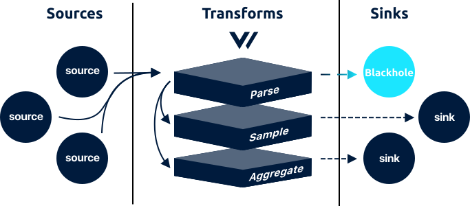

<!---
!!!WARNING!!!!

This file is autogenerated! Please do not manually edit this file.
Instead, please modify the contents of `/.metadata.toml`.
-->


# blackhole sink




The `blackhole` sink streams [`log`][docs.log_event] and [`metric`][docs.metric_event] events to a blackhole that simply discards data, designed for testing and benchmarking purposes.

## Config File



```coffeescript
[sinks.my_blackhole_sink_id]
  # REQUIRED - General
  type = "blackhole" # must be: blackhole
  inputs = ["\"my-source-id\""]
  print_amount = "1000"

  # OPTIONAL - Buffer
  [sinks.my_blackhole_sink_id.buffer]
    type = "memory" # default, enum: memory, disk
    when_full = "block" # default, enum: block, drop_newest
    max_size = 104900000 # no default
    num_items = 500 # default
```


```coffeescript
[sinks.<sink-id>]
  # REQUIRED - General
  type = "blackhole"
  inputs = ["<string>", ...]
  print_amount = <int>

  # OPTIONAL - Buffer
  [sinks.<sink-id>.buffer]
    type = {"memory" | "disk"}
    when_full = {"block" | "drop_newest"}
    max_size = <int>
    num_items = <int>
```


```coffeescript
[sinks.blackhole]
  # REQUIRED - General

  # The component type
  #
  # * must be: blackhole
  type = "blackhole"

  # A list of upstream source for more info.
  inputs = ["\"my-source-id\""]

  # The number of events that must be received in order to print a summary of
  # activity.
  print_amount = "1000"

  # OPTIONAL - Buffer
  [sinks.blackhole.buffer]

    # The buffer's type / location. `disk` buffers are persistent and will be
    # retained between restarts.
    #
    # * default: memory
    # * enum: memory, disk
    type = "memory"
    type = "disk"

    # The behavior when the buffer becomes full.
    #
    # * default: block
    # * enum: block, drop_newest
    when_full = "block"
    when_full = "drop_newest"

    # Only relevant when `type` is `disk`. The maximum size of the buffer on the
    # disk.
    #
    # * no default
    max_size = 104900000

    # Only relevant when `type` is `memory`. The maximum number of events allowed
    # in the buffer.
    #
    # * default: 500
    num_items = 500
```



## Options

| Key  | Type  | Description |
| :--- | :---: | :---------- |
| **REQUIRED** - General | | |
| `type` | `string` | The component type See [Buffers](#buffers) for more info.<br />`required` `enum: "blackhole"` |
| `inputs` | `[string]` | A list of upstream [source][docs.sources] or [transform][docs.transforms] IDs. See [Config Composition][docs.config_composition] for more info.<br />`required` `example: ["my-source-id"]` |
| `print_amount` | `int` | The number of events that must be received in order to print a summary of activity.<br />`required` `example: "1000"` |
| **OPTIONAL** - Buffer | | |
| `buffer.type` | `string` | The buffer's type / location. `disk` buffers are persistent and will be retained between restarts. See [Buffers](#buffers) for more info.<br />`default: "memory"` `enum: "memory", "disk"` |
| `buffer.when_full` | `string` | The behavior when the buffer becomes full. See [Buffers](#buffers) for more info.<br />`default: "block"` `enum: "block", "drop_newest"` |
| `buffer.max_size` | `int` | Only relevant when `type` is `disk`. The maximum size of the buffer on the disk.<br />`no default` `example: 104900000` |
| `buffer.num_items` | `int` | Only relevant when `type` is `memory`. The maximum number of [events][docs.event] allowed in the buffer.<br />`default: 500` |


## How It Works

### Buffers

Vector couples buffers with each sink, this offers a number of advantages over a single shared global buffer. In general, you should configure your sink's buffer to exceed the `batch_size`. This is especially true when using on-disk buffers, as it ensures data is not lost in the event of restarts.

#### Buffer Types

The `buffer.type` option allows you to control buffer resource usage:

| Type | Description |
| :--- | :---------- |
| `memory` | Pros: Fast. Cons: Not persisted across restarts. Possible data loss in the event of a crash. Uses more memory. |
| `disk` | Pros: Persisted across restarts, durable. Uses much less memory. Cons: Slower, see below. |

#### Buffer Overflow

The `buffer.when_full` option allows you to control the behavior when the buffer overflows:

| Type | Description |
| :--- | :---------- |
| `block` | Applies back pressure until the buffer makes room. This will help to prevent data loss but will cause data to pile up on the edge. |
| `drop_newest` | Drops new data as it's received. This data is lost. This should be used when performance is the highest priority. |

### Delivery Guarantee

Due to the nature of this component, it offers a **best effort**
delivery guarantee.

### Health Checks

Vector will perform a simple health check against the underlying service before initializing this sink. This ensures that the service is reachable. You can require this check with the `--require-healthy` flag upon [starting][docs.starting] Vector:

```bash
vector --config /etc/vector/vector.toml --require-healthy
```

### Performance

The `blackhole` source has been involved in the following performance tests:

* [`tcp_to_blackhole_performance`][url.tcp_to_blackhole_performance_test]

Learn more in the [Performance][docs.performance] sections.

### Streaming

Events will be streamed in a real-time, one-by-one fashiong, making
events immediately available. They will not be batched.

## Troubleshooting

The best place to start with troubleshooting is to check the
[Vector logs][docs.monitoring_logs]. This is typically located at
`/var/log/vector.log`, then proceed to follow the
[Troubleshooting Guide][docs.troubleshooting].

If the [Troubleshooting Guide][docs.troubleshooting] does not resolve your
issue, please:

1. Check for any [open sink issues](https://github.com/timberio/vector/issues?q=is%3Aopen+is%3Aissue+label%3A%22Sink%3A+blackhole%22).
2. [Search the forum][url.search_forum] for any similar issues.
2. Reach out to the [community][url.community] for help.

## Resources

* [**Issues**](https://github.com/timberio/vector/issues?q=is%3Aopen+is%3Aissue+label%3A%22Sink%3A+blackhole%22) - [enhancements](https://github.com/timberio/vector/issues?q=is%3Aopen+is%3Aissue+label%3A%22Sink%3A+blackhole%22+label%3A%22Type%3A+Enhancement%22) - [bugs](https://github.com/timberio/vector/issues?q=is%3Aopen+is%3Aissue+label%3A%22Sink%3A+blackhole%22+label%3A%22Type%3A+Bug%22)
* [**Source code**](https://github.com/timberio/vector/tree/master/src/sink/blackhole.rs)


[docs.config_composition]: ../../../usage/configuration/README.md#composition
[docs.event]: ../../../about/data-model.md#event
[docs.log_event]: ../../../about/data-model.md#log
[docs.metric_event]: ../../../about/data-model.md#metric
[docs.monitoring_logs]: ../../../usage/administration/monitoring.md#logs
[docs.performance]: ../../../performance.md
[docs.sources]: ../../../usage/configuration/sources
[docs.starting]: ../../../usage/administration/starting.md
[docs.transforms]: ../../../usage/configuration/transforms
[docs.troubleshooting]: ../../../usage/guides/troubleshooting.md
[url.community]: https://vector.dev/community
[url.search_forum]: https://forum.vector.dev/search?expanded=true
[url.tcp_to_blackhole_performance_test]: https://github.com/timberio/vector-test-harness/tree/master/cases/tcp_to_blackhole_performance
