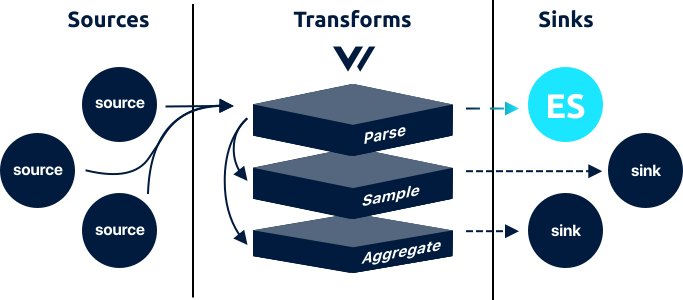

<!---
!!!WARNING!!!!

This file is autogenerated! Please do not manually edit this file.
Instead, please modify the contents of `/.metadata.toml`.
-->


# elasticsearch sink




The `elasticsearch` sink is in beta. Please see the current [enhancements](https://github.com/timberio/vector/issues?q=is%3Aopen+is%3Aissue+label%3A%22Sink%3A+elasticsearch%22+label%3A%22Type%3A+Enhancement%22) and [bugs](https://github.com/timberio/vector/issues?q=is%3Aopen+is%3Aissue+label%3A%22Sink%3A+elasticsearch%22+label%3A%22Type%3A+Bug%22) for known issues. We kindly ask that you [add any missing issues](https://github.com/timberio/vector/issues/new?labels=Sink%3A+elasticsearch) as it will help shape the roadmap of this component.

The `elasticsearch` sink batch and flushes [`log`][docs.log_event] events to [Elasticsearch][url.elasticsearch] via the [`_bulk` API endpoint](https://www.elastic.co/guide/en/elasticsearch/reference/current/docs-bulk.html).

## Config File



```coffeescript
[sinks.my_elasticsearch_sink_id]
  # REQUIRED - General
  type = "elasticsearch" # must be: elasticsearch
  inputs = ["\"my-source-id\""]
  host = "http://10.24.32.122:9000"

  # OPTIONAL - General
  doc_type = "_doc" # default
  index = "vector-%F" # default

  # OPTIONAL - Batching
  batch_size = 10490000 # default, bytes
  batch_timeout = 1 # default, bytes

  # OPTIONAL - Requests
  rate_limit_duration = 1 # default, seconds
  rate_limit_num = 5 # default
  request_in_flight_limit = 5 # default
  request_timeout_secs = 60 # default, seconds
  retry_attempts = 5 # default
  retry_backoff_secs = 5 # default, seconds

  # OPTIONAL - Buffer
  [sinks.my_elasticsearch_sink_id.buffer]
    type = "memory" # default, enum: memory, disk
    when_full = "block" # default, enum: block, drop_newest
    max_size = 104900000 # no default
    num_items = 500 # default
```


```coffeescript
[sinks.<sink-id>]
  # REQUIRED - General
  type = "elasticsearch"
  inputs = ["<string>", ...]
  host = "<string>"

  # OPTIONAL - General
  doc_type = "<string>"
  index = "<string>"

  # OPTIONAL - Batching
  batch_size = <int>
  batch_timeout = <int>

  # OPTIONAL - Requests
  rate_limit_duration = <int>
  rate_limit_num = <int>
  request_in_flight_limit = <int>
  request_timeout_secs = <int>
  retry_attempts = <int>
  retry_backoff_secs = <int>

  # OPTIONAL - Buffer
  [sinks.<sink-id>.buffer]
    type = {"memory" | "disk"}
    when_full = {"block" | "drop_newest"}
    max_size = <int>
    num_items = <int>
```


```coffeescript
[sinks.elasticsearch]
  # REQUIRED - General

  # The component type
  #
  # * must be: elasticsearch
  type = "elasticsearch"

  # A list of upstream source for more info.
  inputs = ["\"my-source-id\""]

  # The host of your Elasticsearch cluster. This should be the full URL as shown
  # in the example.
  host = "http://10.24.32.122:9000"

  # OPTIONAL - General

  # The `doc_type` for your index data. This is only relevant for Elasticsearch
  # <= 6.X. If you are using >= 7.0 you do not need to set this option since
  # Elasticsearch has removed it.
  #
  # * default: _doc
  doc_type = "_doc"

  # Index name to write events to. `strftime` specifiers are supported.
  #
  # * default: vector-%F
  index = "vector-%F"

  # OPTIONAL - Batching

  # The maximum size of a batch before it is flushed.
  #
  # * default: 10490000
  # * bytes
  batch_size = 10490000

  # The maximum age of a batch before it is flushed.
  #
  # * default: 1
  # * bytes
  batch_timeout = 1

  # OPTIONAL - Requests

  # The window used for the `request_rate_limit_num` option
  #
  # * default: 1
  # * seconds
  rate_limit_duration = 1

  # The maximum number of requests allowed within the `rate_limit_duration`
  # window.
  #
  # * default: 5
  rate_limit_num = 5

  # The maximum number of in-flight requests allowed at any given time.
  #
  # * default: 5
  request_in_flight_limit = 5

  # The maximum time a request can take before being aborted.
  #
  # * default: 60
  # * seconds
  request_timeout_secs = 60

  # The maximum number of retries to make for failed requests.
  #
  # * default: 5
  retry_attempts = 5

  # The amount of time to wait before attempting a failed request again.
  #
  # * default: 5
  # * seconds
  retry_backoff_secs = 5

  # OPTIONAL - Buffer
  [sinks.elasticsearch.buffer]

    # The buffer's type / location. `disk` buffers are persistent and will be
    # retained between restarts.
    #
    # * default: memory
    # * enum: memory, disk
    type = "memory"
    type = "disk"

    # The behavior when the buffer becomes full.
    #
    # * default: block
    # * enum: block, drop_newest
    when_full = "block"
    when_full = "drop_newest"

    # Only relevant when `type` is `disk`. The maximum size of the buffer on the
    # disk.
    #
    # * no default
    max_size = 104900000

    # Only relevant when `type` is `memory`. The maximum number of events allowed
    # in the buffer.
    #
    # * default: 500
    num_items = 500
```



## Options

| Key  | Type  | Description |
| :--- | :---: | :---------- |
| **REQUIRED** - General | | |
| `type` | `string` | The component type See [Buffers](#buffers) for more info.<br />`required` `enum: "elasticsearch"` |
| `inputs` | `[string]` | A list of upstream [source][docs.sources] or [transform][docs.transforms] IDs. See [Config Composition][docs.config_composition] for more info.<br />`required` `example: ["my-source-id"]` |
| `host` | `string` | The host of your Elasticsearch cluster. This should be the full URL as shown in the example.<br />`required` `example: "http://10.24.32.122:9000"` |
| **OPTIONAL** - General | | |
| `doc_type` | `string` | The `doc_type` for your index data. This is only relevant for Elasticsearch <= 6.X. If you are using >= 7.0 you do not need to set this option since Elasticsearch has removed it.<br />`default: "_doc"` |
| `index` | `string` | Index name to write events to. [`strftime` specifiers][url.strftime_specifiers] are supported. See [Partitioning](#partitioning) for more info.<br />`default: "vector-%F"` |
| **OPTIONAL** - Batching | | |
| `batch_size` | `int` | The maximum size of a batch before it is flushed. See [Buffers](#buffers) and [Batching](#batching) for more info.<br />`default: 10490000` `unit: bytes` |
| `batch_timeout` | `int` | The maximum age of a batch before it is flushed. See [Batching](#batching) for more info.<br />`default: 1` `unit: bytes` |
| **OPTIONAL** - Requests | | |
| `rate_limit_duration` | `int` | The window used for the `request_rate_limit_num` option See [Rate Limiting](#rate-limiting) for more info.<br />`default: 1` `unit: seconds` |
| `rate_limit_num` | `int` | The maximum number of requests allowed within the `rate_limit_duration` window. See [Rate Limiting](#rate-limiting) for more info.<br />`default: 5` |
| `request_in_flight_limit` | `int` | The maximum number of in-flight requests allowed at any given time. See [Rate Limiting](#rate-limiting) for more info.<br />`default: 5` |
| `request_timeout_secs` | `int` | The maximum time a request can take before being aborted. See [Timeouts](#timeouts) for more info.<br />`default: 60` `unit: seconds` |
| `retry_attempts` | `int` | The maximum number of retries to make for failed requests. See [Retry Policy](#retry-policy) for more info.<br />`default: 5` |
| `retry_backoff_secs` | `int` | The amount of time to wait before attempting a failed request again. See [Retry Policy](#retry-policy) for more info.<br />`default: 5` `unit: seconds` |
| **OPTIONAL** - Buffer | | |
| `buffer.type` | `string` | The buffer's type / location. `disk` buffers are persistent and will be retained between restarts. See [Buffers](#buffers) for more info.<br />`default: "memory"` `enum: "memory", "disk"` |
| `buffer.when_full` | `string` | The behavior when the buffer becomes full. See [Buffers](#buffers) for more info.<br />`default: "block"` `enum: "block", "drop_newest"` |
| `buffer.max_size` | `int` | Only relevant when `type` is `disk`. The maximum size of the buffer on the disk.<br />`no default` `example: 104900000` |
| `buffer.num_items` | `int` | Only relevant when `type` is `memory`. The maximum number of [events][docs.event] allowed in the buffer.<br />`default: 500` |

## Examples

The `elasticsearch` sink batches [`log`][docs.log_event] up to the `batch_size` or `batch_timeout` options. When flushed, Vector will write to [Elasticsearch][url.elasticsearch] via the [`_bulk` API endpoint](https://www.elastic.co/guide/en/elasticsearch/reference/current/docs-bulk.html). The encoding is dictated by the `encoding` option. For example:

```http
POST <host>/_bulk HTTP/1.1
Host: <host>
Content-Type: application/x-ndjson
Content-Length: 654

{ "index" : { "_index" : "<index>" } }
{"timestamp": 1557932537, "message": "GET /roi/evolve/embrace/transparent", "host": "Stracke8362", "process_id": 914, "remote_addr": "30.163.82.140", "response_code": 504, "bytes": 29763} 
{ "index" : { "_index" : "<index>" } }
{"timestamp": 1557933548, "message": "PUT /value-added/b2b", "host": "Wiza2458", "process_id": 775, "remote_addr": "30.163.82.140", "response_code": 503, "bytes": 9468}
{ "index" : { "_index" : "<index>" } }
{"timestamp": 1557933742, "message": "DELETE /reinvent/interfaces", "host": "Herman3087", "process_id": 775, "remote_addr": "43.246.221.247", "response_code": 503, "bytes": 9700}
```


## How It Works

### Batching

By default, the `elasticsearch` sink flushes every 1 seconds to ensure data is available quickly. This can be changed by adjusting the `batch_timeout` and `batch_size` options.

### Buffers

Vector couples buffers with each sink, this offers a number of advantages over a single shared global buffer. In general, you should configure your sink's buffer to exceed the `batch_size`. This is especially true when using on-disk buffers, as it ensures data is not lost in the event of restarts.

#### Buffer Types

The `buffer.type` option allows you to control buffer resource usage:

| Type | Description |
| :--- | :---------- |
| `memory` | Pros: Fast. Cons: Not persisted across restarts. Possible data loss in the event of a crash. Uses more memory. |
| `disk` | Pros: Persisted across restarts, durable. Uses much less memory. Cons: Slower, see below. |

#### Buffer Overflow

The `buffer.when_full` option allows you to control the behavior when the buffer overflows:

| Type | Description |
| :--- | :---------- |
| `block` | Applies back pressure until the buffer makes room. This will help to prevent data loss but will cause data to pile up on the edge. |
| `drop_newest` | Drops new data as it's received. This data is lost. This should be used when performance is the highest priority. |

### Delivery Guarantee

Due to the nature of this component, it offers a **best effort**
delivery guarantee.

### Health Checks

Vector will perform a simple health check against the underlying service before initializing this sink. This ensures that the service is reachable. You can require this check with the `--require-healthy` flag upon [starting][docs.starting] Vector:

```bash
vector --config /etc/vector/vector.toml --require-healthy
```

### Nested Documents

Vector will explode events into nested documents before writing them to Elasticsearch. Vector assumes keys with a . delimit nested fields. You can read more about how Vector handles nested documents in the [Data Model document][docs.data_model].

### Partitioning

Vector supports dynamic `index` values through [`strftime` specificiers][url.strftime_specifiers]. This allows you to use the [event `timestamp`][docs.default_schema] within the index name, creating time partitioned indices. This is highly recommended for the logging use case since it allows for easy data pruning by simply deleting old indices.

For example, when the `index` setting is set to `vector-%Y-%m-%d`, vector will create indexes with names like `vector-2019-05-04`, `vector-2019-05-05`, and so on. The date values are derived from the [event's `timestamp`][docs.default_schema].

### Rate Limiting

Vector offers a few levers to control the rate and volume of requests. Start with the `rate_limit_duration` and `rate_limit_num` options to ensure Vector does not exceed the specified number of requests in the specified window. You can further control the pace at which this window is saturated with the `request_in_flight_limit` option, which will guarantee no more than the specified number of requests are in-flight at any given time.

Please note, Vector's defaults are carefully chosen and it should be rare that you need to adjust these.

### Retry Policy

Vector will retry failed requests (status == `429`, >= `500`, and != `501`). Other responses will not be retried. You can control the number of retry attempts and backoff rate with the `retry_attempts` and `retry_backoff_secs` options.

### Timeouts

The default `request_timeout_secs` option is based on the underlying timeout. It is highly recommended that you do not lower this below the service's timeout, as this could create orphaned requests and pile on retries.

## Troubleshooting

The best place to start with troubleshooting is to check the
[Vector logs][docs.monitoring_logs]. This is typically located at
`/var/log/vector.log`, then proceed to follow the
[Troubleshooting Guide][docs.troubleshooting].

If the [Troubleshooting Guide][docs.troubleshooting] does not resolve your
issue, please:

1. Check for any [open sink issues](https://github.com/timberio/vector/issues?q=is%3Aopen+is%3Aissue+label%3A%22Sink%3A+elasticsearch%22).
2. [Search the forum][url.search_forum] for any similar issues.
2. Reach out to the [community][url.community] for help.

## Resources

* [**Issues**](https://github.com/timberio/vector/issues?q=is%3Aopen+is%3Aissue+label%3A%22Sink%3A+elasticsearch%22) - [enhancements](https://github.com/timberio/vector/issues?q=is%3Aopen+is%3Aissue+label%3A%22Sink%3A+elasticsearch%22+label%3A%22Type%3A+Enhancement%22) - [bugs](https://github.com/timberio/vector/issues?q=is%3Aopen+is%3Aissue+label%3A%22Sink%3A+elasticsearch%22+label%3A%22Type%3A+Bug%22)
* [**Source code**](https://github.com/timberio/vector/tree/master/src/sink/elasticsearch.rs)


[docs.config_composition]: ../../../usage/configuration/README.md#composition
[docs.data_model]: ../../../about/data-model.md
[docs.default_schema]: ../../../about/data-model.md#default-schema
[docs.event]: ../../../about/data-model.md#event
[docs.log_event]: ../../../about/data-model.md#log
[docs.monitoring_logs]: ../../../usage/administration/monitoring.md#logs
[docs.sources]: ../../../usage/configuration/sources
[docs.starting]: ../../../usage/administration/starting.md
[docs.transforms]: ../../../usage/configuration/transforms
[docs.troubleshooting]: ../../../usage/guides/troubleshooting.md
[url.community]: https://vector.dev/community
[url.elasticsearch]: https://www.elastic.co/products/elasticsearch
[url.search_forum]: https://forum.vector.dev/search?expanded=true
[url.strftime_specifiers]: https://docs.rs/chrono/0.3.1/chrono/format/strftime/index.html
