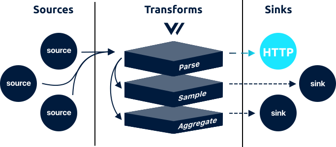

<!---
!!!WARNING!!!!

This file is autogenerated! Please do not manually edit this file.
Instead, please modify the contents of `dist/config/schema.toml`.
-->


# http sink




The `http` sink batch and flushes [`log`][log_event] events to a generic HTTP endpoint.

## Example



```coffeescript
[sinks.my_http_sink]
  # REQUIRED - General
  type = "http"
  inputs = ["my-source-id"]
  encoding = "ndjson" # one of: ndjson, text
  uri = "https://10.22.212.22:9000/endpoint"

  # OPTIONAL - General
  compression = "gzip" # no default, one of: gzip
  healthcheck_uri = "https://10.22.212.22:9000/_health" # no default

  # OPTIONAL - Batching
  batch_size = 1049000 # default, bytes
  batch_timeout = 5 # default, bytes

  # OPTIONAL - Requests
  rate_limit_duration = 1 # default, seconds
  rate_limit_num = 10 # default
  request_in_flight_limit = 10 # default
  request_timeout_secs = 30 # default, seconds
  retry_attempts = 10 # default
  retry_backoff_secs = 10 # default, seconds

  # OPTIONAL - Basic auth
  [sinks.my_http_sink.basic_auth]
    password = "password" # no default
    user = "username" # no default

  # OPTIONAL - Headers
  [sinks.my_http_sink.headers]
    X-Powered-By = "Vector"
```


```coffeescript
[sink.<sink-id>]
  # REQUIRED - General
  type = "<string>"
  inputs = "<string>"
  encoding = {ndjson | text}
  uri = "<string>"

  # OPTIONAL - General
  compression = {gzip}
  healthcheck_uri = "<string>"

  # OPTIONAL - Batching
  batch_size = <int>
  batch_timeout = <int>

  # OPTIONAL - Requests
  rate_limit_duration = <int>
  rate_limit_num = <int>
  request_in_flight_limit = <int>
  request_timeout_secs = <int>
  retry_attempts = <int>
  retry_backoff_secs = <int>

  # OPTIONAL - Basic auth
  [sink.<sink-id>.basic_auth]
    password = "<string>"
    user = "<string>"

  # OPTIONAL - Headers
  [sink.<sink-id>.headers]
    * = "<string>"
```


```coffeescript
[sink.http]
  # REQUIRED - General

  # The component type
  type = "http"

  # A list of upstream source for more info.
  inputs = ["my-source-id"]

  # The encoding format used to serialize the events before flushing.
  encoding = "ndjson"
  encoding = "text"

  # The full URI to make HTTP requests to. This should include the protocol and host, but can also include the port, path, and any other valid part of a URI.
  uri = "https://10.22.212.22:9000/endpoint"

  # OPTIONAL - General

  # The compression strategy used to compress the payload before sending.
  compression = "gzip"

  # A URI that Vector can request in order to determine the service health.
  healthcheck_uri = "https://10.22.212.22:9000/_health"

  # OPTIONAL - Batching

  # The maximum size of a batch before it is flushed.
  batch_size = 1049000

  # The maximum age of a batch before it is flushed.
  batch_timeout = 5

  # OPTIONAL - Requests

  # The window used for the `request_rate_limit_num` option
  rate_limit_duration = 1

  # The maximum number of requests allowed within the `rate_limit_duration` window.
  rate_limit_num = 10

  # The maximum number of in-flight requests allowed at any given time.
  request_in_flight_limit = 10

  # The maximum time a request can take before being aborted.
  request_timeout_secs = 30

  # The maximum number of retries to make for failed requests.
  retry_attempts = 10

  # The amount of time to wait before attempting a failed request again.
  retry_backoff_secs = 10

  # OPTIONAL - Basic auth
  [sink.http.basic_auth]

    # The basic authentication password.
    password = "password"

    # The basic authentication user name.
    user = "username"

  # OPTIONAL - Headers
  [sink.http.headers]

    # A custom header to be added to each outgoing HTTP request.
    X-Powered-By = "Vector"
```



## Options

| Key  | Type  | Description |
| :--- | :---: | :---------- |
| **REQUIRED** - General | | |
| `inputs` | `string` | A list of upstream [source][sources] or [transform][transforms] IDs. See [Config Composition][config_composition] for more info.<br />`required` `example: ["my-source-id"]` |
| `encoding` | `string` | The encoding format used to serialize the events before flushing. See [Encodings](#encodings) for more info.<br />`required` `enum: "ndjson", "text"` |
| `uri` | `string` | The full URI to make HTTP requests to. This should include the protocol and host, but can also include the port, path, and any other valid part of a URI.<br />`required` `example: (see above)` |
| **OPTIONAL** - General | | |
| `compression` | `string` | The compression strategy used to compress the payload before sending. See [Compression](#compression) for more info.<br />`no default` `enum: "gzip"` |
| `healthcheck_uri` | `string` | A URI that Vector can request in order to determine the service health. See [Health Checks](#health-checks) for more info.<br />`no default` `example: (see above)` |
| **OPTIONAL** - Batching | | |
| `batch_size` | `int` | The maximum size of a batch before it is flushed. See [Batching](#batching) for more info.<br />`default: 1049000` `unit: bytes` |
| `batch_timeout` | `int` | The maximum age of a batch before it is flushed. See [Batching](#batching) for more info.<br />`default: 5` `unit: bytes` |
| **OPTIONAL** - Requests | | |
| `rate_limit_duration` | `int` | The window used for the `request_rate_limit_num` option See [Rate Limiting](#rate-limiting) for more info.<br />`default: 1` `unit: seconds` |
| `rate_limit_num` | `int` | The maximum number of requests allowed within the `rate_limit_duration` window. See [Rate Limiting](#rate-limiting) for more info.<br />`default: 10` |
| `request_in_flight_limit` | `int` | The maximum number of in-flight requests allowed at any given time. See [Rate Limiting](#rate-limiting) for more info.<br />`default: 10` |
| `request_timeout_secs` | `int` | The maximum time a request can take before being aborted. See [Timeouts](#timeouts) for more info.<br />`default: 30` `unit: seconds` |
| `retry_attempts` | `int` | The maximum number of retries to make for failed requests. See [Retry Policy](#retry-policy) for more info.<br />`default: 10` |
| `retry_backoff_secs` | `int` | The amount of time to wait before attempting a failed request again. See [Retry Policy](#retry-policy) for more info.<br />`default: 10` `unit: seconds` |
| **OPTIONAL** - Basic auth | | |
| `basic_auth.password` | `string` | The basic authentication password.<br />`no default` `example: "password"` |
| `basic_auth.user` | `string` | The basic authentication user name.<br />`no default` `example: "username"` |
| **OPTIONAL** - Headers | | |
| `headers.*` | `string` | A custom header to be added to each outgoing HTTP request.<br />`no default` `example: "X-Powered-By = \"Vector\""` |

## I/O

The `http` sink batches events up to the `batch_size` or `batch_timeout` options. When flushed, Vector will write to a generic HTTP endpoint. The encoding is dictated by the `encoding` option. For example:

```http
POST <host>/_bulk HTTP/1.1
Host: <host>
Content-Type: application/x-ndjson
Content-Length: 654

{ "index" : { "_index" : "<index>" } }
{"timestamp": 1557932537, "message": "GET /roi/evolve/embrace/transparent", "host": "Stracke8362", "process_id": 914, "remote_addr": "30.163.82.140", "response_code": 504, "bytes": 29763} 
{ "index" : { "_index" : "<index>" } }
{"timestamp": 1557933548, "message": "PUT /value-added/b2b", "host": "Wiza2458", "process_id": 775, "remote_addr": "30.163.82.140", "response_code": 503, "bytes": 9468}
{ "index" : { "_index" : "<index>" } }
{"timestamp": 1557933742, "message": "DELETE /reinvent/interfaces", "host": "Herman3087", "process_id": 775, "remote_addr": "43.246.221.247", "response_code": 503, "bytes": 9700}
```


## How It Works

### Authentication

HTTP authentication is controlled via the `Authorization` header which you can set with the `headers` option. For convenience, Vector also supports the `basic_auth.username` and `basic_auth.password` options which handle setting the `Authorization` header for the [base access authentication scheme][basic_auth].

### Batching

By default, the `http` sink flushes every 5 seconds to ensure data is available quickly. This can be changed by adjusting the `batch_timeout` and `batch_size` options.

### Compression

The `http` sink compresses payloads before flushing. This helps to reduce the payload size, ultimately reducing bandwidth and cost. This is controlled via the `compression` option. Each compression type is described in more detail below:

| Compression | Description |
| `gzip` | The payload will be compressed in [Gzip][gzip] format before being sent. |

### Delivery Guarantee

This component offers an **at least once** delivery guarantee if your
[pipeline is configured to achieve this][at_least_once_delivery].

### Encodings

The `http` sink encodes events before flushing. This is controlled via the `encoding` option. Each encoding type is described in more detail below:

| Encoding | Description |
| `ndjson` | The payload will be encoded in new line delimited JSON payload, each line representing a JSON encoded event. |
| `text` | The payload will be encoded as new line delimited text, each line representing the value of the `"message"` key. |

### Health Checks

If the `healthcheck_uri` option is provided, Vector will issue a request to this URI to determine the service's health before initializing the sink. This ensures that the service is reachable. You can require this check with the `--require-healthy` flag upon [starting][starting] Vector.

### Partitioning

In order to partition data within a Kafka topic, you must specify a `key_field`. This is the name of the field on your event to use as the value for the partition key. Partitioning data in Kafka is generally used to group and maintain order of data sharing the same partition key. You can learn more about partitioning in the [Kakfa docs][kafka_partitioning_docs].

You can use [transforms][transforms] to add a partition key field if your events do not already have one.

### Rate Limiting

Vector offers a few levers to control the rate and volume of requests. Start with the `rate_limit_duration` and `rate_limit_num` options to ensure Vector does not exceed the specified number of requests in the specified window. You can further control the pace at which this window is saturated with the `request_in_flight_limit` option, which will guarantee no more than the specified number of requests are in-flight at any given time.

Please note, Vector's defaults are carefully chosen and it should be rare that you need to adjust these.

### Retry Policy

Vector will retry failed requests (status == `429`, >= `500`, and != `501`). Other responses will not be retried. You can control the number of retry attempts and backoff rate with the `retry_attempts` and `retry_backoff_secs` options.

### Timeouts

The default `request_timeout_secs` option is based on the underlying timeout. It is highly recommended that you do not lower this below the service's timeout, as this could create orphaned requests and pile on retries.

## Troubleshooting

The best place to start with troubleshooting is to check the
[Vector logs][monitoring_logs]. This is typically located at
`/var/log/vector.log`, then proceed to follow the
[Troubleshooting Guide][troubleshooting].

If the [Troubleshooting Guide][troubleshooting] does not resolve your
issue, please:

1. Check for any [open sink issues](https://github.com/timberio/vector/issues?q=is%3Aopen+is%3Aissue+label%3A%22Sink%3A+http%22).
2. [Search the forum][search_forum] for any similar issues.
2. Reach out to the [community][community] for help.

## Resources

* [**Issues**](https://github.com/timberio/vector/issues?q=is%3Aopen+is%3Aissue+label%3A%22Sink%3A+http%22) - [enhancements](https://github.com/timberio/vector/issues?q=is%3Aopen+is%3Aissue+label%3A%22Sink%3A+http%22+label%3A%22Type%3A+Enhancement%22) - [bugs](https://github.com/timberio/vector/issues?q=is%3Aopen+is%3Aissue+label%3A%22Sink%3A+http%22+label%3A%22Type%3A+Bug%22)
* [**Source code**](https://github.com/timberio/vector/tree/master/src/sink/http.rs)


[log_event]: "../../../about/data-model.md#log"
[sources]: "../../../usage/configuration/sources"
[transforms]: "../../../usage/configuration/transforms"
[config_composition]: "../../../usage/configuration/README.md#composition"
[basic_auth]: "https://en.wikipedia.org/wiki/Basic_access_authentication"
[gzip]: "https://www.gzip.org/"
[at_least_once_delivery]: "../../../about/guarantees.md#at-least-once-delivery"
[starting]: "../../../usage/administration/starting.md"
[kafka_partitioning_docs]: "https://cwiki.apache.org/confluence/display/KAFKA/A+Guide+To+The+Kafka+Protocol#AGuideToTheKafkaProtocol-Partitioningandbootstrapping"
[monitoring_logs]: "../../../administration/moonitoring.md#logs"
[troubleshooting]: "../../../usages/guides/troubleshooting.md"
[search_forum]: "https://forum.vectorproject.io/search?expanded=true"
[community]: "https://vectorproject.io/community"

