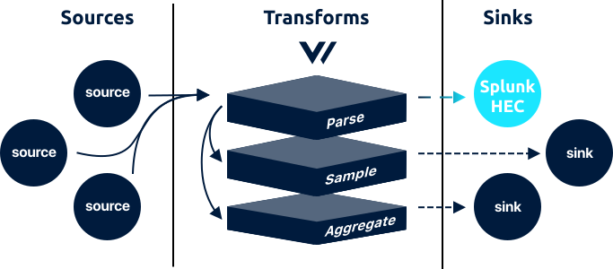

# splunk\_hec sink



The `splunk_hec` sink batches and flushes [`log`](../../../about/data-model.md#log) events to a [Spunk HTTP Event Collector](https://docs.splunk.com/Documentation/Splunk/7.2.6/Data/UsetheHTTPEventCollector).

## Example



```coffeescript
[sinks.<sink-id>]
    # REQUIRED
    inputs   = ["{<source-id> | <transform-id>}"]
    type     = "splunk_hec"
    token    = "<token>"
    host     = "<host>"
    encoding = "ndjson"
    
    # OPTIONAL - Generic
    compression = "none"
    
    # OPTIONAL - Batch
    batch_size = 1049000 # 1mib
    batch_timeout = 1 # 1 second
    
    # OPTIONAL - Request
    request_in_flight_limit          = 10
    request_timeout_secs             = 60
    request_rate_limit_duration_secs = 1
    request_rate_limit_num           = 10
    request_retry_attempts           = 5
    request_retry_backoff_secs       = 5
    
    # OPTIONAL - Buffer
    [sinks.<sink-id>.buffer]
        type      = "memory"
        num_items = 1000
        when_full = "block"
```



## Options

<table>
  <thead>
    <tr>
      <th style="text-align:left">Key</th>
      <th style="text-align:center">Type</th>
      <th style="text-align:left">Description</th>
    </tr>
  </thead>
  <tbody>
    <tr>
      <td style="text-align:left"><b>REQUIRED</b>
      </td>
      <td style="text-align:center"></td>
      <td style="text-align:left"></td>
    </tr>
    <tr>
      <td style="text-align:left"><code>token</code>
      </td>
      <td style="text-align:center"><code>string</code>
      </td>
      <td style="text-align:left">
        <p>Your Splunk HEC token. See <a href="splunk_hec.md#getting-a-token">Getting A Token</a> below.</p>
        <p><code>example: &quot;A94A8FE5CCB19BA61C4C08&quot;</code>
        </p>
      </td>
    </tr>
    <tr>
      <td style="text-align:left"><code>host</code>
      </td>
      <td style="text-align:center"><code>string</code>
      </td>
      <td style="text-align:left">
        <p>Your Splunk Enterprise or Splunk Cloud server&apos;s hostname. See Getting
          My Host below.</p>
        <p><code>example: &quot;myhost.com&quot;</code>
        </p>
      </td>
    </tr>
    <tr>
      <td style="text-align:left"><code>encoding</code>
      </td>
      <td style="text-align:center"><code>string</code>
      </td>
      <td style="text-align:left">
        <p>The encoding format used to serialize the events before flushing. See
          <a
          href="splunk_hec.md#encoding">Encoding</a>below for more info.</p>
        <p><code>enum: &quot;text&quot;, &quot;ndjson&quot;</code>
        </p>
      </td>
    </tr>
    <tr>
      <td style="text-align:left"><b>OPTIONAL</b> - Generic</td>
      <td style="text-align:center"></td>
      <td style="text-align:left"></td>
    </tr>
    <tr>
      <td style="text-align:left"><code>compression</code>
      </td>
      <td style="text-align:center"><code>string</code>
      </td>
      <td style="text-align:left">
        <p>The compression type to use before flushing data. See <a href="splunk_hec.md#compression">Compression</a> for
          more info.
          <br /><code>enum: &quot;none&quot;, &quot;gzip&quot;</code>
        </p>
        <p><code>default: &quot;none&quot;</code>
        </p>
      </td>
    </tr>
    <tr>
      <td style="text-align:left"><b>OPTIONAL </b>- Batch</td>
      <td style="text-align:center"></td>
      <td style="text-align:left"></td>
    </tr>
    <tr>
      <td style="text-align:left"><code>batch_size</code>
      </td>
      <td style="text-align:center"><code>int</code>
      </td>
      <td style="text-align:left">
        <p>The maximum size of the <a href="./#batches">batch</a>, in bytes, before
          it is flushed. See <a href="splunk_hec.md#batching">Batching</a> below.</p>
        <p><code>default: 1049000</code> (1 mib)</p>
      </td>
    </tr>
    <tr>
      <td style="text-align:left"><code>batch_timeout</code>
      </td>
      <td style="text-align:center"><code>int</code>
      </td>
      <td style="text-align:left">
        <p>The maximum age of a <a href="./#batches">batch</a>, in seconds, before
          it is flushed. See <a href="splunk_hec.md#batching">Batching</a> below.</p>
        <p><code>default: 1</code>
        </p>
      </td>
    </tr>
    <tr>
      <td style="text-align:left"><b>OPTIONAL </b>- Request</td>
      <td style="text-align:center"></td>
      <td style="text-align:left"></td>
    </tr>
    <tr>
      <td style="text-align:left"><code>request_in_flight_limit</code>
      </td>
      <td style="text-align:center"><code>int</code>
      </td>
      <td style="text-align:left">
        <p>The maximum number of in-flight requests allowed at any given time. See
          <a
          href="http.md#rate-limiting">Rate Limiting</a>below for more info.</p>
        <p><code>default: 10</code>
        </p>
      </td>
    </tr>
    <tr>
      <td style="text-align:left"><code>request_timeout_secs</code>
      </td>
      <td style="text-align:center"><code>int</code>
      </td>
      <td style="text-align:left">
        <p>The maximum time a request can take before being aborted. See <a href="http.md#timeouts">Timeouts</a> below
          for more info.</p>
        <p><code>default: 60</code>
        </p>
      </td>
    </tr>
    <tr>
      <td style="text-align:left"><code>rate_limit_duration</code>
      </td>
      <td style="text-align:center"><code>int</code>
      </td>
      <td style="text-align:left">
        <p>The window, in seconds, used for the <code>request_rate_limit_num</code> option.
          See <a href="http.md#rate-limiting">Rate Limiting</a> below for more info.</p>
        <p><code>default: 1</code>
        </p>
      </td>
    </tr>
    <tr>
      <td style="text-align:left"><code>rate_limit_num</code>
      </td>
      <td style="text-align:center"><code>int</code>
      </td>
      <td style="text-align:left">
        <p>The maximum number of requests allowed within the <code>rate_limit_duration</code> window.
          See <a href="http.md#rate-limiting">Rate Limiting</a> below for more info.</p>
        <p><code>default: 10</code>
        </p>
      </td>
    </tr>
    <tr>
      <td style="text-align:left"><code>retry_attempts</code>
      </td>
      <td style="text-align:center"><code>int</code>
      </td>
      <td style="text-align:left">
        <p>The maximum number of retries to make for failed requests. See <a href="splunk_hec.md#retry-policy">Retry Policy</a> below
          for more info.</p>
        <p><code>default: 5</code>
        </p>
      </td>
    </tr>
    <tr>
      <td style="text-align:left"><code>retry_backoff_secs</code>
      </td>
      <td style="text-align:center"><code>int</code>
      </td>
      <td style="text-align:left">
        <p>The amount of time, in seconds, to wait before attempting a failed request
          again. See <a href="splunk_hec.md#retry-policy">Retry Policy</a> below for
          more info.</p>
        <p><code>default: 1</code>
        </p>
      </td>
    </tr>
    <tr>
      <td style="text-align:left"><b>OPTIONAL</b> - Buffer</td>
      <td style="text-align:center"></td>
      <td style="text-align:left"></td>
    </tr>
    <tr>
      <td style="text-align:left">&lt;code&gt;&lt;/code&gt;<a href="buffer.md"><code>buffer.*</code></a>&lt;code&gt;&lt;/code&gt;</td>
      <td
      style="text-align:center"><code>table</code>
        </td>
        <td style="text-align:left">A table that configures the sink specific buffer. See the <a href="buffer.md">*.buffer document</a>.</td>
    </tr>
  </tbody>
</table>## Tuning

The `splunk_hec` sink should rarely require tuning. If you are experiencing throughput issues you can adjust the `batch_size`, `request_in_flight_limit`, and `rate_limit_num` options to increase throughput. See [Batching](splunk_hec.md#batching) and [Rate Limiting](splunk_hec.md#rate-limiting) for more info.

## Input

The `splunk_hec` sink accepts only [`log`](../../../about/data-model.md#log) events from a [source](../sources/) or [transform](../transforms/).

## Output

The `splunk_hec` sink batches events up to the `batch_size` or `batch_timeout` [options](splunk_hec.md#options). When flushed, Vector will produce an HTTP request to the configured Splunk HEC endpoint:



```http
POST <host> HTTP/1.1
Host: <host>
Content-Type: application/x-ndjson
Content-Length: 711

{"timestamp": 1557932537, "message": "GET /roi/evolve/embrace/transparent", "host": "Stracke8362", "process_id": 914, "remote_addr": "30.163.82.140", "response_code": 504, "bytes": 29763} 
{"timestamp": 1557933548, "message": "PUT /value-added/b2b", "host": "Wiza2458", "process_id": 775, "remote_addr": "30.163.82.140", "response_code": 503, "bytes": 9468}
{"timestamp": 1557933742, "message": "DELETE /reinvent/interfaces", "host": "Herman3087", "process_id": 775, "remote_addr": "43.246.221.247", "response_code": 503, "bytes": 9700}
```



```http
POST <host> HTTP/1.1
Host: <host>.s3.amazonaws.com
Content-Type: text/plain
Content-Length: 645

30.163.82.140 - Stracke8362 914 [2019-05-15T11:17:57-04:00] "GET /roi/evolve/embrace/transparent" 504 29763
190.218.92.219 - Wiza2458 775 [2019-05-15T11:17:57-04:00] "PUT /value-added/b2b" 503 9468
43.246.221.247 - Herman3087 294 [2019-05-15T11:17:57-04:00] "DELETE /reinvent/interfaces" 503 9700
```



The above examples are purposefully small for demonstration purposes. You can read more about encoding in the [Encoding](splunk_hec.md#encoding) section.

## How It Works

### Batching

The Splunk HEC service is designed for rapid flushing. Therefore, Vector, by default, flushes every 1 second to make data available as quickly as possible. This can be increased by adjusting the `batch_timeout` option. Keep in mind that Splunk will [only accept payloads up to `1mb`](https://docs.splunk.com/Documentation/SplunkCloud/7.2.4/Service/SplunkCloudservice), \(controlled by the `batch_size` option\), which may trigger a flush as well.

### Compression

By default Vector does not implement any compression. This is typically recommended since the Splunk HEC is designed to receive streaming data. That said, you can reduce bandwidth by enabling [GZIP](https://www.gzip.org/) compression via the `compression` setting. This will reduce outgoing bandwidth but will reduce performance since data must be compressed before sent.

### Encoding

The `splunk_hec` sink encodes [events](../../../about/data-model.md#event) before flushing them. Because Splunk HEC is simply an HTTP request with multiple events, Vector can encode that request in different formats via the `encoding` option. Each encoding type is described in more detail below.

#### text

When encoding [events](../../../about/data-model.md#event) to `text` Vector will use the raw value of the `"message"` field and new line delimit \(the `0xA` byte\) the contents.

#### ndjson

When encoding events to `ndjson`, Vector will encode the object as [ndjson](http://ndjson.org/), which means the entire [event](../../../about/concepts.md#events) is JSON encoded and then new line \(the `0xA` byte\) delimited.

### Getting A Token

The Splunk HTTP Event Collector requires that you generate a token. We recommend that you generate a Vector specific token. You can read more about how to do this in [Splunk's token management guide](http://dev.splunk.com/view/event-collector/SP-CAAAE7C).

### Getting My Host

Depending on your Splunk setup \(Enterprise or Cloud\) you host will be different. Splunk display's your host when you enable the Splunk HEC data source. Splunk offers a [full guide on setting up Splunk HEC](https://docs.splunk.com/Documentation/Splunk/latest/Data/UsetheHTTPEventCollector).

### Rate Limiting

Vector offers a few levers to control the rate and volume of requests made to the downstream service. We recommend starting with the `rate_limit_duration` and `rate_limit_num` options to ensure Vector does not exceed the specified number of requests in the specified window. You can further control the pace at which this window is saturated with the `request_in_flight_limit` option, which will guarantee no more than the specified number of requests are in-flight at any given time.

### Retry Policy

Vector will retry failed requests \(status `== 429`, `>= 500`, and `!= 501`\). Other responses will not be retried. You can control the number of retry attempts and backoff rate with the `retry_attempts` and `retry_backoff_secs` options.

### Timeouts

The default `request_timeout_secs` is based on Splunk HEC's service timeout as well as how Splunk configures its libraries. It is highly recommended that you do not lower this, as this could create orphaned requests and pile on retries.

## Resources

* [Source code](https://github.com/timberio/vector/blob/master/src/sinks/splunk.rs)
* [Issues](https://github.com/timberio/vector/labels/Sink%3A%20Splunk%20HEC)

