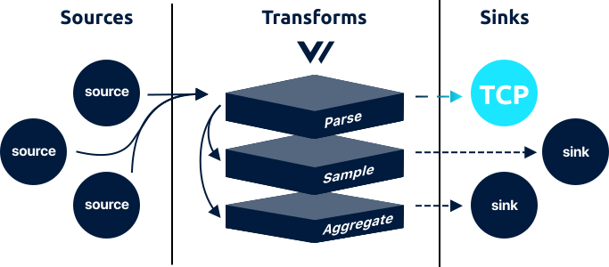

<!---
!!!WARNING!!!!

This file is autogenerated! Please do not manually edit this file.
Instead, please modify the contents of `dist/config/schema.toml`.
-->

# tcp sink




The `tcp` sink streams [`log`][log_event] events to a TCP connection.

## Example



```coffeescript
[sources.my_tcp_sink]
  # REQUIRED - General
  type = "tcp"
  inputs = ["my-source-id"]

  # OPTIONAL - General
  address = "92.12.333.224:5000" # no default

  # OPTIONAL - Requests
  encoding = "json" # no default
```


```coffeescript
[sink.<sink-id>]
  # REQUIRED - General
  type = "<string>"
  inputs = "<string>"

  # OPTIONAL - General
  address = "<string>"

  # OPTIONAL - Requests
  encoding = "<string>"
```



## Options

| Key  | Type  | Description |
| :--- | :---: | :---------- |
| **REQUIRED** - General | | |
| `inputs` | `string` | A list of upstream [source][sources] or [transform][transforms] IDs. See [Config Composition][config_composition] for more info.<br />`required` `example: ["my-source-id"]` |
| **OPTIONAL** - General | | |
| `address` | `string` | The TCP address.<br />`no default` `example: "92.12.333.224:5000"` |
| **OPTIONAL** - Requests | | |
| `encoding` | `string` | The encoding format used to serialize the events before flushing. See [Encodings](#encodings) for more info.<br />`no default` `enum: "json", "text"` |

## Input

The `tcp` sink accepts [`log`][log_event] events.

## Output

The `tcp` sink streams events to a TCP connection. The encoding of each event is dictated by the `encoding` option.

The `tcp` sink streams events in a real-time fashion. Each event is encoded as dictated by the `encoding` option. See [Encoding](#encoding) for more info.

## Delivery Guarantee

Due to nature of writing data to a TCP connection, the `tcp` sink
makes a [best effort delivery guarantee][best_effort_delivery].


## How It Works

### Encodings

The `tcp` sink encodes events before flushing. This is controlled via the `encoding` option. Each encoding type is described in more detail below:

| Encoding | Description |
| `json` | The payload will be encoded as a single JSON payload. |
| `text` | The payload will be encoded as new line delimited text, each line representing the value of the `"message"` key. |

### Health Checks

Vector will perform a simple health check against the underlying service before initializing this sink. This ensures that the service is reachable. You can require this check with the `--require-healthy` flag upon [starting][starting] Vector.

### Performance

The `tcp` source has been involved in the following performance tests:

* [`file_to_tcp_performance`][file_to_tcp_performance_test]
* [`tcp_to_blackhole_performance`][tcp_to_blackhole_performance_test]
* [`tcp_to_tcp_performance`][tcp_to_tcp_performance_test]

Learn more in the [Performance][performance] sections.

### Streaming

Events will be streamed in a real-time, one-by-one fashiong, making
events immediately available. They will not be batched.

## Troubleshooting

The best place to start with troubleshooting is to check the
[Vector logs][monitoring_logs]. This is typically located at
`/var/log/vector.log`, then proceed to follow the
[Troubleshooting Guide][troubleshooting].

### Getting help

If the [Troubleshooting Guide][troubleshooting] does not resolve your
issue, please:

1. Check for any [open sink issues](https://github.com/timberio/vector/issues?q=is%3Aopen+is%3Aissue+label%3A%22Sink%3A+tcp%22).
2. [Search the forum][search_forum] for any similar issues.
2. Reach out to the [community][community] for help.

## Resources

* [**Issues**](https://github.com/timberio/vector/issues?q=is%3Aopen+is%3Aissue+label%3A%22Sink%3A+tcp%22) - [enhancements](https://github.com/timberio/vector/issues?q=is%3Aopen+is%3Aissue+label%3A%22Sink%3A+tcp%22+label%3A%22Type%3A+Enhancement%22) - [bugs](https://github.com/timberio/vector/issues?q=is%3Aopen+is%3Aissue+label%3A%22Sink%3A+tcp%22+label%3A%22Type%3A+Bug%22)
* [**Source code**](https://github.com/timberio/vector/tree/master/src/sink/tcp.rs)


[log_event]: "../../../about/data-model.md#log"
[sources]: "../../../usage/configuration/sources"
[transforms]: "../../../usage/configuration/transforms"
[config_composition]: "../../../usage/configuration/README.md#composition"
[best_effort_delivery]: "../../../about/guarantees.md#best-effort-delivery"
[starting]: "../../../usage/administration/starting.md"
[file_to_tcp_performance_test]: "https://github.com/timberio/vector-test-harness/tree/master/cases/file_to_tcp_performance"
[tcp_to_blackhole_performance_test]: "https://github.com/timberio/vector-test-harness/tree/master/cases/tcp_to_blackhole_performance"
[tcp_to_tcp_performance_test]: "https://github.com/timberio/vector-test-harness/tree/master/cases/tcp_to_tcp_performance"
[performance]: "../../../comparisons/performance.md"
[monitoring_logs]: "../../../administration/moonitoring.md#logs"
[troubleshooting]: "../../../usages/guides/troubleshooting.md"
[search_forum]: "https://forum.vectorproject.io/search?expanded=true"
[community]: "https://vectorproject.io/community"

