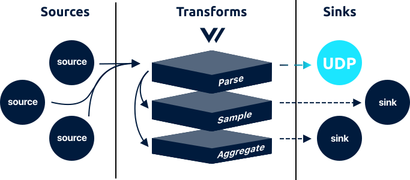

# udp sink



The `udp` sink streams [`log`](../../../about/data-model.md#log) events over UDP.

## Example



```coffeescript
[sinks.<sink-id>]
    # REQUIRED
    inputs     = ["{<source-id> | <transform-id>}", [ ... ]]
    type       = "tcp"
    address    = "92.12.333.224:5000"
    
    # OPTIONAL - General
    encoding = "text"
    
    # OPTIONAL - Buffer
    [sinks.<sink-id>.buffer]
        type      = "memory"
        num_items = 1000
        when_full = "block"
```



## Options

<table>
  <thead>
    <tr>
      <th style="text-align:left">Key</th>
      <th style="text-align:center">Type</th>
      <th style="text-align:left">Description</th>
    </tr>
  </thead>
  <tbody>
    <tr>
      <td style="text-align:left"><b>REQUIRED</b>
      </td>
      <td style="text-align:center"></td>
      <td style="text-align:left"></td>
    </tr>
    <tr>
      <td style="text-align:left"><code>address</code>
      </td>
      <td style="text-align:center"><code>string</code>
      </td>
      <td style="text-align:left">
        <p>The UDP socket address.</p>
        <p><code>example: &quot;92.12.333.224:5000&quot;</code>
        </p>
      </td>
    </tr>
    <tr>
      <td style="text-align:left"><b>OPTIONAL</b> - General</td>
      <td style="text-align:center"></td>
      <td style="text-align:left"></td>
    </tr>
    <tr>
      <td style="text-align:left"><code>encoding</code>
      </td>
      <td style="text-align:center"><code>string</code>
      </td>
      <td style="text-align:left">
        <p>The encoding format used to serialize the event before flushing. See
          <a
          href="udp.md#encoding">Encoding</a>below for more info.
            <br /><code>enum: &quot;text&quot;, &quot;json&quot;</code>
        </p>
        <p><code>no default</code>
        </p>
      </td>
    </tr>
    <tr>
      <td style="text-align:left"><b>OPTIONAL</b> - Buffer</td>
      <td style="text-align:center"></td>
      <td style="text-align:left"></td>
    </tr>
    <tr>
      <td style="text-align:left">&lt;code&gt;&lt;/code&gt;<a href="buffer.md"><code>buffer.*</code></a>&lt;code&gt;&lt;/code&gt;</td>
      <td
      style="text-align:center"><code>table</code>
        </td>
        <td style="text-align:left">A table that configures the sink specific buffer. See the <a href="buffer.md">*.buffer document</a>.</td>
    </tr>
  </tbody>
</table>## Input

The `udp` sink accepts both [`log`](../../../about/data-model.md#log) and [`metric`](../../../about/data-model.md#metric) events from a [source](../sources/) or [transform](../transforms/).

## Output

The `udp` sink streams events over UDP encoded via the `encoding` [option](udp.md#options). Each encoding is demonstrated below:



```http
{"timestamp": 1557932537, "message": "GET /roi/evolve/embrace/transparent", "host": "Stracke8362", "process_id": 914, "remote_addr": "30.163.82.140", "response_code": 504, "bytes": 29763} 
```



```http
30.163.82.140 - Stracke8362 914 [2019-05-15T11:17:57-04:00] "GET /roi/evolve/embrace/transparent" 504 29763
```



The above examples are purposefully small for demonstration purposes. You can read more about encoding in the [Encoding](udp.md#encoding) section.

## How It Works

### Encoding

The `udp` sink can encode [events](../../../about/data-model.md#event) before printing them. Each encoding type is described in more detail below.

#### text

When encoding [events](../../../about/data-model.md#event) to `text` Vector will submit the `"message"` field only.

#### json

When encoding events to `json`, Vector will encode the entire [event](../../../about/concepts.md#events) to JSON.

#### nil \(default\)

If left unspecified, Vector will dynamically choose the appropriate encoding. If an [event](../../../about/concepts.md#events) is explicitly structured then it will be encoded as `json`, if it is not, it will be encoded as `text`. This provides the path of least surprise for different [pipelines](../../../about/concepts.md#pipelines).

For example, take the simple [`tcp` source](../sources/tcp.md) to `udp` sink pipeline. The data coming from the `tcp` source is raw text lines, therefore, if you connected it directly to this sink you would expect to see those same raw text lines. Alternatively, if you parsed that data with a [transform](../transforms/), you would expect to see encoded structured data.

### Streaming

Data is streamed in a real-time, per-record basis. It is not batched.

## Resources

* [Source code](https://github.com/timberio/vector/blob/master/src/sinks/tcp.rs)
* [Issues](https://github.com/timberio/vector/labels/Sink%3A%20UDP)

