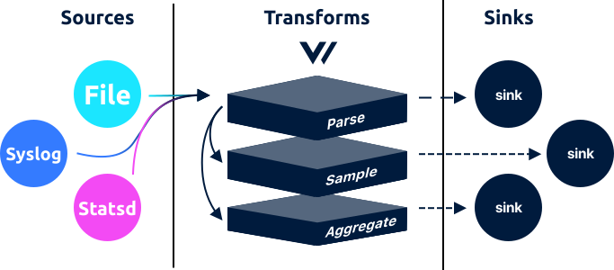

# Sources

Sources are first in the [pipeline](../../../about/concepts.md#pipelines), responsible for ingesting data into Vector, they can both receive and pull data. If you're deploying Vector in an [agent role](../../../setup/deployment/roles/agent.md), you'll want to look at local data sources like a [`file`](file.md), [`journald`](), and [`stdin`](stdin.md). If you're deploying Vector in a [service role](../../../setup/deployment/roles/service.md), you'll want to look at sources that receive data over the network, like the [`vector`](vector.md), [`tcp`](tcp.md), [`http`](), and [`kafka`]() sources. A full list of sources is available in the left-hand navigation.

## How It Works

### Context

When possible a source will add context to each [event](../../../about/data-model.md#event). For example, the [`tcp` source](tcp.md) adds the `"host"` context key representing the address of the upstream host. Context keys, when possible, will follow the [default schema](../../../about/data-model.md#default-schema) which is outlined in the [Data Model](../../../about/data-model.md) document. For explicitness, each source will document the context keys it adds as well as the expected event output structure.

### Event Types

#### Output

Every source will specify the output [event type](../../../about/data-model.md#event). This makes it clear the type of event you're being emitted.

#### Connectivity

A source must be connected to a [transforms](../transforms/) or [sinks](../sinks/) with the same input type.

### Vector to Vector Communication

If you're receiving data from another upstream Vector instance then you should use the [`vector` source](vector.md), with the upstream instance using the [`vector` sink](../sinks/vector.md). A more detailed guide is below:



