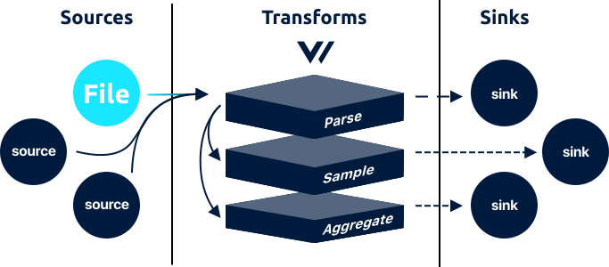

# file source



The `file` source allows you to ingest [`log`](../../../about/data-model.md#log) events by tailing one or more files.

## Example



```coffeescript
[sources.<source-id>]
    # REQUIRED
    type    = "file"
    include = ["/var/*.log"]
    
    # OPTIONAL - general
    exclude            = ["/var/bad.log"]
    ignore_older       = 86400 # 24 hours
    max_line_bytes     = 102400 # 100kib
    start_at_beginning = false
    
    # OPTIONAL - context
    file_key = "file"
    host_key = "host"
```



## Options

<table>
  <thead>
    <tr>
      <th style="text-align:left">Key</th>
      <th style="text-align:center">Type</th>
      <th style="text-align:left">Description</th>
    </tr>
  </thead>
  <tbody>
    <tr>
      <td style="text-align:left"><b>REQUIRED</b>
      </td>
      <td style="text-align:center"></td>
      <td style="text-align:left"></td>
    </tr>
    <tr>
      <td style="text-align:left"><code>include</code>
      </td>
      <td style="text-align:center"><code>[string]</code>
      </td>
      <td style="text-align:left">
        <p>Array of file patterns to include. <a href="https://en.wikipedia.org/wiki/Glob_%28programming%29">Globbing</a> is
          supported.</p>
        <p><code>example: [&quot;/var/log/nginx*.log&quot;]</code>
        </p>
      </td>
    </tr>
    <tr>
      <td style="text-align:left"><b>OPTIONAL</b> - general</td>
      <td style="text-align:center"></td>
      <td style="text-align:left"></td>
    </tr>
    <tr>
      <td style="text-align:left"><code>exclude</code>
      </td>
      <td style="text-align:center"><code>[string]</code>
      </td>
      <td style="text-align:left">
        <p>Array of file patterns to exclude. <a href="https://en.wikipedia.org/wiki/Glob_%28programming%29">Globbing</a> is
          supported. <em>Takes precedence over the <code>include</code>option.</em>
        </p>
        <p><code>example: [&quot;/var/log/system*.log&quot;]</code>
        </p>
      </td>
    </tr>
    <tr>
      <td style="text-align:left"><code>ignore_older</code>
      </td>
      <td style="text-align:center"><code>int</code>
      </td>
      <td style="text-align:left">
        <p>Ignore files with a data modification date that does not exceed this age,
          in seconds.
          <br /><code>example: 86400</code>
        </p>
        <p><code>no default</code>
        </p>
      </td>
    </tr>
    <tr>
      <td style="text-align:left"><code>max_line_bytes</code>
      </td>
      <td style="text-align:center"><code>int</code>
      </td>
      <td style="text-align:left">
        <p>The maximum number of a bytes a line can contain before being discarded.
          This protects against malformed lines or tailing incorrect files.</p>
        <p><code>default: 102400</code> (100kib)</p>
      </td>
    </tr>
    <tr>
      <td style="text-align:left"><code>start_at_beginning</code>
      </td>
      <td style="text-align:center"><code>bool</code>
      </td>
      <td style="text-align:left">When <code>true</code> Vector will read from the beginning of new files,
        when <code>false</code> Vector will only read new data added to the file.
        See <a href="file.md#how-it-works">How It Works</a> for more information.<em><br /></em><code>default: false</code>
      </td>
    </tr>
    <tr>
      <td style="text-align:left"><b>OPTIONAL</b> - context</td>
      <td style="text-align:center"></td>
      <td style="text-align:left"></td>
    </tr>
    <tr>
      <td style="text-align:left"><code>file_key</code>
      </td>
      <td style="text-align:center"><code>string</code>
      </td>
      <td style="text-align:left">The key name added to each record with the full path of the file. See
        <a
        href="file.md#context">Context</a>for more details.
          <br /><code>default: &quot;file&quot;</code>
      </td>
    </tr>
    <tr>
      <td style="text-align:left"><code>host_key</code>
      </td>
      <td style="text-align:center"><code>string</code>
      </td>
      <td style="text-align:left">The key name added to each record representing the current host. See
        <a
        href="file.md#context">Context</a>for more details.
          <br /><code>default: &quot;host&quot;</code>
      </td>
    </tr>
  </tbody>
</table>## Output

The `file` source outputs [`log`](../../../about/data-model.md#log) event types with the following [default schema](../../../about/data-model.md#default-schema):



```javascript
{
    "timestamp": "<timestamp>",
    "message": "<line>"
    "file": "<file-path>",
    "host": "<host-name>"
}
```



## How It Works

Tailing files can be a [cumbersome process with many edge cases](https://www.youtube.com/watch?v=30jNsCVLpAE). This section will shed light on Vector's approach to file tailing and how it handles these edge cases.

### Autodiscovery

Vector will continually look for new files matching any of your `include` patterns. If a new file is added that matches _any_ of the supplied patterns, Vector will begin tailing it. Vector maintains a unique list of files and will not tail a file more than once, even if it matches multiple patterns. You can read more about how we identify file in the [Identification](file.md#identification) section.

### Context

Each line is augmented with the following context keys:

* `"file"` - The full path of the file the line originated from.
* `"host"` - The value of `HOSTNAME` for the local host.

The key names can be changed with the [Context options](file.md#options). An example can be seen in the [Output section](file.md#output).

### Deletions

If a file is deleted Vector will flush the current buffer and stop tailing the file.

### Delivery Guarantees

The `file` source has a [**best effort delivery guarantee**](../../../about/guarantees.md#best-effort-delivery).

Due to the nature of file tailing, there are _very_ rare edge cases that would violate the at least once guarantee. For example, the [Truncating & Rotating section](file.md#truncating-and-rotating) outlines how file positions are tracked by remembering the file byte size of the previous read. If a file is truncated, and immediately exceeds the previous byte size, Vector will continue from the previous byte offset. In this case you would lose all data before that offset. In practice, this should never happen, as files should be truncated & rotated after reaching a very large size; a size so large as to make it near impossible to exceed the previous byte size quickly.

### Globbing

[Globbing](https://en.wikipedia.org/wiki/Glob_%28programming%29) is supported in all provided file paths, files will be [autodiscovered](file.md#autodiscovery) continually.

### Identification

Vector identifies files by creating a [cyclic redundancy check \(CRC\)](https://en.wikipedia.org/wiki/Cyclic_redundancy_check) on the first 256 bytes of the file. This serves as a fingerprint to uniquely identify the file. This strategy avoids the common pitfalls of using device and inode names since inode names, allowing Vector to [properly tail files in the event of rotation](../../../comparisons/correctness.md).

### Line Delimiters

Each line is read until a new line delimiter \(the `0xA` byte\) or `EOF` is found.

### Read Position

Vector defaults to reading new data only. Only data added to the file after Vector starts tailing the file will be collected. To read from the beginning of the file set the [`start_at_beginning` option](file.md#options) to `true`.

### Rotation

Vector will follow files across rotations in the manner of `tail`, and because of the way Vector [identifies files](file.md#identification) , Vector will properly recognize newly rotated files regardless if you are using `copytruncate` or `create`. To ensure Vector handle rotate files properly we recommend:

1. Ensure the `includes` paths include rotated files. For example, use `/var/log/nginx*.log` to recognize `/var/log/nginx.2.log`.
2. Use either `copytruncate` or `create` directives when rotating files. If historical data is compressed, or altered in any way, Vector will not be able to properly identify the file.
3. Only delete files when they have exceeded the `ignore_older` age. While extremely rare, this ensures you do not delete data before Vector has a chance to ingest it.

## Resources

* [Source code](https://github.com/timberio/vector/blob/master/src/sources/file.rs)
* [Issues](https://github.com/timberio/vector/labels/Source%3A%20File)

