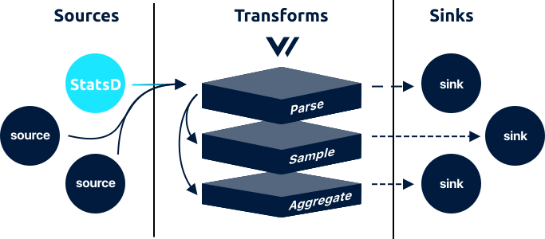

<!---
!!!WARNING!!!!

This file is autogenerated! Please do not manually edit this file.
Instead, please modify the contents of `/.metadata.toml`.
-->


# statsd source




The `statsd` source is in beta. Please see the current [enhancements](https://github.com/timberio/vector/issues?q=is%3Aopen+is%3Aissue+label%3A%22Source%3A+statsd%22+label%3A%22Type%3A+Enhancement%22) and [bugs](https://github.com/timberio/vector/issues?q=is%3Aopen+is%3Aissue+label%3A%22Source%3A+statsd%22+label%3A%22Type%3A+Bug%22) for known issues. We kindly ask that you [add any missing issues](https://github.com/timberio/vector/issues/new?labels=Source%3A+statsd) as it will help shape the roadmap of this component.

The `statsd` source continuously ingests [`log`][docs.log_event] events through the StatsD UDP protocol.

## Config File



```coffeescript
[sources.my_statsd_source_id]
  # REQUIRED - General
  type = "statsd" # must be: statsd
  address = "127.0.0.1:8126"
```


```coffeescript
[sources.<source-id>]
  # REQUIRED - General
  type = "statsd"
  address = "<string>"
```


```coffeescript
[sources.statsd]
  # REQUIRED - General

  # The component type
  #
  # * must be: statsd
  type = "statsd"

  # UDP socket address to bind to.
  address = "127.0.0.1:8126"
```



## Options

| Key  | Type  | Description |
| :--- | :---: | :---------- |
| `type` | `string` | The component type<br />`required` `enum: "statsd"` |
| `address` | `string` | UDP socket address to bind to.<br />`required` `example: "127.0.0.1:8126"` |

## Examples




Given the following Statsd counter:

```
login.invocations:1|c
```

A [`metric` event][docs.metric_event] will be emitted with the following structure:



```javascript
{
  "counter": {
    "name": "login.invocations",
    "val": 1
  }
}
```





Given the following Statsd gauge:

```
gas_tank:0.50|g
```

A [`metric` event][docs.metric_event] will be emitted with the following structure:



```javascript
{
  "gauge": {
    "name": "gas_tank",
    "val": 0.5
  }
}
```





Given the following Statsd set:

```
unique_users:foo|s
```

A [`metric` event][docs.metric_event] will be emitted with the following structure:



```javascript
{
  "set": {
    "name": "unique_users",
    "val": 1
  }
}
```





Given the following Statsd timer:

```
login.time:22|ms 
```

A [`metric` event][docs.metric_event] will be emitted with the following structure:



```javascript
{
  "timer": {
    "name": "login.time",
    "val": 22
  }
}
```







## How It Works

### Delivery Guarantee

Due to the nature of this component, it offers a **best effort**
delivery guarantee.

## Troubleshooting

The best place to start with troubleshooting is to check the
[Vector logs][docs.monitoring_logs]. This is typically located at
`/var/log/vector.log`, then proceed to follow the
[Troubleshooting Guide][docs.troubleshooting].

If the [Troubleshooting Guide][docs.troubleshooting] does not resolve your
issue, please:

1. Check for any [open source issues](https://github.com/timberio/vector/issues?q=is%3Aopen+is%3Aissue+label%3A%22Source%3A+statsd%22).
2. [Search the forum][url.search_forum] for any similar issues.
2. Reach out to the [community][url.community] for help.

## Resources

* [**Issues**](https://github.com/timberio/vector/issues?q=is%3Aopen+is%3Aissue+label%3A%22Source%3A+statsd%22) - [enhancements](https://github.com/timberio/vector/issues?q=is%3Aopen+is%3Aissue+label%3A%22Source%3A+statsd%22+label%3A%22Type%3A+Enhancement%22) - [bugs](https://github.com/timberio/vector/issues?q=is%3Aopen+is%3Aissue+label%3A%22Source%3A+statsd%22+label%3A%22Type%3A+Bug%22)
* [**Source code**](https://github.com/timberio/vector/tree/master/src/source/statsd.rs)


[docs.log_event]: ../../../about/data-model.md#log
[docs.metric_event]: ../../../about/data-model.md#metric
[docs.monitoring_logs]: ../../../usage/administration/monitoring.md#logs
[docs.troubleshooting]: ../../../usage/guides/troubleshooting.md
[url.community]: https://vector.dev/community
[url.search_forum]: https://forum.vector.dev/search?expanded=true
