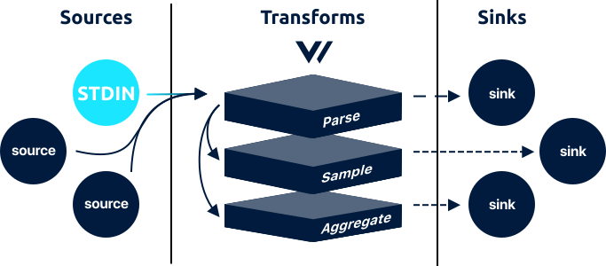

# stdin source



The `stdin` source allows you ingest [`log`](../../../about/data-model.md#log) events via [`STDIN`](https://en.wikipedia.org/wiki/Standard_streams#Standard_input_%28stdin%29).

## Example



```coffeescript
[sources.<source-id>]
    # REQUIRED
    type = "stdin"
    
    # OPTIONAL
    host_key = "host"
    max_length = 10240 # 10mib
```



## Options

<table>
  <thead>
    <tr>
      <th style="text-align:left">Key</th>
      <th style="text-align:center">Type</th>
      <th style="text-align:left">Description</th>
    </tr>
  </thead>
  <tbody>
    <tr>
      <td style="text-align:left"><b>OPTIONAL</b>
      </td>
      <td style="text-align:center"></td>
      <td style="text-align:left"></td>
    </tr>
    <tr>
      <td style="text-align:left"><code>host_key</code>
      </td>
      <td style="text-align:center"><code>string</code>
      </td>
      <td style="text-align:left">
        <p>The name of the key used for the local host. See Context for more info.</p>
        <p><code>default: &quot;host&quot;</code>
        </p>
      </td>
    </tr>
    <tr>
      <td style="text-align:left"><code>max_length</code>
      </td>
      <td style="text-align:center"><code>int</code>
      </td>
      <td style="text-align:left">
        <p>The maximum length, in bytes, that a single line can be. If exceeded,
          the line will be discarded.</p>
        <p><code>default: 102400</code> (100 mib)</p>
      </td>
    </tr>
  </tbody>
</table>## Output

The `stdin` source outputs [`log`](../../../about/data-model.md#log) events with the following [default schema](../../../about/data-model.md#default-schema):



```javascript
{
    "timestamp": "<timestamp>",
    "message": "<line>",
    "host": "<host>"
}
```



## How It Works

### Context

The `stdin` adds the following key as context:

* `"host"` - The value of `HOSTNAME` for the local host.

The key names can be changed with the [Context options](stdin.md#options). An example can be seen in the [Output section](stdin.md#output).

### Guarantees

The `stdin` source is capable of achieving an **at least once delivery guarantee** if your [pipeline is configured to achieve this](../../../about/guarantees.md#at-least-once-delivery).

### Line Delimiters

Each line is read until a new line delimiter \(the `0xA` byte\) is found.

### Sending Data

To send data to Vector over STDIN you can simply pipe input to Vector when starting it:

```bash
echo "Hello world\nGoodbye world" | vector --config vector.toml
```

## Resources

* [Source code](https://github.com/timberio/vector/blob/master/src/sources/stdin.rs)
* [Issues](https://github.com/timberio/vector/issues?q=is%3Aopen+is%3Aissue+label%3A%22Source%3A+STDIN%22)

