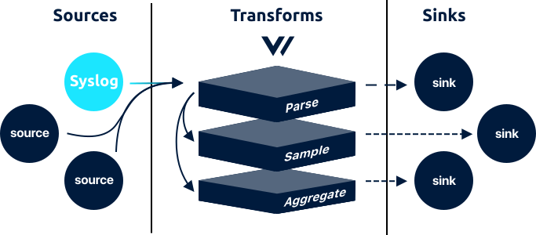

# syslog source



The `syslog` source allows you to ingest [`log`](../../../about/data-model.md#log) events via the [Syslog system](https://en.wikipedia.org/wiki/Syslog).

## Example



```coffeescript
[sources.<source-id>]
    # REQUIRED
    type    = "syslog"
    mode    = "{tcp | udp | unix}"
    address = "123.123.123.123:9000" # only if mode = "tcp"
    path    = "/path/to/unix/socket" # only if mode = "udp"
    
    # OPTIONAL - general
    max_length = 2048
    
    # OPTIONAL - context
    host_key      = "host"
    peer_path_key = "peer_path"
```



## Options

<table>
  <thead>
    <tr>
      <th style="text-align:left">Key</th>
      <th style="text-align:center">Type</th>
      <th style="text-align:left">Description</th>
    </tr>
  </thead>
  <tbody>
    <tr>
      <td style="text-align:left"><b>REQUIRED</b>
      </td>
      <td style="text-align:center"></td>
      <td style="text-align:left"></td>
    </tr>
    <tr>
      <td style="text-align:left"><code>mode</code>
      </td>
      <td style="text-align:center"><code>string</code>
      </td>
      <td style="text-align:left">
        <p>The Syslog input mode.</p>
        <p><code>enum: &quot;tcp&quot;, &quot;udp&quot;, &quot;unix&quot;</code>
        </p>
      </td>
    </tr>
    <tr>
      <td style="text-align:left"><code>address</code>
      </td>
      <td style="text-align:center"><code>string</code>
      </td>
      <td style="text-align:left">
        <p>The TCP or UDP address to listen on. Only relevant when <code>mode</code> is
          set to <code>tcp</code> or <code>udp</code>. Use <code>0.0.0.0:&lt;port&gt;</code> if
          you&apos;d like to accept data from remote instances, and <code>127.0.0.1:&lt;port&gt;</code> if
          you&apos;d like to accept data locally.</p>
        <p><code>example: &quot;0.0.0.0:9000&quot;</code>
        </p>
      </td>
    </tr>
    <tr>
      <td style="text-align:left"><code>path</code>
      </td>
      <td style="text-align:center"><code>string</code>
      </td>
      <td style="text-align:left">
        <p>The unix socket path. Only relevant when <code>mode</code> is set to <code>unix</code>.</p>
        <p><code>example: &quot;/path/to/socket&quot;</code>
        </p>
      </td>
    </tr>
    <tr>
      <td style="text-align:left"><b>OPTIONAL</b> - General</td>
      <td style="text-align:center"></td>
      <td style="text-align:left"></td>
    </tr>
    <tr>
      <td style="text-align:left"><code>max_length</code>
      </td>
      <td style="text-align:center"><code>int</code>
      </td>
      <td style="text-align:left">
        <p>The maximum length, in bytes, that a single message can be. If exceeded,
          the message will be discarded.</p>
        <p><code>default: 102400</code> (100 mib)</p>
      </td>
    </tr>
    <tr>
      <td style="text-align:left"><b>OPTIONAL</b> - Context</td>
      <td style="text-align:center"></td>
      <td style="text-align:left"></td>
    </tr>
    <tr>
      <td style="text-align:left"><code>host_key</code>
      </td>
      <td style="text-align:center"><code>string</code>
      </td>
      <td style="text-align:left">
        <p>The name of the key to use for the upstream client address. Only relevant
          when <code>mode</code> is <code>tcp</code> or <code>udp</code>. See <a href="syslog.md#context">Context</a> for
          more info.</p>
        <p><code>default: &quot;host&quot;</code>
        </p>
      </td>
    </tr>
    <tr>
      <td style="text-align:left"><code>peer_path_key</code>
      </td>
      <td style="text-align:center"><code>string</code>
      </td>
      <td style="text-align:left">
        <p>The name of the key to use for the domain socket path. Only relevant when <code>mode</code> is <code>unix</code>.
          See Context for more info.</p>
        <p><code>default: &quot;peer_path&quot;</code>
        </p>
      </td>
    </tr>
  </tbody>
</table>## Output

The `syslog` source outputs [`log`](../../../about/data-model.md#log) events with the following [default schema](../../../about/data-model.md#default-schema):



```javascript
{
    "timestamp": "<timestamp>",
    "message": "<line>",
    "host": "<host>", // only if mode = {"tcp" | "udp"}
    "peer_path": "<socket-path>" // only if mode = "unix"
}
```



## How It Works

### Context

Each line is augmented with the following context keys:

* `"host"` - Only relevant when `mode` is `tcp` or `udp`. Represents the host of the upstream client.
* `"peer_path"` - Only relevant when `mode` is `udp`. The value of the socket location

The key names can be changed with the [Context options](syslog.md#options). An example can be seen in the [Output section](file.md#output).

### Guarantees

The `syslog` source is capable of achieving an [**at least once delivery guarantee**](../../../about/guarantees.md#at-least-once-delivery) if your [pipeline is configured to achieve this](../../../about/guarantees.md#at-least-once-delivery) _and_ you use the `tcp` or `unix` `mode`.

### Line Delimiters

Each line is read until a new line delimiter \(the `0xA` byte\) is found.

### Parsing

Vector will parse messages in the [Syslog 5424 format](https://tools.ietf.org/html/rfc5424).

#### Successful parsing

Upon successful parsing, Vector will create a structured [event](../../../about/concepts.md#events). For example, given this Syslog message:

```text
<13>1 2019-02-13T19:48:34+00:00 74794bfb6795 root 8449 - [meta sequenceId="1"] i am foobar
```

Vector will produce an event with this structure.

```javascript
{
    "message": "<13>1 2019-02-13T19:48:34+00:00 74794bfb6795 root 8449 - [meta sequenceId="1"] i am foobar",
    "timestamp": "2019-02-13T19:48:34+00:00",
    "host": "74794bfb6795"
}
```

#### Unsuccessful parsing

Anyone with Syslog experience knows there are often deviations from the Syslog specifications. Vector tries its best to account for these \(note the tests [here](https://github.com/timberio/vector/blob/master/src/sources/syslog.rs)\). In the event Vector fails to parse your format, we recommend that you [open an issue](https://github.com/timberio/vector/issues/new) informing us of this, and then proceed to use the [`tcp`](tcp.md) , [`udp`](udp.md), or [`unix`](unix.md) source coupled with a parser [transform](../transforms/) of your choice.

## Resources

* [Source code](https://github.com/timberio/vector/blob/master/src/sources/syslog.rs)
* [Issues](https://github.com/timberio/vector/labels/Source%3A%20Syslog)

