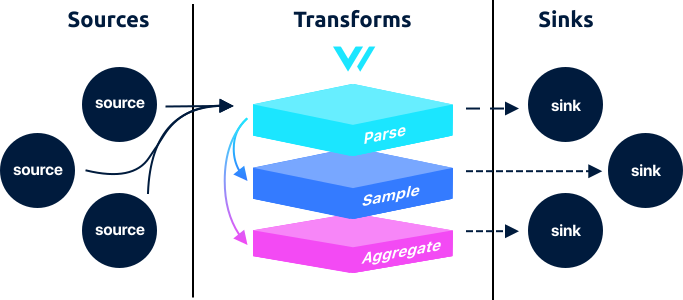

# Transforms

Transforms are in the middle of the [pipeline](../../../about/concepts.md#pipelines), sitting in-between [sources](../sources/) and [sinks](../sinks/). They transform [events](../../../about/data-model.md#event) or the stream as a whole.

## How It Works

### Event Types

#### Input & Output

Every transform will include an "Input" and "Output" section. This helps you to understand it's compatibility with the [event types](../../../about/data-model.md#event).

#### Connectivity

Transforms must be connected to other sources or transforms that output the supported input. For example, a source that outputs a [`log`](../../../about/data-model.md#log) event type must be connected to a transform that inputs a [`log`](../../../about/data-model.md#log) event type.\

#### Transitioning Types

It is possible for transforms to convert a window of `log` events into a `metric` events.

