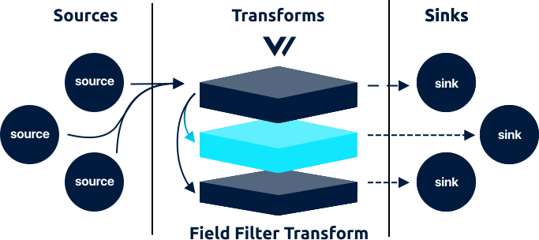

<!---
!!!WARNING!!!!

This file is autogenerated! Please do not manually edit this file.
Instead, please modify the contents of `/.metadata.toml`.
-->


# field_filter transform




The `field_filter` transform is in beta. Please see the current [enhancements](https://github.com/timberio/vector/issues?q=is%3Aopen+is%3Aissue+label%3A%22Transform%3A+field_filter%22+label%3A%22Type%3A+Enhancement%22) and [bugs](https://github.com/timberio/vector/issues?q=is%3Aopen+is%3Aissue+label%3A%22Transform%3A+field_filter%22+label%3A%22Type%3A+Bug%22) for known issues. We kindly ask that you [add any missing issues](https://github.com/timberio/vector/issues/new?labels=Transform%3A+field_filter) as it will help shape the roadmap of this component.

The `field_filter` transforms accepts [`log`][docs.log_event] and [`metric`][docs.metric_event] events and allows you to filter events by a field's value.

## Config File



```coffeescript
[transforms.my_field_filter_transform_id]
  # REQUIRED - General
  type = "field_filter" # must be: field_filter
  inputs = ["\"my-source-id\""]
  field = "file"
  value = "/var/log/nginx.log"
```


```coffeescript
[transforms.<transform-id>]
  # REQUIRED - General
  type = "field_filter"
  inputs = ["<string>", ...]
  field = "<string>"
  value = "<string>"
```


```coffeescript
[transforms.field_filter]
  # REQUIRED - General

  # The component type
  #
  # * must be: field_filter
  type = "field_filter"

  # A list of upstream source for more info.
  inputs = ["\"my-source-id\""]

  # The target field to compare against the `value`.
  field = "file"

  # If the value of the specified `field` matches this value then the event will
  # be permitted, otherwise it is dropped.
  value = "/var/log/nginx.log"
```



## Options

| Key  | Type  | Description |
| :--- | :---: | :---------- |
| `type` | `string` | The component type<br />`required` `enum: "field_filter"` |
| `inputs` | `[string]` | A list of upstream [source][docs.sources] or [transform][docs.transforms] IDs. See [Config Composition][docs.config_composition] for more info.<br />`required` `example: ["my-source-id"]` |
| `field` | `string` | The target field to compare against the `value`.<br />`required` `example: "file"` |
| `value` | `string` | If the value of the specified `field` matches this value then the event will be permitted, otherwise it is dropped.<br />`required` `example: "/var/log/nginx.log"` |


## How It Works

### Complex Comparisons

The `field_filter` transform is designed for simple equality filtering, it is not designed for complex comparisons. There are plans to build a `filter` transform that accepts more complex filtering. See [Issue #479][url.issue_479] for more info.

## Troubleshooting

The best place to start with troubleshooting is to check the
[Vector logs][docs.monitoring_logs]. This is typically located at
`/var/log/vector.log`, then proceed to follow the
[Troubleshooting Guide][docs.troubleshooting].

If the [Troubleshooting Guide][docs.troubleshooting] does not resolve your
issue, please:

1. Check for any [open transform issues](https://github.com/timberio/vector/issues?q=is%3Aopen+is%3Aissue+label%3A%22Transform%3A+field_filter%22).
2. [Search the forum][url.search_forum] for any similar issues.
2. Reach out to the [community][url.community] for help.

## Resources

* [**Issues**](https://github.com/timberio/vector/issues?q=is%3Aopen+is%3Aissue+label%3A%22Transform%3A+field_filter%22) - [enhancements](https://github.com/timberio/vector/issues?q=is%3Aopen+is%3Aissue+label%3A%22Transform%3A+field_filter%22+label%3A%22Type%3A+Enhancement%22) - [bugs](https://github.com/timberio/vector/issues?q=is%3Aopen+is%3Aissue+label%3A%22Transform%3A+field_filter%22+label%3A%22Type%3A+Bug%22)
* [**Source code**](https://github.com/timberio/vector/tree/master/src/transform/field_filter.rs)


[docs.config_composition]: ../../../usage/configuration/README.md#composition
[docs.log_event]: ../../../about/data-model.md#log
[docs.metric_event]: ../../../about/data-model.md#metric
[docs.monitoring_logs]: ../../../usage/administration/monitoring.md#logs
[docs.sources]: ../../../usage/configuration/sources
[docs.transforms]: ../../../usage/configuration/transforms
[docs.troubleshooting]: ../../../usage/guides/troubleshooting.md
[url.community]: https://vector.dev/community
[url.issue_479]: https://github.com/timberio/vector/issues/479
[url.search_forum]: https://forum.vector.dev/search?expanded=true
