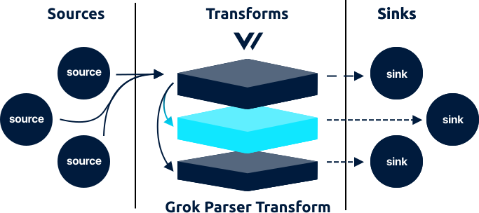

<!---
!!!WARNING!!!!

This file is autogenerated! Please do not manually edit this file.
Instead, please modify the contents of `dist/config/schema.toml`.
-->


# grok_parser transform




The `grok_parser` transforms accepts [`log`][log_event] events and allows you to parse a field value with [Grok][grok].

## Example



```coffeescript
[transforms.my_grok_parser_transform]
  # REQUIRED - General
  type = "grok_parser"
  inputs = ["my-source-id"]

  # OPTIONAL - General
  drop_field = true # default
  field = "message" # default
  pattern = "%{TIMESTAMP_ISO8601:timestamp} %{LOGLEVEL:level} %{GREEDYDATA:message}" # no default
```


```coffeescript
[transforms.<transform-id>]
  # REQUIRED - General
  type = "<string>"
  inputs = "<string>"

  # OPTIONAL - General
  drop_field = <bool>
  field = "<string>"
  pattern = "<string>"
```



## Options

| Key  | Type  | Description |
| :--- | :---: | :---------- |
| **REQUIRED** | | |
| `inputs` | `string` | A list of upstream [source][sources] or [transform][transforms] IDs. See [Config Composition][config_composition] for more info.<br />`required` `example: ["my-source-id"]` |
| **OPTIONAL** | | |
| `drop_field` | `bool` | If `true` will drop the `field` after parsing.<br />`default: true` |
| `field` | `string` | The field to execute the `pattern` against. Must be a `string` value.<br />`default: "message"` |
| `pattern` | `string` | The [Grok pattern][grok_patterns]<br />`no default` `example: (see above)` |

## I/O

The `grok_parser` accepts [`log`][log_event] events and outputs [`log`][log_event] events.


## How It Works

### Debugging

We recommend the [Grok debugger][grok_debugger] for Grok testing.

### Patterns

Vector uses the Rust [`grok` library][rust_grok_library]. All patterns [listed here][grok_patterns] are supported. It is recommended to use any maintained patterns when possible.

### Performance

Grok is approximately 50% slower than it's Regex counterpart. We plan to add a [performance test][performance] for this in the future. While this is still plenty fast for most use cases we recommend using the [`regex_parser` transform][regex_parser_transform] if you are experiencing performance issues.

## Troubleshooting

The best place to start with troubleshooting is to check the
[Vector logs][monitoring_logs]. This is typically located at
`/var/log/vector.log`, then proceed to follow the
[Troubleshooting Guide][troubleshooting].

If the [Troubleshooting Guide][troubleshooting] does not resolve your
issue, please:

1. Check for any [open transform issues](https://github.com/timberio/vector/issues?q=is%3Aopen+is%3Aissue+label%3A%22Transform%3A+grok_parser%22).
2. [Search the forum][search_forum] for any similar issues.
2. Reach out to the [community][community] for help.
### Alternatives

Finally, consider the following alternatives:

* [`lua` transform][lua_transform]
* [`regex_parser` transform][regex_parser_transform]
* [`tokenizer` transform][tokenizer_transform]

## Resources

* [**Issues**](https://github.com/timberio/vector/issues?q=is%3Aopen+is%3Aissue+label%3A%22Transform%3A+grok_parser%22) - [enhancements](https://github.com/timberio/vector/issues?q=is%3Aopen+is%3Aissue+label%3A%22Transform%3A+grok_parser%22+label%3A%22Type%3A+Enhancement%22) - [bugs](https://github.com/timberio/vector/issues?q=is%3Aopen+is%3Aissue+label%3A%22Transform%3A+grok_parser%22+label%3A%22Type%3A+Bug%22)
* [**Source code**](https://github.com/timberio/vector/tree/master/src/transform/grok_parser.rs)
* [**Grok Debugger**](grok_debugger)
* [**Grok Patterns**](grok_patterns)


[grok]: "http://grokdebug.herokuapp.com/"
[log_event]: "../../../about/data-model.md#log"
[sources]: "../../../usage/configuration/sources"
[transforms]: "../../../usage/configuration/transforms"
[config_composition]: "../../../usage/configuration/README.md#composition"
[grok_patterns]: "https://github.com/daschl/grok/tree/master/patterns"
[grok_debugger]: "http://grokdebug.herokuapp.com/"
[rust_grok_library]: "https://github.com/daschl/grok"
[performance]: "../../../performance.md"
[regex_parser_transform]: "../../../usage/configuration/transform/regex_parser.md"
[monitoring_logs]: "../../../administration/moonitoring.md#logs"
[troubleshooting]: "../../../usages/guides/troubleshooting.md"
[search_forum]: "https://forum.vectorproject.io/search?expanded=true"
[community]: "https://vectorproject.io/community"
[lua_transform]: "../../../usage/configuration/transform/lua.md"
[tokenizer_transform]: "../../../usage/configuration/transform/tokenizer.md"

