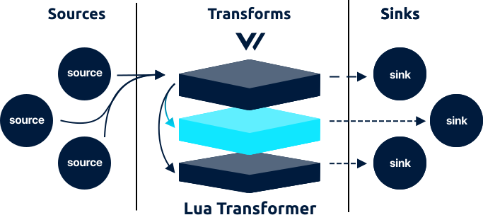

<!---
!!!WARNING!!!!

This file is autogenerated! Please do not manually edit this file.
Instead, please modify the contents of `scripts/schema.toml`.
-->


# lua transform




The `lua` transform is in beta. Please see the current [enhancements](https://github.com/timberio/vector/issues?q=is%3Aopen+is%3Aissue+label%3A%22Transform%3A+lua%22+label%3A%22Type%3A+Enhancement%22) and [bugs](https://github.com/timberio/vector/issues?q=is%3Aopen+is%3Aissue+label%3A%22Transform%3A+lua%22+label%3A%22Type%3A+Bug%22) for known issues. We kindly ask that you [add any missing issues](https://github.com/timberio/vector/issues/new?labels=Transform%3A+lua) as it will help shape the roadmap of this component.

The `lua` transforms accepts [`log`][log_event] events and allows you to transform events with a full embedded [Lua][lua] engine.

## Example



```coffeescript
[transforms.my_lua_transform]
  # REQUIRED - General
  type = "lua" # must be: lua
  inputs = ["my-source-id"]

  # OPTIONAL - General
  search_dirs = true # no default
  source = """
  require("script") # a `script.lua` file must be in your `search_dirs`

  if event["host"] == nil then
    local f = io.popen ("/bin/hostname")
    local hostname = f:read("*a") or ""
    f:close()
    hostname = string.gsub(hostname, "\n$", "")
    event["host"] = hostname
  end
  """
```


```coffeescript
[transforms.<transform-id>]
  # REQUIRED - General
  type = {"lua"}
  inputs = "<string>"

  # OPTIONAL - General
  search_dirs = ["<string>", ...]
  source = "<string>"
```


```coffeescript
[transforms.lua]
  # REQUIRED - General

  # The component type
  #
  # * must be: lua
  type = "lua"

  # A list of upstream source for more info.
  inputs = ["my-source-id"]

  # OPTIONAL - General

  # A list of directories search when loading a Lua file via the `require`
  # function.
  #
  # * no default
  search_dirs = true

  # The inline Lua source to evaluate.
  #
  # * no default
  source = """
  require("script") # a `script.lua` file must be in your `search_dirs`

  if event["host"] == nil then
    local f = io.popen ("/bin/hostname")
    local hostname = f:read("*a") or ""
    f:close()
    hostname = string.gsub(hostname, "\n$", "")
    event["host"] = hostname
  end
  """
```



## Options

| Key  | Type  | Description |
| :--- | :---: | :---------- |
| **REQUIRED** | | |
| `type` | `string` | The component type<br />`required` `enum: "lua"` |
| `inputs` | `string` | A list of upstream [source][sources] or [transform][transforms] IDs. See [Config Composition][config_composition] for more info.<br />`required` `example: ["my-source-id"]` |
| **OPTIONAL** | | |
| `search_dirs` | `[string]` | A list of directories search when loading a Lua file via the `require` function. See [Search Directories](#search-directories) for more info.<br />`no default` `example: true` |
| `source` | `string` | The inline Lua source to evaluate. See [Global Variables](#global-variables) for more info.<br />`no default` `example: (see above)` |

## I/O

The `lua` transform accepts [`log`][log_event] events and outputs [`log`][log_event] events.


Here are a few example Lua scripts that demonstrate working with the [`event` variable](#global-variables). You can pass these examples to the `source` option:



```lua
# Add root level field
event["new_field"] = "new value"

# Add nested field
event["parent.child"] = "nested value"
```


```lua
# Remove root level field
event["field"] = nil

# Remove nested field
event["parent.child"] = nil
```


```lua
# To drop an event entirely
event = nil
```




## How It Works

### Dropping Events

To drop events, simply set the `event` variable to `nil`. For example:

```lua
if event["message"].match(str, "debug") then
  event = nil
end
```

### Global Variables

When evaluating the provided `source`, Vector will provide a single global variable representing the event:

| Name | Type | Description |
| :--- | :--: | :---------- |
| `event` | [`table`][lua_table] | The current [`log` event]. Depending on prior processing the structure of your event will vary. Generally though, it will follow the [default event schema][default_schema].

Note, a Lua `table` is an associative array. You can read more about [Lua types][lua_types] in the [Lua docs][lua_docs].

### Nested Fields

As described in the [Data Model document][data_model], Vector flatten events, representing nested field with a `.` delimiter. Therefore, adding, accessing, or removing nested fields is as simple as added a `.` in your key name:

```lua
# Add nested field
event["parent.child"] = "nested value"

# Remove nested field
event["parent.child"] = nil
```

### Search Directories

Vector provides a `search_dirs` option that allows you to specify absolute paths that will searched when using the [Lua `require` function][lua_require].

## Troubleshooting

The best place to start with troubleshooting is to check the
[Vector logs][monitoring_logs]. This is typically located at
`/var/log/vector.log`, then proceed to follow the
[Troubleshooting Guide][troubleshooting].

If the [Troubleshooting Guide][troubleshooting] does not resolve your
issue, please:

1. Check for any [open transform issues](https://github.com/timberio/vector/issues?q=is%3Aopen+is%3Aissue+label%3A%22Transform%3A+lua%22).
2. [Search the forum][search_forum] for any similar issues.
2. Reach out to the [community][community] for help.

### Alternatives

Finally, consider the following alternatives:

* [`grok_parser` transform][grok_parser_transform]
* [`regex_parser` transform][regex_parser_transform]
* [`tokenizer` transform][tokenizer_transform]

## Resources

* [**Issues**](https://github.com/timberio/vector/issues?q=is%3Aopen+is%3Aissue+label%3A%22Transform%3A+lua%22) - [enhancements](https://github.com/timberio/vector/issues?q=is%3Aopen+is%3Aissue+label%3A%22Transform%3A+lua%22+label%3A%22Type%3A+Enhancement%22) - [bugs](https://github.com/timberio/vector/issues?q=is%3Aopen+is%3Aissue+label%3A%22Transform%3A+lua%22+label%3A%22Type%3A+Bug%22)
* [**Source code**](https://github.com/timberio/vector/tree/master/src/transform/lua.rs)
* [**Lua Reference Manual**](http://www.lua.org/manual/5.1/manual.html)


[lua]: "https://www.lua.org/"
[log_event]: "../../../about/data-model.md#log"
[sources]: "../../../usage/configuration/sources"
[transforms]: "../../../usage/configuration/transforms"
[config_composition]: "../../../usage/configuration/README.md#composition"
[lua_table]: "https://www.lua.org/manual/2.2/section3_3.html"
[default_schema]: "../../../about/data_model.md#default-schema"
[lua_types]: "https://www.lua.org/manual/2.2/section3_3.html"
[lua_docs]: "https://www.lua.org/manual/5.3/"
[data_model]: "../../../about/data_model.md"
[lua_require]: "http://www.lua.org/manual/5.1/manual.html#pdf-require"
[monitoring_logs]: "../../../administration/moonitoring.md#logs"
[troubleshooting]: "../../../usages/guides/troubleshooting.md"
[search_forum]: "https://forum.vectorproject.io/search?expanded=true"
[community]: "https://vectorproject.io/community"
[grok_parser_transform]: "../../../usage/configuration/transforms/grok_parser.md"
[regex_parser_transform]: "../../../usage/configuration/transforms/regex_parser.md"
[tokenizer_transform]: "../../../usage/configuration/transforms/tokenizer.md"

