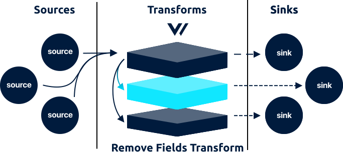

<!---
!!!WARNING!!!!

This file is autogenerated! Please do not manually edit this file.
Instead, please modify the contents of `scripts/metadata.toml`.
-->


# remove_fields transform




The `remove_fields` transforms accepts [`log`][docs.log_event] and [`metric`][docs.metric_event] events and allows you to remove one or more event fields.

## Example



```coffeescript
[transforms.my_remove_fields_transform]
  # REQUIRED - General
  type = "remove_fields" # must be: remove_fields
  inputs = ["my-source-id"]

  # OPTIONAL - General
  fields = ["field1", "field2"] # no default
```


```coffeescript
[transforms.<transform-id>]
  # REQUIRED - General
  type = {"remove_fields"}
  inputs = "<string>"

  # OPTIONAL - General
  fields = ["<string>", ...]
```


```coffeescript
[transforms.remove_fields]
  # REQUIRED - General

  # The component type
  #
  # * must be: remove_fields
  type = "remove_fields"

  # A list of upstream source for more info.
  inputs = ["my-source-id"]

  # OPTIONAL - General

  # The field names to drop.
  #
  # * no default
  fields = ["field1", "field2"]
```



## Options

| Key  | Type  | Description |
| :--- | :---: | :---------- |
| **REQUIRED** | | |
| `type` | `string` | The component type<br />`required` `enum: "remove_fields"` |
| `inputs` | `string` | A list of upstream [source][docs.sources] or [transform][docs.transforms] IDs. See [Config Composition][docs.config_composition] for more info.<br />`required` `example: ["my-source-id"]` |
| **OPTIONAL** | | |
| `fields` | `[string]` | The field names to drop.<br />`no default` `example: ["field1", "field2"]` |

## I/O

The `remove_fields` transform accepts [`log`][docs.log_event] and [`metric`][docs.metric_event] events and outputs [`log`][docs.log_event] and [`metric`][docs.metric_event] events.


## Troubleshooting

The best place to start with troubleshooting is to check the
[Vector logs][docs.monitoring_logs]. This is typically located at
`/var/log/vector.log`, then proceed to follow the
[Troubleshooting Guide][docs.troubleshooting].

If the [Troubleshooting Guide][docs.troubleshooting] does not resolve your
issue, please:

1. Check for any [open transform issues](https://github.com/timberio/vector/issues?q=is%3Aopen+is%3Aissue+label%3A%22Transform%3A+remove_fields%22).
2. [Search the forum][url.search_forum] for any similar issues.
2. Reach out to the [community][url.community] for help.

### Alternatives

Finally, consider the following alternatives:

* [`add_fields` transform][docs.add_fields_transform]

## Resources

* [**Issues**](https://github.com/timberio/vector/issues?q=is%3Aopen+is%3Aissue+label%3A%22Transform%3A+remove_fields%22) - [enhancements](https://github.com/timberio/vector/issues?q=is%3Aopen+is%3Aissue+label%3A%22Transform%3A+remove_fields%22+label%3A%22Type%3A+Enhancement%22) - [bugs](https://github.com/timberio/vector/issues?q=is%3Aopen+is%3Aissue+label%3A%22Transform%3A+remove_fields%22+label%3A%22Type%3A+Bug%22)
* [**Source code**](https://github.com/timberio/vector/tree/master/src/transform/remove_fields.rs)


[docs.add_fields_transform]: ../../../usage/configuration/transforms/add_fields.md
[docs.config_composition]: ../../../usage/configuration/README.md#composition
[docs.log_event]: ../../../about/data-model.md#log
[docs.metric_event]: ../../../about/data-model.md#metric
[docs.monitoring_logs]: ../../../usage/administration/monitoring.md#logs
[docs.sources]: ../../../usage/configuration/sources
[docs.transforms]: ../../../usage/configuration/transforms
[docs.troubleshooting]: ../../../usage/guides/troubleshooting.md
[url.community]: https://vector.dev/community
[url.search_forum]: https://forum.vector.dev/search?expanded=true
