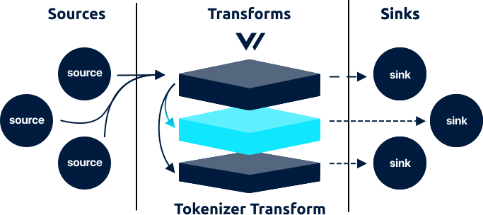

<!---
!!!WARNING!!!!

This file is autogenerated! Please do not manually edit this file.
Instead, please modify the contents of `/.metadata.toml`.
-->


# tokenizer transform




The `tokenizer` transforms accepts [`log`][docs.log_event] events and allows you to tokenize a field's value by splitting on white space, ignoring special wrapping characters, and zipping the tokens into ordered field names.

## Config File



```coffeescript
[transforms.my_tokenizer_transform_id]
  # REQUIRED - General
  type = "tokenizer" # must be: tokenizer
  inputs = ["\"my-source-id\""]
  field_names = ["\"timestamp\"", "\"level\"", "\"message\""]

  # OPTIONAL - General
  drop_field = true # default
  field = "message" # default

  # OPTIONAL - Types
  [transforms.my_tokenizer_transform_id.types]
    status = "int"
    duration = "float"
    success = "bool"
    timestamp = "timestamp|%s" # unix
    timestamp = "timestamp|%+" # iso8601 (date and time)
    timestamp = "timestamp|%F" # iso8601 (date)
    timestamp = "timestamp|%a %b %e %T %Y" # custom strftime format
```


```coffeescript
[transforms.<transform-id>]
  # REQUIRED - General
  type = "tokenizer"
  inputs = ["<string>", ...]
  field_names = ["<string>", ...]

  # OPTIONAL - General
  drop_field = <bool>
  field = "<string>"

  # OPTIONAL - Types
  [transforms.<transform-id>.types]
    * = {"string" | "int" | "float" | "bool" | "timestamp|strftime"}
```


```coffeescript
[transforms.tokenizer]
  # REQUIRED - General

  # The component type
  #
  # * must be: tokenizer
  type = "tokenizer"

  # A list of upstream source for more info.
  inputs = ["\"my-source-id\""]

  # The field names assigned to the resulting tokens, in order.
  field_names = ["\"timestamp\"", "\"level\"", "\"message\""]

  # OPTIONAL - General

  # If `true` the `field` will be dropped after parsing.
  #
  # * default: true
  drop_field = true

  # The field to tokenize.
  #
  # * default: message
  field = "message"

  # OPTIONAL - Types
  [transforms.tokenizer.types]

    # A definition of mapped field types. They key is the field name and the value
    # is the type. `strftime` specifiers are supported for the `timestamp` type.
    #
    # * no default
    # * enum: string, int, float, bool, timestamp|strftime
    status = "int"
    duration = "float"
    success = "bool"
    timestamp = "timestamp|%s" # unix
    timestamp = "timestamp|%+" # iso8601 (date and time)
    timestamp = "timestamp|%F" # iso8601 (date)
    timestamp = "timestamp|%a %b %e %T %Y" # custom strftime format
```



## Options

| Key  | Type  | Description |
| :--- | :---: | :---------- |
| **REQUIRED** - General | | |
| `type` | `string` | The component type<br />`required` `enum: "tokenizer"` |
| `inputs` | `[string]` | A list of upstream [source][docs.sources] or [transform][docs.transforms] IDs. See [Config Composition][docs.config_composition] for more info.<br />`required` `example: ["my-source-id"]` |
| `field_names` | `[string]` | The field names assigned to the resulting tokens, in order.<br />`required` `example: (see above)` |
| **OPTIONAL** - General | | |
| `drop_field` | `bool` | If `true` the `field` will be dropped after parsing.<br />`default: true` |
| `field` | `string` | The field to tokenize.<br />`default: "message"` |
| **OPTIONAL** - Types | | |
| `types.*` | `string` | A definition of mapped field types. They key is the field name and the value is the type. [`strftime` specifiers][url.strftime_specifiers] are supported for the `timestamp` type.<br />`no default` `enum: "string", "int", "float", "bool", "timestamp\|strftime"` |

## Examples


Given the following log line:



```json
{
  "message": "5.86.210.12 - zieme4647 [19/06/2019:17:20:49 -0400] "GET /embrace/supply-chains/dynamic/vertical" 201 20574"
}
```



And the following configuration:



```coffeescript
[transforms.<transform-id>]
type = "tokenizer"
field = "message"
fields = ["remote_addr", "ident", "user_id", "timestamp", "message", "status", "bytes"]
```



A [`log` event][docs.log_event] will be emitted with the following structure:

```javascript
{
  // ... existing fields
  "remote_addr": "5.86.210.12",
  "user_id": "zieme4647",
  "timestamp": "19/06/2019:17:20:49 -0400",
  "message": "GET /embrace/supply-chains/dynamic/vertical",
  "status": "201",
  "bytes": "20574"
}
```

A few things to note about the output:

1. The `message` field was overwritten.
2. The `ident` field was dropped since it contained a `"-"` value.
3. All values are strings, we have plans to add type coercion.
4. [Special wrapper characters](#special-characters) were dropped, such as wrapping `[...]` and `"..."` characters.


## How It Works

### Special Characters

In order to extract raw values and remove wrapping characters, we must treat certain characters as special. These characters will be discarded:

* `"..."` - Is used tp wrap phrases. Spaces are preserved, but the wrapping quotes will be discarded.
* `[...]` - Is used to wrap phrases. Spaces are preserved, but the wrapping brackers will be discarded.
* `\` - Can be used to escape the above characters, making them literal.

### Type Coercion

body

## Troubleshooting

The best place to start with troubleshooting is to check the
[Vector logs][docs.monitoring_logs]. This is typically located at
`/var/log/vector.log`, then proceed to follow the
[Troubleshooting Guide][docs.troubleshooting].

If the [Troubleshooting Guide][docs.troubleshooting] does not resolve your
issue, please:

1. Check for any [open transform issues](https://github.com/timberio/vector/issues?q=is%3Aopen+is%3Aissue+label%3A%22Transform%3A+tokenizer%22).
2. [Search the forum][url.search_forum] for any similar issues.
2. Reach out to the [community][url.community] for help.

### Alternatives

Finally, consider the following alternatives:

* [`grok_parser` transform][docs.grok_parser_transform]
* [`lua` transform][docs.lua_transform]
* [`regex_parser` transform][docs.regex_parser_transform]

## Resources

* [**Issues**](https://github.com/timberio/vector/issues?q=is%3Aopen+is%3Aissue+label%3A%22Transform%3A+tokenizer%22) - [enhancements](https://github.com/timberio/vector/issues?q=is%3Aopen+is%3Aissue+label%3A%22Transform%3A+tokenizer%22+label%3A%22Type%3A+Enhancement%22) - [bugs](https://github.com/timberio/vector/issues?q=is%3Aopen+is%3Aissue+label%3A%22Transform%3A+tokenizer%22+label%3A%22Type%3A+Bug%22)
* [**Source code**](https://github.com/timberio/vector/tree/master/src/transform/tokenizer.rs)


[docs.config_composition]: ../../../usage/configuration/README.md#composition
[docs.grok_parser_transform]: ../../../usage/configuration/transforms/grok_parser.md
[docs.log_event]: ../../../about/data-model.md#log
[docs.lua_transform]: ../../../usage/configuration/transforms/lua.md
[docs.monitoring_logs]: ../../../usage/administration/monitoring.md#logs
[docs.regex_parser_transform]: ../../../usage/configuration/transforms/regex_parser.md
[docs.sources]: ../../../usage/configuration/sources
[docs.transforms]: ../../../usage/configuration/transforms
[docs.troubleshooting]: ../../../usage/guides/troubleshooting.md
[url.community]: https://vector.dev/community
[url.search_forum]: https://forum.vector.dev/search?expanded=true
[url.strftime_specifiers]: https://docs.rs/chrono/0.3.1/chrono/format/strftime/index.html
