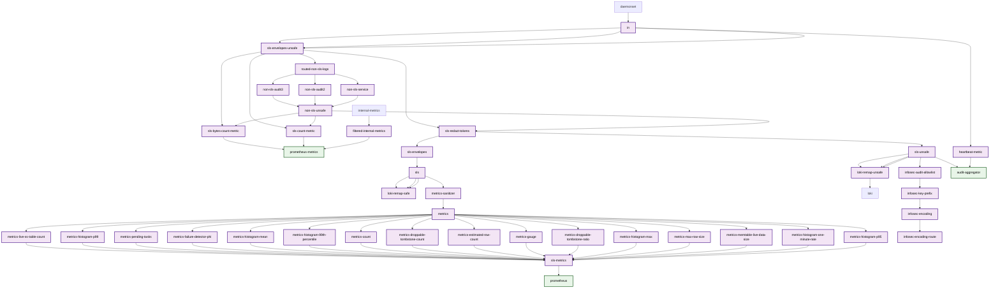

```mermaid
---
id: cc9c7a3a-a79e-439d-baae-1c6e626cdee8
---
graph TD
    class daemonset Source
    daemonset --> in
    class in Transform
    in --> sls-envelopes-unsafe
    class sls-envelopes-unsafe Transform
    sls-envelopes-unsafe --> sls-bytes-count-metric
    class sls-bytes-count-metric Transform
    sls-bytes-count-metric --> prometheus-metrics
    class prometheus-metrics Sink
    sls-envelopes-unsafe --> sls-redact-tokens
    class sls-redact-tokens Transform
    sls-redact-tokens --> sls-envelopes
    class sls-envelopes Transform
    sls-envelopes --> sls
    class sls Transform
    sls --> loki-remap-safe
    class loki-remap-safe Transform
    sls --> loki-remap-safe
    sls --> loki-remap-safe
    sls --> metrics-sanitizer
    class metrics-sanitizer Transform
    metrics-sanitizer --> metrics
    class metrics Transform
    metrics --> metrics-live-ss-table-count
    class metrics-live-ss-table-count Transform
    metrics-live-ss-table-count --> sls-metrics
    class sls-metrics Transform
    sls-metrics --> prometheus
    class prometheus Sink
    metrics --> metrics-histogram-p99
    class metrics-histogram-p99 Transform
    metrics-histogram-p99 --> sls-metrics
    metrics --> metrics-pending-tasks
    class metrics-pending-tasks Transform
    metrics-pending-tasks --> sls-metrics
    metrics --> metrics-failure-detector-phi
    class metrics-failure-detector-phi Transform
    metrics-failure-detector-phi --> sls-metrics
    metrics --> metrics-histogram-mean
    class metrics-histogram-mean Transform
    metrics-histogram-mean --> sls-metrics
    metrics --> metrics-histogram-99th-percentile
    class metrics-histogram-99th-percentile Transform
    metrics-histogram-99th-percentile --> sls-metrics
    metrics --> metrics-count
    class metrics-count Transform
    metrics-count --> sls-metrics
    metrics --> metrics-droppable-tombstone-count
    class metrics-droppable-tombstone-count Transform
    metrics-droppable-tombstone-count --> sls-metrics
    metrics --> metrics-estimated-row-count
    class metrics-estimated-row-count Transform
    metrics-estimated-row-count --> sls-metrics
    metrics --> metrics-gauge
    class metrics-gauge Transform
    metrics-gauge --> sls-metrics
    metrics --> metrics-droppable-tombstone-ratio
    class metrics-droppable-tombstone-ratio Transform
    metrics-droppable-tombstone-ratio --> sls-metrics
    metrics --> metrics-histogram-max
    class metrics-histogram-max Transform
    metrics-histogram-max --> sls-metrics
    metrics --> metrics-max-row-size
    class metrics-max-row-size Transform
    metrics-max-row-size --> sls-metrics
    metrics --> metrics-memtable-live-data-size
    class metrics-memtable-live-data-size Transform
    metrics-memtable-live-data-size --> sls-metrics
    metrics --> metrics-histogram-one-minute-rate
    class metrics-histogram-one-minute-rate Transform
    metrics-histogram-one-minute-rate --> sls-metrics
    metrics --> metrics-histogram-p95
    class metrics-histogram-p95 Transform
    metrics-histogram-p95 --> sls-metrics
    sls-redact-tokens --> sls-unsafe
    class sls-unsafe Transform
    sls-unsafe --> loki-remap-unsafe
    class loki-remap-unsafe Transform
    loki-remap-unsafe --> loki
    %% class loki Sink
    sls-unsafe --> loki-remap-unsafe
    sls-unsafe --> infosec-audit-allowlist
    class infosec-audit-allowlist Transform
    infosec-audit-allowlist --> infosec-key-prefix
    class infosec-key-prefix Transform
    infosec-key-prefix --> infosec-encoding
    class infosec-encoding Transform
    infosec-encoding --> infosec-encoding-route
    class infosec-encoding-route Transform
    sls-unsafe --> audit-aggregator
    class audit-aggregator Sink
    sls-unsafe --> loki-remap-unsafe
    sls-envelopes-unsafe --> sls-count-metric
    class sls-count-metric Transform
    sls-count-metric --> prometheus-metrics
    sls-envelopes-unsafe --> routed-non-sls-logs
    class routed-non-sls-logs Transform
    routed-non-sls-logs --> non-sls-audit3
    class non-sls-audit3 Transform
    non-sls-audit3 --> non-sls-unsafe
    class non-sls-unsafe Transform
    non-sls-unsafe --> sls-bytes-count-metric
    non-sls-unsafe --> sls-redact-tokens
    non-sls-unsafe --> sls-count-metric
    routed-non-sls-logs --> non-sls-audit2
    class non-sls-audit2 Transform
    non-sls-audit2 --> non-sls-unsafe
    routed-non-sls-logs --> non-sls-service
    class non-sls-service Transform
    non-sls-service --> non-sls-unsafe
    in --> sls-envelopes-unsafe
    in --> sls-envelopes-unsafe
    in --> heartbeat-metric
    class heartbeat-metric Transform
    heartbeat-metric --> audit-aggregator
    class internal-metrics Source
    internal-metrics --> filtered-internal-metrics
    class filtered-internal-metrics Transform
    filtered-internal-metrics --> prometheus-metrics

    classDef Source fill:#2196f3,stroke:#01579b,stroke-width:2px,color:#000000
    classDef Transform fill:#f3e5f5,stroke:#4a148c,stroke-width:2px,color:#000000
    classDef Sink fill:#e8f5e8,stroke:#1b5e20,stroke-width:2px,color:#000000
```