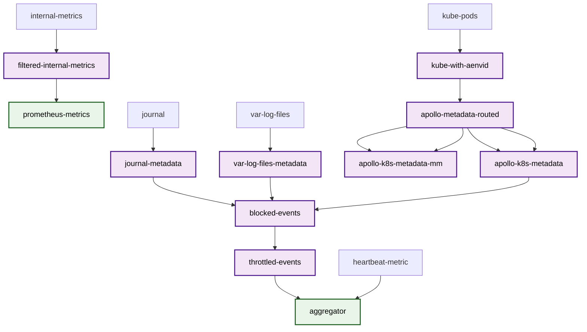

```mermaid
graph TD
    class internal-metrics Source
    internal-metrics --> filtered-internal-metrics
    class filtered-internal-metrics Transform
    filtered-internal-metrics --> prometheus-metrics
    class prometheus-metrics Sink
    class journal Source
    journal --> journal-metadata
    class journal-metadata Transform
    journal-metadata --> blocked-events
    class blocked-events Transform
    blocked-events --> throttled-events
    class throttled-events Transform
    throttled-events --> aggregator
    class aggregator Sink
    class var-log-files Source
    var-log-files --> var-log-files-metadata
    class var-log-files-metadata Transform
    var-log-files-metadata --> blocked-events
    class heartbeat-metric Source
    heartbeat-metric --> aggregator
    class kube-pods Source
    kube-pods --> kube-with-aenvid
    class kube-with-aenvid Transform
    kube-with-aenvid --> apollo-metadata-routed
    class apollo-metadata-routed Transform
    apollo-metadata-routed --> apollo-k8s-metadata-mm
    class apollo-k8s-metadata-mm Transform
    apollo-metadata-routed --> apollo-k8s-metadata
    class apollo-k8s-metadata Transform
    apollo-k8s-metadata --> blocked-events
    apollo-metadata-routed --> apollo-k8s-metadata
    apollo-metadata-routed --> apollo-k8s-metadata-mm

    classDef Source fill:#2196f3,stroke:#01579b,stroke-width:2px,color:#000000
    classDef Transform fill:#f3e5f5,stroke:#4a148c,stroke-width:2px,color:#000000
    classDef Sink fill:#e8f5e8,stroke:#1b5e20,stroke-width:2px,color:#000000
```