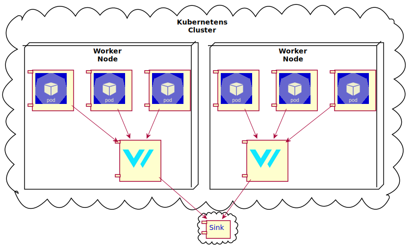

# RFC 2221 - 2020-04-04 - Kubernetes Integration

This RFC outlines how the Vector will integration with Kubernetes (k8s).

**Note: This RFC is retroactive and meant to serve as an audit to complete our
Kubernetes integration. At the time of writing this RFC, Vector has already made
considerable progress on it's Kubernetes integration. It has a `kubernetes`
source, `kubernetes_pod_metadata` transform, an example `DaemonSet` file, and the
ability automatically reload configuration when it changes. The fundamental
pieces are mostly in place to complete this integration, but as we approach
the finish line we're being faced with deeper questions that heavily affect the
UX. Such as how to properly deploy Vector and exclude it's own logs ([pr#2188]).
We had planned to perform a 3rd party audit on the integration before
announcement and we've decided to align this RFC with that process.**

## Table of contents

<!-- TOC -->

- [RFC 2221 - 2020-04-04 - Kubernetes Integration](#rfc-2221---2020-04-04---kubernetes-integration)
  - [Table of contents](#table-of-contents)
  - [Motivation](#motivation)
  - [Guide-level Proposal](#guide-level-proposal)
    - [Strategy](#strategy)
      - [How This Guide Works](#how-this-guide-works)
    - [What We'll Accomplish](#what-well-accomplish)
    - [Tutorial](#tutorial)
      - [Deploy using `kubectl`](#deploy-using-kubectl)
      - [Deploy using Helm](#deploy-using-helm)
      - [Deploy using Kustomize](#deploy-using-kustomize)
  - [Design considerations](#design-considerations)
    - [Minimal supported Kubernetes version](#minimal-supported-kubernetes-version)
      - [Initial Minimal Supported Kubernetes Version](#initial-minimal-supported-kubernetes-version)
    - [Reading container logs](#reading-container-logs)
      - [Kubernetes logging architecture](#kubernetes-logging-architecture)
      - [File locations](#file-locations)
      - [Log file format](#log-file-format)
      - [Automatic partial events merging](#automatic-partial-events-merging)
    - [Helm vs raw YAML files](#helm-vs-raw-yaml-files)
    - [Helm Chart Repository](#helm-chart-repository)
    - [Deployment Variants](#deployment-variants)
    - [Deployment configuration](#deployment-configuration)
      - [Managing Object](#managing-object)
      - [Data directory](#data-directory)
      - [Vector config files](#vector-config-files)
      - [Vector config file reloads](#vector-config-file-reloads)
      - [Strategy on YAML file grouping](#strategy-on-yaml-file-grouping)
        - [Considered Alternatives](#considered-alternatives)
      - [Resource Limits](#resource-limits)
        - [Vector Runtime Properties Bulletin](#vector-runtime-properties-bulletin)
      - [Security considerations on deployment configuration](#security-considerations-on-deployment-configuration)
      - [Other notable [`PodSpec`][k8sapipodspec] properties](#other-notable-podspeck8sapipodspec-properties)
      - [Container probes](#container-probes)
    - [Annotating events with metadata from Kubernetes](#annotating-events-with-metadata-from-kubernetes)
    - [Origin filtering](#origin-filtering)
      - [Filtering based on the log file path](#filtering-based-on-the-log-file-path)
      - [Filtering based on Kubernetes API metadata](#filtering-based-on-kubernetes-api-metadata)
        - [A note on k8s API server availability and `Pod` objects cache](#a-note-on-k8s-api-server-availability-and-pod-objects-cache)
        - [Practical example of filtering by annotation](#practical-example-of-filtering-by-annotation)
        - [Filtering by namespaces annotations](#filtering-by-namespaces-annotations)
      - [Filtering based on event fields after annotation](#filtering-based-on-event-fields-after-annotation)
    - [Configuring Vector via Kubernetes API](#configuring-vector-via-kubernetes-api)
      - [Annotations and labels on vector pod via downward API](#annotations-and-labels-on-vector-pod-via-downward-api)
      - [Custom CRDs](#custom-crds)
    - [Changes to Vector release process](#changes-to-vector-release-process)
    - [Testing](#testing)
      - [Unit tests](#unit-tests)
      - [Integration tests](#integration-tests)
        - [Test targets](#test-targets)
        - [Where to keep and how to manage integration infrastructure config](#where-to-keep-and-how-to-manage-integration-infrastructure-config)
        - [What to assert/verify in integration tests](#what-to-assertverify-in-integration-tests)
      - [Existing k8s tests](#existing-k8s-tests)
    - [Other data gathering](#other-data-gathering)
      - [Exposing Kubernetes [`Event`s][k8sapievent] as Vector events](#exposing-kubernetes-eventsk8sapievent-as-vector-events)
      - [Discover and gather Prometheus metrics for Kubernetes API resources](#discover-and-gather-prometheus-metrics-for-kubernetes-api-resources)
      - [Gather data from the host OS](#gather-data-from-the-host-os)
        - [Automatic discovery of things to monitor on the host OS](#automatic-discovery-of-things-to-monitor-on-the-host-os)
      - [Kubernetes audit logs](#kubernetes-audit-logs)
    - [Windows support](#windows-support)
      - [Potential Windows-specific Issues](#potential-windows-specific-issues)
    - [Security](#security)
      - [Vector Code Audit](#vector-code-audit)
      - [Vector Docker Images Audit](#vector-docker-images-audit)
      - [Deployment Hardening](#deployment-hardening)
      - [Securing secrets](#securing-secrets)
      - [Recommend users additional steps to secure the cluster](#recommend-users-additional-steps-to-secure-the-cluster)
      - [Automatic container rebuilds](#automatic-container-rebuilds)
  - [Prior Art](#prior-art)
  - [Sales Pitch](#sales-pitch)
  - [Drawbacks](#drawbacks)
  - [Alternatives](#alternatives)
  - [Outstanding Questions](#outstanding-questions)
    - [From Ben](#from-ben)
    - [From Mike](#from-mike)
  - [Plan Of Attack](#plan-of-attack)

<!-- /TOC -->

## Motivation

Kubernetes is arguably the most popular container orchestration framework at
the time of writing this RFC; many large companies, with large production
deployments, depend heavily on Kubernetes. Kubernetes handles log collection
but does not facilitate shipping. Shipping is meant to be delegated to tools
like Vector. This is precisely the use case that Vector was built for. So,
motivation is three-fold:

1. A Kubernetes integration is essential to achieving Vector's vision of being
   the dominant, single collector for observability data.
2. This will inherently attract large, valuable users to Vector since Kubernetes
   is generally used with large deployments.
3. It is currently the #1 requested feature of Vector.

## Guide-level Proposal

**Note: This guide largely follows the format of our existing guides
([example][guide_example]). There are two perspectives to our guides: 1) A new
user coming from Google 2) A user that is familiar with Vector. This guide is
from perspective 2.**

This guide covers integrating Vector with Kubernetes. We'll touch on the basic
concepts of deploying Vector into Kubernetes and walk through our recommended
[strategy](#strategy). By the end of this guide you'll have a single,
lightweight, ultra-fast, and reliable data collector ready to ship your
Kubernetes logs and metrics to any destination you please.

### Strategy

#### How This Guide Works

Our recommended strategy deploys Vector as a Kubernetes
[`DaemonSet`][k8s_docs_daemon_set]. Vector is reading the logs files directly
from the file system, so to collect the logs from all the [`Pod`s][k8s_docs_pod]
it has to be deployed on every [`Node`][k8s_docs_node] in your cluster.

The following diagram demonstrates how this works:



### What We'll Accomplish

- Collect data from each of your Kubernetes Pods
  - Ability to filter by container names, Pod IDs, and namespaces.
  - Automatically merge logs that Kubernetes splits.
  - Enrich your logs with useful Kubernetes context.
- Send your logs to one or more destinations.

### Tutorial

#### Deploy using `kubectl`

1.  Configure Vector:

    Before we can deploy Vector we must configure. This is done by creating
    a Kubernetes `ConfigMap`:

    ...insert selector to select any of Vector's sinks...

    ```shell
    cat <<-CONFIG > vector.toml
    # Docs: https://vector.dev/docs/
    # Container logs are available from "kubernetes" input.

    # Send data to one or more sinks!
    [sinks.aws_s3]
      type = "aws_s3"
      inputs = ["kubernetes"]
      bucket = "my-bucket"
      compression = "gzip"
      region = "us-east-1"
      key_prefix = "date=%F/"
    CONFIG
    kubectl create secret generic vector-config --from-file=vector.toml=vector.toml
    ```

2.  Deploy Vector!

    Now that you have your custom `ConfigMap` ready it's time to deploy Vector.
    Create a `Namespace` and apply your `ConfigMap` and our recommended
    deployment configuration into it:

    ```shell
    kubectl create namespace vector
    kubectl apply --namespace vector -f vector-configmap.yaml
    kubectl apply -f https://packages.timber.io/vector/latest/kubernetes/vector-global.yaml
    kubectl apply --namespace vector -f https://packages.timber.io/vector/latest/kubernetes/vector-namespaced.yaml
    ```

    That's it!

#### Deploy using Helm

1.  Install [`helm`][helm_install].

2.  Add our Helm Chart repo.

    ```shell
    helm repo add vector https://charts.vector.dev
    helm repo update
    ```

3.  Configure Vector.

    TODO: address this when we decide on the helm chart internals.

4.  Deploy Vector!

    ```shell
    kubectl create namespace vector

    # Helm v3
    helm upgrade \
      --install \
      --namespace vector \
      --values vector-values.yaml \
      vector \
      vector/vector

    # Helm v2
    helm upgrade
      --install  \
      --namespace vector \
      --values vector-values.yaml \
      --name vector \
      vector/vector
    ```

#### Deploy using Kustomize

1.  Install [`kustomize`][kustomize].

1.  Prepare `kustomization.yaml`.

    Use the same config as in [`kubectl` guide][anchor_tutorial_kubectl].

    ```yaml
    # kustomization.yaml
    namespace: vector

    resources:
      - https://packages.timber.io/vector/latest/kubernetes/vector-global.yaml
      - https://packages.timber.io/vector/latest/kubernetes/vector-namespaced.yaml
      - vector-configmap.yaml
    ```

1.  Deploy Vector!

    ```shell
    kustomize build . | kubectl apply -f -
    ```

## Design considerations

### Minimal supported Kubernetes version

The minimal supported Kubernetes version is the earliest released version of
Kubernetes that we intend to support at full capacity.

We use minimal supported Kubernetes version (or MSKV for short), in the
following ways:

- to communicate to our users what versions of Kubernetes Vector will work on;
- to run our Kubernetes test suite against Kubernetes clusters starting from
  this version;
- to track what Kubernetes API feature level we can use when developing Vector
  code.

We can change MSKV over time, but we have to notify our users accordingly.

There has to be one "root" location where current MSKV for the whole Vector
project is specified, and it should be a single source of truth for all the
decisions that involve MSKV, as well as documentation. A good candidate for
such location is a file at `.meta` dir of the Vector repo. `.meta/mskv` for
instance.

#### Initial Minimal Supported Kubernetes Version

Kubernetes 1.14 introduced some significant improvements to how logs files are
organized, putting more useful metadata into the log file path. This allows us
to implement more high-efficient flexible ways to filter what log files we
consume, which is important for preventing Vector from consuming logs that
it itself produces - which is bad since it can potentially result in an
flood-kind DoS.

We can still offer support for Kubernetes 1.13 and earlier, but it will be
limiting our high-efficient filtering capabilities significantly. It will
also increase maintenance costs and code complexity.

On the other hand, Kubernetes pre-1.14 versions are quite rare these days.
At the time of writing, the latest Kubernetes version is 1.18, and, according
to the [Kubernetes version and version skew support policy], only versions
1.18, 1.17 and 1.16 are currently maintained.

Considering all of the above, we assign **1.14** as the initial MSKV.

### Reading container logs

#### Kubernetes logging architecture

Kubernetes does not directly control the logging, as the actual implementation
of the logging mechanisms is a domain of the container runtime.
That said, Kubernetes requires container runtime to fulfill a certain contract,
and allowing it to enforce desired behavior.

Kubernetes tries to store logs at consistent filesystem paths for any container
runtime. In particular, `kubelet` is responsible of configuring the container
runtime it controls to put the log at the right place.
Log file format can vary per container runtime, and we have to support all the
formats that Kubernetes itself supports.

Generally, most Kubernetes setups will put the logs at the `kubelet`-configured
locations in a `/var/log` directory on the host.

There is [official documentation][k8s_log_path_location_docs] at Kubernetes
project regarding logging. I had a misconception that it specifies reading these
log files as an explicitly supported way of consuming the logs, however, I
couldn't find a confirmation of that when I checked.
Nonetheless, Kubernetes log files is a de-facto well-settled interface, that we
should be able to use reliably.

#### File locations

We can read container logs directly from the host filesystem. Kubernetes stores
logs such that they're accessible from the following locations:

- [`/var/log/pods`][k8s_src_var_log_pods];
- `/var/log/containers` - legacy location, kept for backward compatibility
  with pre `1.14` clusters.

To make our lives easier, here's a [link][k8s_src_build_container_logs_directory]
to the part of the k8s source that's responsible for building the path to the
log file. If we encounter issues, this would be a good starting point to unwrap
the k8s code.

#### Log file format

As already been mentioned above, log formats can vary, but there are certain
invariants that are imposed on the container runtimes by the implementation of
Kubernetes itself.

A particularity interesting piece of code is the [`ReadLogs`][k8s_src_read_logs]
function - it is responsible for reading container logs. We should carefully
inspect it to gain knowledge on the edge cases. To achieve the best
compatibility, we can base our log files consumption procedure on the logic
implemented by that function.

Based on the [`parseFuncs`][k8s_src_parse_funcs] (that
[`ReadLogs`][k8s_src_read_logs] uses), it's evident that k8s supports the
following formats:

- Docker [JSON File logging driver] format - which is essentially a simple
  [`JSONLines`][jsonlines] (aka `ndjson`) format;
- [CRI format][cri_log_format].

We have to support both formats.

#### Automatic partial events merging

Kubernetes uses two log file formats, and both split log messages that are too
long into multiple log records.

It makes sense to automatically merge the log records that were split back
together, similarly to how we do in the `docker_logs` source.

We will implement automatic partial event merging and enable it by default,
while allowing users to opt-out of it if they need to.

### Helm vs raw YAML files

We consider both raw YAML files and Helm Chart officially supported installation
methods.

With Helm, people usually use the Chart we provide, and tweak it to their needs
via variables we expose as the chart configuration. This means we can offer a
lot of customization, however, in the end, we're in charge of generating the
YAML configuration that will k8s will run from our templates.
This means that, while it is very straightforward for users, we have to keep in
mind the compatibility concerns when we update our Helm Chart.
We should provide a lot of flexibility in our Helm Charts, but also have sane
defaults that would be work for the majority of users.

With raw YAML files, they have to be usable out of the box, but we shouldn't
expect users to use them as-is. People would often maintain their own "forks" of
those, tailored to their use case. We shouldn't overcomplicate our recommended
configuration, but we shouldn't oversimplify it either. It has to be
production-ready. But it also has to be portable, in the sense that it should
work without tweaking with as much cluster setups as possible.
We should support both `kubectl create` and `kubectl apply` flows.
`kubectl apply` is generally more limiting than `kubectl create`.

We can derive our YAML files from the Helm Charts to fold to a single source of
truth for the configuration. To do that we'd need a `values.yaml`, suitable
for rendering the Helm Chart template into a set of YAML files, and a script
combine/regroup/reformat the rendered templates for better usability.

Alternatively, we can hand-write the YAML files. This has the benefit of making
them more user-friendly. It's unclear if this is provides a real value compared
to deriving them from Helm Charts - since the ultimate user-friendly way is to
use Helm Charts.

### Helm Chart Repository

We should not just maintain a Helm Chart, we also should offer Helm repo to make
installations easily upgradable.

Everything we need to do to achieve this is outlined at the
[The Chart Repository Guide].

We can use a tool like [ChartMuseum] to manage our repo. Alternatively, we can
use a bare HTTP server, like AWS S3 or GitHub Pages.
[ChartMuseum] has the benefit of doing some things for us. It can use S3 for
storage, and offers a convenient [helm plugin][helm_push] to release charts, so
the release process should be very simple.

From the user experience perspective, it would be cool if we expose our chart
repo at `https://charts.vector.dev` - short and easy to remember or even guess.

### Deployment Variants

We have two ways to deploy vector:

- as a [`DaemonSet`][k8s_docs_daemon_set];
- as a [sidecar `Container`][sidecar_container].

Deployment as a [`DaemonSet`][k8s_docs_daemon_set] is trivial, applies
cluster-wide and makes sense to as default scenario for the most use cases.

Sidecar container deployments make sense when cluster-wide deployment is not
available. This can generally occur when users are not in control of the whole
cluster (for instance in shared clusters, or in highly isolated clusters).
We should provide recommendations for this deployment variant, however, since
people generally know what they're doing in such use cases, and because those
cases are often very custom, we probably don't have to go deeper than explaining
the generic concerns. We should provide enough flexibility at the Vector code
level for those use cases to be possible.

It is possible to implement a sidecar deployment via implementing an
[operator][k8s_docs_operator] to automatically inject Vector
[`Container`][k8s_api_container] into [`Pod`s][k8s_api_pod], via a custom
[admission controller][k8s_docs_admission_controllers], but that doesn't make
a lot of sense for us to work on, since [`DaemonSet`][k8s_api_daemon_set]
works for most of the use cases already.

Note that [`DaemonSet`][k8s_docs_daemon_set] deployment does require special
support at Vector code (a dedicated `kubernetes` source), while a perfectly
valid sidecar configuration can be implemented with just a simple `file` source.
This is another reason why we don't pay as much attention to sidecar model.

### Deployment configuration

It is important that provide a well-thought deployment configuration for the
Vector as part of our Kubernetes integration. We want to ensure good user
experience, and it includes installation, configuration, and upgrading.

We have to make sure that Vector, being itself an app, runs well in Kubernetes,
and sanely makes use of all the control and monitoring interfaces that
Kubernetes exposes to manage Vector itself.

We will provide YAML and Helm as deployment options. While Helm configuration is
templated and more generic, and YAML is intended for manual configuration, a lot
of design considerations apply to both of them.

#### Managing Object

For the reasons discussed above, we'll be using
[`DaemonSet`][k8s_api_daemon_set].

#### Data directory

Vector needs a location to keep the disk buffers and other data it requires for
operation at runtime. This directory has to persist across restarts, since it's
essential for some features to function (i.e. not losing buffered data if/while
the sink is gone).

We'll be using [`DaemonSet`][k8s_api_daemon_set], so, naturally, we can
leverage [`hostPath`][k8s_api_host_path_volume_source] volumes.

We'll be using `hostPath` volumes at our YAML config, and at the Helm Chart
we'll be using this by default, but we'll also allow configuring this to provide
the flexibility users will expect.

An alternative to `hostPath` volumes would be a user-provided
[persistent volume][k8s_docs_persistent_volumes] of some kind. The only
requirement is that it has to have a `ReadWriteMany` access mode.

#### Vector config files

> This section is about Vector `.toml` config files.

Vector configuration in the Kubernetes environment can generally be split into
two logical parts: a common Kubernetes-related configuration, and a custom
user-supplied configuration.

A common Kubernetes-related configuration is a part that is generally expected
to be the same (or very similar) across all of the Kubernetes environments.
Things like `kubernetes` source and `kubernetes_pod_metadata` transform belong
there.

A custom user-supplied configuration specifies a part of the configuration that
contains parameters like what sink to use or what additional filtering or
transformation to apply. This part is expected to be a unique custom thing for
every user.

Vector supports multiple configuration files, and we can rely on that to ship
a config file with the common configuration part in of our YAML / Helm suite,
and let users keep their custom config part in a separate file.

We will then [mount][k8s_api_config_map_volume_source] two `ConfigMap`s into a
container, and start Vector in multiple configuration files mode
(`vector --config .../common.toml --config .../custom.toml`).

#### Vector config file reloads

It is best to explicitly disable reloads in our default deployment
configuration, because this provides more reliability that [eventually consistent
`ConfigMap` updates][configmap_updates].

Users can recreate the `Pod`s (thus restarting Vector, and making it aware of
the new config) via
[`kubectl rollout restart -n vector daemonset/vector`][kubectl_rollout_restart].

#### Strategy on YAML file grouping

> This section is about Kubernetes `.yaml` files.

YAML files storing Kubernetes API objects configuration can be grouped
differently.

The layout proposed in [guide above][anchor_tutorial_kubectl] is what we're
planing to use. It is in line with the sections above on Vector configuration
splitting into the common and custom parts.

The idea is to have a single file with a namespaced configuration (`DaemonSet`,
`ServiceAccount`, `ClusterRoleBinding`, common `ConfigMap`, etc), a single file
with a global (non-namespaced) configuration (mainly just `ClusterRole`) and a
user-supplied file containing just a `ConfigMap` with the custom part of the
Vector configuration. Three `.yaml` files in total, two of which are supplied by
us, and one is created by the user.

Ideally we'd want to make the presence of the user-supplied optional, but it
just doesn't make sense, because sink has to be configured somewhere.

We can offer some simple "typical custom configurations" at our documentation as
an example:

- with a sink to push data to our Alloy;
- with a cluster-agnostic `elasticsearch` sink;
- for AWS clusters, with a `cloudwatch` sink;
- etc...

We must be careful with our `.yaml` files to make them play well with not just
`kubectl create -f`, but also with `kubectl apply -f`. There are often issues
with idempotency when labels and selectors aren't configured properly and we
should be wary of that.

##### Considered Alternatives

We can use a separate `.yaml` file per object.
That's more inconvenient since we'll need users to execute more commands, yet it
doesn't seems like it provides any benefit.

We expect users to "fork" and adjust our config files as they see fit, so
they'll be able to split the files if required. They then maintain their
configuration on their own, and we assume they're capable and know what they're
doing.

#### Resource Limits

> This section is on [`Container`][k8s_api_container] [`resources`][k8s_api_resource_requirements] clause.

Setting resource requirements for Vector container is very important to enable
Kubernetes to properly manage node resources.

Optimal configuration is very case-specific, and while we have some
understanding of Vector performance characteristics, we can't account for the
environment Vector will run at. This means it's nearly impossible for us to come
up with sane defaults, and we have to rely on users properly configuring the
resources for their use case.

However, it doesn't mean we should ignore this concern. Instead, we must share
our understanding of Vector runtime properties and data, and provide as much
assistance to the users trying to determine the resource requirements as
possible.

We should provide the documentation explaining the inner architecture of Vector
and our considerations on how to estimate memory / CPU usage.

At to our configuration, we'll omit the `resources` from the YAML files, and
make them configurable at Helm Charts.

##### Vector Runtime Properties Bulletin

It would be great to publish a regularly updated bulletin on Vector runtime
properties (i.e. how much memory and CPU Vector can utilize and under what
conditions). That would be a real killer feature for everyone that wants to
deploy Vector under load, not just in the context of Kubernetes integration.
Though it's a lot of hard work to determine these properties, people with large
deployments tend to do this anyway to gain confidence in their setup. We could
exchange this data with our partners and derive an even more realistic profile
for Vector's runtime properties, based on real data from the multiple data sets.
This worth a separate dedicated RFC though.

#### Security considerations on deployment configuration

Security considerations on deployment configuration are grouped together with
other security-related measures. See [here](#deployment-hardening).

#### Other notable [`PodSpec`][k8s_api_pod_spec] properties

- `terminationGracePeriodSeconds` - we should set this to a value slightly
  bigger than Vector topology grace termination period;
- `hostNetwork` - we shouldn't use host network since we need access to
  `kube-apiserver`, and the easiest way to get that is to use cluster network;
- `preemptionPolicy` - our default deployment mode - aggregating logs from
  pods - is not considered critical for cluster itself, so we should _not_
  disable preemption;
- `priorityClassName` - see [`PriorityClass` docs][k8s_docs_priority_class]; we
  could ship a [`PriorityClass`][k8s_api_priority_class] and set this value, but
  the priority value is not normalized, so it's probably not a good idea to
  provide a default our of the box, and leave it for cluster operator to
  configure;
- `runtimeClassName` - we'll be using this value in tests to validate that
  Vector works with non-standard runtime; we shouldn't set it in our default
  YAMLs, nor set it at Helm by default;

#### Container probes

Kubernetes allows configuring a number of [`Probe`s][k8s_api_probe] on
[`Container`][k8s_api_container], and taking action based on those probes.
See the [documentation](k8s_docs_pod_lifecycle_container_probes) to learn more.

- `readinessProbe`

  Periodic probe of container service readiness. Container will be removed from
  service endpoints if the probe fails.

- `livenessProbe`

  Periodic probe of container liveness. Container will be restarted if the probe
  fails.

- `startupProbe`

  Startup probe indicates that the container has successfully initialized. If
  specified, no other probes are executed until this completes successfully. If
  this probe fails, the container will be restarted, just as if the
  `livenessProbe` failed.

Vector should implement proper support for all of those one way or another at
the code level.

- `startupProbe` can be tight to the initial topology healthcheck - i.e. we
  consider it failed until the initial topology health check is complete, and
  consider it ok at any moment after that;

- `livenessProbe` should probably be tied to the async executor threadpool
  responsiveness - i.e. if we can handle an HTTP request in a special liveness
  server we expose in Vector - consider the probe ok, else something's very
  wrong, and we should consider the probe failed;

- `readinessProbe` is the most tricky one; it is unclear what the semantics
  makes sense there.

### Annotating events with metadata from Kubernetes

Kubernetes has a lot of metadata that can be associated with the logs, and most
of the users expect us to add some parts of that metadata as fields to the
event.

We already have an implementation that does this in the form of
`kubernetes_pod_metadata` transform.

It works great, however, as can be seen from the next section, we might need
to implement a very similar functionality at the `kubernetes` source as well to
perform log filtering. So, if we'll be obtaining pod metadata at the
`kubernetes` source, we might as well enhance the event right there. This would
render `kubernetes_pod_metadata` useless, as there would be no use case for
it that wouldn't be covered by `kubernetes` source.
Of course, `kubernetes_pod_metadata` would still make sense if used not in
conjunction with `kubernetes` source - which is the case, for instance, in a
sidecar deployment - where `file` source is used directly with in-pod logs file.

What parts of metadata we inject into events should be configurable, but we can
and want to offer sane defaults here.

Technically, the approach implemented at `kubernetes_pod_metadata` already is
pretty good.

One small detail is that we probably want to allow adding arbitrary fields from
the `Pod` object record to the event, instead of a predefined set of fields.
The rationale is we can never imagine all the use cases people could have
in the k8s environment, so we probably should be as flexible as possible.
There doesn't seem to be any technical barriers preventing us from offering
this.

### Origin filtering

We can do highly efficient filtering based on the log file path, and a more
comprehensive filtering via metadata from the k8s API, that is, unfortunately,
has a bit move overhead.

The best user experience is via k8s API, because then we can support filtering
by labels/annotations, which is a standard way of doing things with k8s.

#### Filtering based on the log file path

We already do that in our current implementation.

The idea we can derive some useful parameters from the logs file paths.
For more info on the logs file paths, see the
[File locations][anchor_file_locations] section of this RFC.

So, Kubernetes 1.14+ [exposes][k8s_src_build_container_logs_directory] the
following information via the file path:

- `pod namespace`
- `pod name`
- `pod uuid`
- `container name`

This is enough information for the basic filtering, and the best part is it's
available to us without and extra work - we're reading the files anyways.

#### Filtering based on Kubernetes API metadata

Filtering by Kubernetes metadata is way more advanced and flexible from the user
perspective.

The idea of doing filtering like that is when Vector picks up a new log file to
process at `kubernetes` source, it has to be able to somehow decide on whether
to consume the logs from that file, or to ignore it, based on the state at the
k8s API and the Vector configuration.

This means that there has to be a way to make the data from the k8s API related
to the log file available to Vector.

Based on the k8s API structure, it looks like we should aim for obtaining the
[`Pod`][k8s_api_pod] object, since it contains essential information about the
containers that produced the log file. Also, it is the [`Pod`][k8s_api_pod]
objects that control the desired workload state that `kubelet` strives to
achieve on the node, which this makes [`Pod`][k8s_api_pod] objects the best
option for our case. In particular - better than
[`Deployment`][k8s_api_deployment] objects. Technically, everything that needs
to run containers will produce a [`Pod`][k8s_api_pod] object, and live
[`Container`s][k8s_api_container] can only exist inside of the
[`Pod`][k8s_api_pod].

There in a number of approaches to get the required [`Pod`][k8s_api_pod]
objects:

1. Per-file requests.

   The file paths provide enough data for us to make a query to the k8s API. In
   fact, we only need a `pod namespace` and a `pod uuid` to successfully
   [obtain][k8s_api_pod_read] the [`Pod`][k8s_api_pod] object.

2. Per-node requests.

   This approach is to [list][k8s_api_pod_list_all_namespaces] all the pods that
   are running at the same node as Vector runs. This effectively lists all the
   [`Pod`][k8s_api_pod] objects we could possibly care about.

One important thing to note is metadata for the given pod can change over time,
and the implementation has to take that into account, and update the filtering
state accordingly.

We also can't overload the k8s API with requests. The general rule of thumb is
we shouldn't do requests much more often that k8s itself generates events.

Each approach has very different properties. It is hard to estimate which set is
is a better fit.

A single watch call for a list of pods running per node (2) should generate
less overhead and would probably be easier to implement.

Issuing a watch per individual pod (1) is more straightforward, but will
definitely use more sockets. We could speculate that we'll get a smaller latency
than with doing per-node filtering, however it's very unclear if that's the
case.

Either way, we probably want to keep some form of cache + a circuit breaker to
avoid hitting the k8s API too often.

##### A note on k8s API server availability and `Pod` objects cache

One downside is we'll probably have to stall the events originated from a
particular log file until we obtain the data from k8s API and decide whether
to allow that file or filter it. During disasters, if the API server becomes
unavailable, we'll end up stalling the events for which we don't have `Pod`
object data cached. It is a good idea to handle this elegantly, for instance
if we detect that k8s API is gone, we should pause cache-busting until it comes
up again - because no changes can ever arrive while k8s API server is down, and
it makes sense to keep the cache while it's happening.

We're in a good position here, because we have a good understanding of the
system properties, and can intelligently handle k8s API server being down.

Since we'll be stalling the events while we don't have the `Pod` object, there's
an edge case where we won't be able to ship the events for a prolonged time.
This scenario occurs when a new pod is added to the node and then kubernetes API
server goes down. If `kubelet` picks up the update and starts the containers,
and they start producing logs, but Vector at the same node doesn't get the
update - we're going to stall the logs indefinitely. Ideally, we'd want to talk
to the `kubelet` instead of the API server to get the `Pod` object data - since
it's local (hence has a much higher chance to be present) and has even more
authoritative information, in a sense, than the API server on what pods are
actually running on the node. However there's currently no interface to the
`kubelet` we could utilize for that.

##### Practical example of filtering by annotation

Here's an example of an `nginx` deployment.

```yaml
apiVersion: apps/v1
kind: Deployment
metadata:
  name: nginx-deployment
  labels:
    app: nginx
spec:
  replicas: 3
  selector:
    matchLabels:
      app: nginx
  template:
    metadata:
      labels:
        app: nginx
      annotations:
        vector.dev/exclude: "true"
    spec:
      containers:
        - name: nginx
          image: nginx:1.14.2
          ports:
            - containerPort: 80
```

The `vector.dev/exclude: "true"`
`annotation` at the `PodTemplateSpec` is intended to let Vector know that it
shouldn't collect logs from the relevant `Pod`s.

Upon picking up a new log file for processing, Vector is intended to read the
`Pod` object, see the `vector.dev/exclude: "true"` annotation and ignore the
log file altogether. This should save take much less resources compared to
reading logs files into events and then filtering them out.

This is also a perfectly valid way of filtering out logs of Vector itself.

##### Filtering by namespaces annotations

There is a [demand](https://github.com/fluent/fluent-bit/issues/1140) for
filtering by namespace via namespace annotations. This is an additional concern
to filtering by just the `Pod` object data that was already described above.

The idea is that all `Pod`s belong to [`Namespace`s][k8s_api_namespace] ([docs][k8s_docs_namespaces]), and users want to be able
to annotate the `Namespace` itself for exclusion, effectively excluding all the
`Pod` belonging to it from collection.

To support this, we'll have to maintain the list of excluded `Namespace`s, and
filter `Pod`s against that list.

Listing the `Namespace`s can be done via the
[corresponding API][k8s_api_namespace_list] in a similar manner to how we do it
for `Pod`s. Came concerns regarding caching and load limiting apply.

#### Filtering based on event fields after annotation

This is an alternative approach to the previous implementation.

The current implementation allows doing this, but is has certain downsides -
the main problem is we're paying the price of reading the log files that are
filtered out completely.

In most scenarios it'd be a significant overhead, and can lead to cycles.

### Configuring Vector via Kubernetes API

#### Annotations and labels on vector pod via downward API

We might want to implement support for configuring Vector via annotations
and/or labels in addition to the configuration files at the `ConfigMap`s.

This actually should be a pretty easy thing to do with a [downward API]. It
exposes pod data as files, so all we need is a slightly altered configuration
loading procedure.

This is how is would look like (very simplified):

```yaml
apiVersion: v1
kind: Pod
metadata:
  name: kubernetes-downwardapi-volume-example
  annotations:
    vector.dev/config: |
      [sinks.aws_s3]
      type = "aws_s3"
      inputs = ["kubernetes"]
      bucket = "my-bucket"
      compression = "gzip"
      region = "us-east-1"
      key_prefix = "date=%F/"
spec:
  containers:
    - name: vector
      image: vector-image
      command:
        ["vector", "--k8s-downward-api-config", "/etc/podinfo/annotations"]
      volumeMounts:
        - name: podinfo
          mountPath: /etc/podinfo
  volumes:
    - name: podinfo
      downwardAPI:
        items:
          - path: "annotations"
            fieldRef:
              fieldPath: metadata.annotations
```

The `/etc/podinfo/annotations` file will look something like this:

```text
kubernetes.io/config.seen="2020-04-15T13:35:27.290739039Z"
kubernetes.io/config.source="api"
vector.dev/config="[sinks.aws_s3]\ntype = \"aws_s3\"\ninputs = [\"kubernetes\"]\nbucket = \"my-bucket\"\ncompression = \"gzip\"\nregion = \"us-east-1\"\nkey_prefix = \"date=%F/\"\n"
```

It's quite trivial to extract the configuration.

While possible, this is outside of the scope of the initial integration.

#### Custom CRDs

A much more involved feature than the one above would be making `Vector`
configurable via [`Custom Resource Definition`][k8s_docs_crds].

This feature is not considered for the initial integration with Kubernetes, and
is not even explored, since it is a way more advanced level of integration that
we can achieve in the short term in the near future.

This section is here for completeness, and we would probably like to explore
this in the future.

This includes both adding the support for CRDs to Vector itself, and
implementing an orchestrating component (such things are usually called
[operators][k8s_docs_operator] in the k8s context, i.e. `vector-operator`).

### Changes to Vector release process

We need to ship a particular Vector version along with a particular set of k8s
configuration YAML files and a Helm chart. This is so that we can be sure
all our configurations actually tested and known to work for a particular Vector
release. This is very important for maintaining the legacy releases, and for
people to be able to downgrade if needed, which is one of the major properties
for a system-level component like Vector is.

This means we need to orchestrate the releases of the YAML configs and Helm
Charts together with the Vector releases.

Naturally, it's easiest to implement if we keep the code for both the YAML
configs and the Helm Chart in our Vector repo.

The alternative - having either just the Helm Chart or it together with YAML
files in a separate repo - has a benefit of being a smaller footprint to grasp -
i.e. a dedicated repo with just the k8s deployment config would obviously have
smaller code and history - but it would make it significantly more difficult to
correlate histories with Vector mainline, and it's a major downside. For this
reason, using the Vector repo for keeping everything is preferable.

During the release process, together with shipping the Vector version, we'd
have to also bump the Vector versions at the YAML and Helm Chart configs, and
also bump the version of the Helm Chart as well. We then copy the YAML configs
to the same location where we keep release artifacts (i.e. `.deb`s, `.rpm`s,
etc) for that particular Vector version. We also publish a new Helm Chart
release into our Helm Chart repo.

While bumping the versions is human work, and is hard to automate - copying the
YAML files and publishing a Helm Chart release is easy, and we should take care
of that. We can also add CI lints to ensure the version of Vector at YAML
file and Helm Chart and the one the Rust code has baked in match at all times.
Ideally, they should be bumped together atomically and never diverge.

If we need to ship an update to just YAML configs or a new Helm Chart without
changes to the Vector code, as our default strategy we can consider cutting a
patch release of Vector - simply as a way to go through the whole process.
What is bumping Vector version as well, even though there's no practical reason
for that since the code didn't change. This strategy will not only simplify the
process on our end, but will also be very simple to understand for our users.

### Testing

We want to implement a comprehensive test system to maintain our k8s
integration.

As usual, we need a way to do unit tests to validate isolated individual
components during development. We also need integration tests, whose purpose is
to validate that, as a whole, Vector properly functions when deployed into a
real Kubernetes cluster.

#### Unit tests

To be able to utilize unit tests, we have to build the code from the modular,
composable, and loosely-coupled components. These requirements often allow unit
testing individual components easily, thus significantly improving the
confidence in the overall implementation.

If we have to, we can rely on mocks to test all the edge cases of the individual
components.

#### Integration tests

Integration tests are performed against the real k8s clusters.

##### Test targets

We have a matrix of concerns, we'd like to ensure Vectors works properly with.

- Kubernetes Versions
  - Minimal Supported Kubernetes Version
  - Latest version
  - All versions in between the latest and MSKV
- Managed Kubernetes offers (see also [CNCF Certified Kubernetes][cncf_software_conformance])
  - [Amazon Elastic Kubernetes Service](https://aws.amazon.com/ru/eks/)
  - [Google Kubernetes Engine](https://cloud.google.com/kubernetes-engine/)
  - [Azure Kubernetes Service](https://azure.microsoft.com/en-us/services/kubernetes-service/)
  - [DigitalOcean Kubernetes](https://www.digitalocean.com/products/kubernetes/)
  - [Platform9 Managed Kubernetes](https://platform9.com/managed-kubernetes/)
  - [Red Hat OpenShift Container Platform](https://www.openshift.com/products/container-platform)
  - [IBM Cloud Kubernetes Service](https://www.ibm.com/cloud/container-service/)
  - [Alibaba Cloud Container Service for Kubernetes](https://www.alibabacloud.com/product/kubernetes)
  - [Oracle Container Engine for Kubernetes](https://www.oracle.com/cloud/compute/container-engine-kubernetes.html)
  - [OVH Managed Kubernetes Service](https://www.ovhcloud.com/en-gb/public-cloud/kubernetes/)
  - [Rackspace Kubernetes-as-a-Service](https://www.rackspace.com/managed-kubernetes)
  - [Linode Kubernetes Engine](https://www.linode.com/products/kubernetes/)
  - [Yandex Managed Service for Kubernetes](https://cloud.yandex.com/services/managed-kubernetes)
  - [Tencent Kubernetes Engine](https://intl.cloud.tencent.com/product/tke)
- Kubernetes Distributions (for on-premise deployment)
  - Production-grade
    - bare `kubeadm`
    - [OKD](https://www.okd.io/) (deploys OpenShift Origin)
    - [Rancher Kubernetes Engine](https://rancher.com/products/rke/)
    - [Metal3](https://metal3.io/)
    - [Project Atomic Kubernetes](https://www.projectatomic.io/docs/kubernetes/)
    - [Canonical Charmed Kubernetes](https://ubuntu.com/kubernetes/install#multi-node)
    - [Kubernetes on DC/OS](https://github.com/mesosphere/dcos-kubernetes-quickstart)
  - For small/dev deployments
    - [Minikube](https://kubernetes.io/ru/docs/setup/learning-environment/minikube/)
    - [MicroK8s](https://microk8s.io/)
    - [Docker Desktop Kubernetes](https://www.docker.com/products/docker-desktop)
    - [kind](https://kubernetes.io/docs/setup/learning-environment/kind/)
    - [minishift](https://www.okd.io/minishift/)
- [Container Runtimes (CRI impls)](https://kubernetes.io/docs/setup/production-environment/container-runtimes/)
  - [Docker](https://www.docker.com/) (Kubernetes still has some "special"
    integration with Docker; these days, "using Docker" technically means using
    `runc` via `containerd` via `docker-engine`)
  - OCI (via [CRI-O](https://cri-o.io/) or [containerd](https://containerd.io/))
    - [runc](https://github.com/opencontainers/runc)
    - [runhcs](https://github.com/Microsoft/hcsshim/tree/master/cmd/runhcs) -
      see more [here][windows_in_kubernetes]
    - [Kata Containers](https://github.com/kata-containers/runtime)
    - [gVisor](https://github.com/google/gvisor)
    - [Firecracker](https://github.com/firecracker-microvm/firecracker-containerd)

We can't possibly expand this matrix densely due to the enormous amount of
effort required to maintain the infrastructure and the costs. It may also be
inefficient to test everything everywhere, because a lot of configurations
don't have any significant or meaningful differences among each other.

Testing various managed offers and distributions is not as important as testing
different Kubernetes versions and container runtimes.

It's probably a good idea to also test against the most famous managed
Kubernetes provides: AWS, GCP and Azure. Just because our users are most likely
to be on one of those.

So, the goal for integration tests is to somehow test Vector with Kubernetes
versions from MSKV to latest, all the container runtimes listed above and,
additionally, on AWS, GCP and Azure.

We can combine our requirements with offers from cloud providers. For instance,
`runhcs` (and Windows containers in general) are supported at Azure. Although,
whether we want to address Windows containers support is a different topic, we
still should plan ahead.

We'll need to come up with an optimal configuration.

##### Where to keep and how to manage integration infrastructure config

This is a very controversial question.

Currently we have:

- the Vector repo (with the GitHub Actions based CI flow)
- the test harness (also integrated with CI, but this is it's own thing)

We don't necessarily have to choose one of those places: we can add a new
location if it's justified enough.

Let's outline the requirements on the properties of the solution:

- We want to have the ability to run the checks from the Vector repo CI, i.e.
  per commit, per PR, per tag etc. This might not be immediately utilized, but
  we just want to have that option.

- We want to consolidate the management of the _cloud_ resources we allocate and
  pay for Kubernetes test infrastructure in a single place. This is to avoid
  spreading the responsibility, duplicating the logic, reusing allocated
  resources for all our testing needs, and simplify accounting and make the
  configuration management more flexible.
  We can, for example, have a shared dependency for Vector CI flow, Test Harness
  invocations, locally run tests - and whatever else we have - to rely on.

- We want our test infrastructure easily available for the trusted developers
  (Vector core team) to run experiments and tests against locally. This doesn't
  mean we want to automate this and include running tests locally against our
  whole k8s test infrastructure - but the ability to do it with little effort is
  very important: even if we employ super-reliable CI automation, the turnaround
  time of going through it is way higher than conducting an experiment locally.
  Locally means using local code tree and binaries - the infrastructure itself
  is still in the cloud.

- Ideally, we want the test system to be available not just to the Vector core
  team, but to the whole open-source community. Of course, we don't want to give
  unrestricted access to _our_ cloud testing infrastructure - but the solution
  we employ should allow third-parties to bring their own resources. Things that
  are local in essence (like `minikube`) should just work. There shouldn't be a
  situation where one can't run tests in `minikube` because cloud parts aren't
  available. We already have similar constraints at the Vector Test Harness.

- We need the required efforts to managements the solution to be low, and the
  price to be relatively small. This means that the solution has to be simple.

- We want to expose the same kind of interface to each of the clusters, so the
  cluster we run the tests is easily interchangeable.
  A kubectl config file is a good option, since it encapsulates all the
  necessary information tp connect to a cluster.

Based on all of the above, it makes sense to split the infrastructure into two
parts.

- Cloud infrastructure that we manage and pay for.

  We will create a dedicated public repo with [Terraform] configs to setup a
  long-running Kubernetes test infrastructure.
  The goal here is to make the real, live cloud environments available for
  people and automation to work with.

- Self-hosted infrastructure that we maintain configs for.

  This is what keep so that it's easy to run the a self-hosted cluster. Most
  likely locally - for things like `minikube`, but not limited to. The focus
  here is lock particular _versions_ and _configuration_ of the tooling, so it's
  easy to run tests against. Potentially even having multiple versions of the
  same tool, for instance, when you need to compare `minikube` `1.9.2` and
  `1.8.2`.
  The goal here is to address the problem of configuring the self hosted cluster
  management tools once and for all, and share those configurations. For people
  it has the benefit of enabling them to spend time on soling the problem (or
  doing whatever they need to do with k8s) rather than spending time on
  configuration. For automation flows - it'll make it really simple to reference
  a particular self-hosted configuration - and offload the complexity of
  preparing it.

  This one we'll have to figure out, but most likely we'll create a dedicated
  repo per tool, each with different rules - but with a single interface.

The interface (and the goal) those repos is to provide kubectl-compatible config
files, enabling access to clusters where we can deploy Vector to and conduct
some tests (and, in general, _other arbitrary activity_).

##### What to assert/verify in integration tests

We can recognize three typical categories of integration tests that are relevant
to the Kubernetes integration: correctness, performance and reliability.
In fact, this is actually how we split things at the Vector Test Harness
already.

It is important that with Kubernetes we don't only have to test that Vector
itself perform correctly, but also that our YAML configs and Helm Chart
templates are sane and work properly. So in a sense, we still have the same
test categories, but the scope is broader than just testing Vector binary. We
want to test the whole integration.

Ideally we want to test everything: the correctness, performance and
reliability. Correctness tests are relatively easy, however, it's not yet clear
how to orchestrate the performance and reliability tests. Measuring performance
in clusters is quite difficult and requires insight thought to make it right.
For example, we have to consider and control a lot more variables of the
environment - like CNI driver, underlying network topology and so on - to
understand the conditions we're testing. Reliability tests also require
more careful designing the test environment.
For this reason, the initial Kubernetes integration only focuses on correctness
tests. Once we get some experience with correctness test we can expand our test
suite with tests from other categories.

It is important that we do actually test correctness on all the configurations -
see this [comment][why_so_much_configurations] as an example. Kubernetes is has
a lot of LOC, is very complex and properly supporting it is quite a challenge.

The exact design of the tests is an implementation detail, so it's not specified
in this RFC, but the suggested approach, as a starting point, could be to deploy
Vector using our documented installation methods, then run some log-generating
workload and then run assertions on the collected logs.

The things we'd generally want to ensure work properly include (but are not
limited to):

- basic log collection and parsing
- log message filtering (both by file paths and by metadata)
- log events enhancement with metadata
- partial log events merging

We want the assertions and tests to be cluster-agnostic, so that they work with
any supplied kubectl config.

#### Existing k8s tests

We already have k8s integration tests implemented in Rust in the Vector repo.
Currently, they're being run as part of the `cd tests; make tests`. They
assert that Vector code works properly by deploying Vector plus some test
log producers and asserting that Vector produced the expected output. This is
very elegant solution.
However, these tests are really more like unit tests - in a sense that they
completely ignore the YAMLs and Helm Charts and
use their own test configs. While they do a good job in what they're built for -
we probably shouldn't really consider them integration tests in a broad sense.

It was discussed that we'd want to reuse them as our integration tests, however,
for the reasons above I don't think it's a good idea. At least as they're now.
We can decouple the deployment of Vector from the deployment of test containers
and assertions - then we use just the second half with Vector deployed via YAMLs
and/or Helm Charts. For now, we should probably leave them as is, maintain them,
but hold the adoption as integration tests.

### Other data gathering

> This section is on gathering data other than container logs.

While our main focus for the integration is collecting log data from the `Pod`s,
there are other possibilities to gain observability in the Kubernetes
environment.

#### Exposing Kubernetes [`Event`s][k8s_api_event] as Vector events

It is possible to subscribe to Kubernetes [`Event`s][k8s_api_event], similarly
to how this command works:

```shell
kubectl get events --all-namespaces --watch
```

Implementing this in Vector would allow capturing the Kubernetes
[`Event`s][k8s_api_event] and processing them as Vector events.

This feature might be very useful for anyone that wants to see what's going on
in their cluster.

Note that this feature would require deploying Vector in a differently: instead
of running Vector on every node, here we need only once Vector instance running
per cluster. If run on every node, it'd be unnecessarily capturing each event
multiple times.

So, to implement this, we'd need to add a special source that captures events
from Kubernetes API, and provide a new workload configuration based on
[`Deployment`][k8s_api_deployment].

See also a section on collecting
[Kubernetes audit logs][anchor_kubernetes_audit_logs].

#### Discover and gather Prometheus metrics for Kubernetes API resources

Prometheus already has a built-in
[Kubernetes Service Discovery][prometheus_kubernetes_sd_config] support, so one
could just deploy a Prometheus server, make it discover and gather the metrics,
and the configure Vector to read metrics from it.

However, to pursue our goal of making Vector the only agent one would need to
deploy - we can consider reimplementing what prometheus
[does][prometheus_kubernetes_sd_config] in Vector code, eliminate the need for
the intermediary.

We don't aim to implement this in the initial Kubernetes integration.

#### Gather data from the host OS

This is very useful for Kubernetes Cluster Operators willing to deploy Vector
for the purposes of gaining observability on what's going on with their cluster
nodes.

Example use cases are:

- reading `kubelet`/`docker` logs from `journald`;
- capturing `kubelet`/`docker` prometheus metrics;
- gathering system metrics from the node, things like `iostat -x`, `df -h`,
  `uptime`, `free`, etc;
- gathering system logs, like `sshd`, `dmesg` and etc.

There are countless use cases here, and good news Vector already well fit to
perform those kinds of tasks! Even without any Kubernetes integration
whatsoever, it's possible to just deploy Vector as a
[`DaemonSet`][k8s_api_daemon_set], expose the system data to it via
[`hostPath` volume][k8s_api_host_path_volume_source] mounts and/or enabling
`hostNetwork` at the [`PodSpec`][k8s_api_pod_spec].

##### Automatic discovery of things to monitor on the host OS

While nothing prevents users from manually configuring Vector for gathering data
from the host OS, it's very hard for us to offer sane defaults that would work
out-of-the-box for all clusters, since there's a myriad of configurations.

We can consider offering some kind of user-selectable presets for well known
popular setups - like AWS and CGP.

We can also solve this a general problem of automatic discovery of what we can
monitor on a given system - something similar to what [`netdata`][netdata] has.

In the context of the current integration efforts, it doesn't make a lot of
sense to try to address this issue in Vector code or deployment configs:

- gathering data from the host OS works with manual configuration;
- cluster operators mostly know what they're doing, and are capable to configure
  Vector as they require;
- there's a myriad of configurations we'd have to support, and it'd be very hard
  (if even possible) to come up with sane defaults.
- related to the point above, even with sane defaults, in 95% on cases, cluster
  operators would want to tailor the configuration for their use case.

What we can do, though, is provide guides, blog posts and explainers with
concrete examples for Vector usage for Kubernetes Cluster Operators.

#### Kubernetes audit logs

We can also collect [Kubernetes audit logs][k8s_docs_audit].

This is very similar to
[collecting Kubernetes Events][anchor_collecting_kubernetes_events], but
provides a more fine-grained control over what events are audited.

It's important to understand that events, unfiltered, should be considered very
sensitive and privileged data.

Kubernetes audit [`Policy`][k8s_api_policy] allows cluster operator to configure
`kubelet`s to manage the audit data with a high degree of flexibility.

The best part is this is something that should already work great with Vector -
we can already support operation via both log and webhook backends.

### Windows support

We don't aim to support Windows Kubernetes clusters initially. The reason for
that is Windows support in general (i.e. outside of Kubernetes context) is a bit
lacking - we don't measure performance on Windows, don't run unit tests on
Windows, don't build Windows docker images, etc.
This is a blocker for a proper integration with Kubernetes clusters running on
Windows.

To sum up: if it works - it works, if it doesn't - we'll take care of it later.

> If you're reading this and want to use Vector with Windows - please let us
> know.

#### Potential Windows-specific Issues

Windows has it's own specifics. We can learn from the past experience of other
implementations to avoid the problems they encounter.

- https://github.com/fluent/fluent-bit/issues/2027

  This issue is on what seems to be a resource management problem with files on
  Windows - their implementation doesn't let go of the log file in time when the
  container (along with it's log files) is about to be removed.
  This is a non-issue in a typical linux deployment because it's not the path at
  the filesystem, but the inode that FD bind to. On Windows it's the other way.

  There's actually a workaround for that: it's possible request Windows to allow
  deletion of the opened file - by specifying the `FILE_SHARE_DELETE` flag at
  [`CreateFileA`](https://docs.microsoft.com/en-us/windows/win32/api/fileapi/nf-fileapi-createfilea)
  call.

  See more details:

  - https://stackoverflow.com/questions/3202329/will-we-ever-be-able-to-delete-an-open-file-in-windows
  - https://boostgsoc13.github.io/boost.afio/doc/html/afio/FAQ/deleting_open_files.html

### Security

There are different aspects of security. In this RFC we're going to focus on
Kubernetes specific aspects.

Securing in Kubernetes environment plays a major role, and the more we do to
ensure our code and deployment recommendations are safe - the better. Big
deployments often have dedicated security teams that will be doing what we do
on their own - just to double-check, but the majority of our people out there
don't have enough resources to dedicate enough attention to the security
aspects. This is why implementing security measures in our integration is
important.

#### Vector Code Audit

There have to be automated security audit of the Vector codebase, to ensure
we don't have easily detectable issues. Things like automated CVE checks and
static analyzers fall into this category.
We're already doing a good job in this aspect.

#### Vector Docker Images Audit

There has to be an automated security audit of the Vector docker images that we
ship.

We should consider using tools like this:

- [trivy](https://github.com/aquasecurity/trivy)
- [clair](https://github.com/quay/clair)
- [anchore-engine](https://github.com/anchore/anchore-engine)

... and similar.

#### Deployment Hardening

We should harden the Vector deployment by default. This means that our suggested
YAML files should be hardened, and Helm Chart should be configurable, but also
hardened by default.

- We should properly configure
  [PodSecurityContext][k8s_api_pod_security_context]
  ([docs][k8s_docs_security_context]):

  - properly configure [`sysctls`][k8s_api_sysctl];
  - `fsGroup` - should be unset.

- We should properly configure [SecurityContext][k8s_api_security_context]
  ([docs][k8s_docs_security_context]):

  - enable `readOnlyRootFilesystem` since we don't need to write to files at
    rootfs;
  - enable `runAsNonRoot` if possible - we shouldn't need root access to conduct
    most of our operations, but this has to be validated in practice; the aim
    is to enable it if possible;
  - disable `allowPrivilegeEscalation` since we shouldn't need extra any special
    privileges in the first place, and definitely we don't need escalation;
  - properly configure [`seLinuxOptions`][k8s_api_se_linux_options];
  - properly configure [`capabilities`][k8s_api_capabilities] - see
    [`man 7 capabilities`][man_7_capabilities] for more info;
  - disable `privileged` - we shouldn't don't need privileged access, and it's
    me a major security issue if we do.

- We should properly use [`ServiceAccount`][k8s_api_service_account],
  [`Role`][k8s_api_role], [`RoleBinding`][k8s_api_role_binding],
  [`ClusterRole`][k8s_api_cluster_role] and
  [`ClusterRoleBinding`][k8s_api_cluster_role_binding] ([docs][k8s_docs_rbac]).

  The service accounts at Kubernetes by default have no permissions, except for
  the service accounts at the `kube-system` namespace. We'll be using a
  dedicated `vector` namespace, so it's our responsibility to request the
  required permissions.

  The exact set of permissions to request at default deployment configuration
  depends on the implementation we'll land and the Vector settings of the
  default deployment configuration.
  The goal is to eliminate any non-required permissions - we don't have to keep
  anything extra there for demonstration purposes.

  We also have to document all possible required permissions, so that users are
  aware of the possible configuration options. At Helm Charts we should allow
  configuring arbitrary permissions via values (while providing sane defaults).

  We can optionally support non-[RBAC][k8s_docs_rbac] clusters in the Helm
  Chart.
  In the real world, the non-RBAC clusters should be very rare, since RBAC has
  been recommended for a very long time, and it's the default for the fresh
  `kubeadm` installations. It's probably not a major concern.

#### Securing secrets

Vector sometimes needs access to secrets, like AWS API access tokens and so on.
That data has to be adequately protected.

We should recommend users to use [`Secret`][k8s_api_secret]
([docs][k8s_docs_secret]) instead of [`ConfigMap`][k8s_api_config_map] if they
have secret data embedded in their Vector `.toml` config files.

We should also consider integrating with tools like [Vault] and [redoctober].

#### Recommend users additional steps to secure the cluster

- Suggest using [Falco].
- Suggest setting up proper RBAC rules for cluster operators and users;
  [`audit2rbac`](https://github.com/liggitt/audit2rbac) is a useful tool to
  help with this.
- Suggest using [Pod Security Policies][k8s_docs_pod_security_policy]
  ([API][k8s_api_pod_security_policy]).
- Suggest using [NetworkPolicy][k8s_api_network_policy].
- Suggest running [kube-bench].
- Suggest reading the
  [Kubernetes security documentation][k8s_docs_securing_a_cluster].

#### Automatic container rebuilds

The ability to rebuild containers with a CVE fix automatically quickly is a very
important part of a successful vulnerability mitigation strategy.
We should prepare in advance and rollout the infrastructure and automation to
make it possible to rebuild the containers for _all_ (not just the latest or
nightly!) the supported Vector versions.

## Prior Art

1. [Filebeat k8s integration]
1. [Fluentbit k8s integration]
1. [Fluentd k8s integration]
1. [LogDNA k8s integration]
1. [Honeycomb integration]
1. [Bonzai logging operator] - This is approach is likely outside of the scope
   of Vector's initial Kubernetes integration because it focuses more on
   deployment strategies and topologies. There are likely some very useful
   and interesting tactics in their approach though.
1. [Influx Helm charts]
1. [Awesome Operators List] - an "awesome list" of operators.

## Sales Pitch

See [motivation](#motivation).

## Drawbacks

1. Increases the surface area that our team must manage.

## Alternatives

1. Not do this integration and rely solely on external community-driven
   integrations.

## Outstanding Questions

### From Ben

1. ~~What is the best to avoid Vector from ingesting it's own logs? I'm assuming
   that my [`kubectl` tutorial][anchor_tutorial_kubectl] handles this with
   namespaces?
   We'd just need to configure Vector to exclude this namespace?~~
   See the [Origin filtering][anchor_origin_filtering] section.
1. ~~From what I understand, Vector requires the Kubernetes `watch` verb in order
   to receive updates to k8s cluster changes. This is required for the
   `kubernetes_pod_metadata` transform. Yet, Fluentbit [requires the `get`,
   `list`, and `watch` verbs][fluentbit_role]. Why don't we require the same?~~
   Right, this is a requirement since we're using k8s API. The exact set of
   permissions is to be determined at YAML files design stage - after we
   complete the implementation. It's really trivial to determine from a set of
   API calls used.
   See the [Deployment Hardening](#deployment-hardening) section.
1. What are some of the details that set Vector's Kubernetes integration apart?
   This is for marketing purposes and also helps us "raise the bar".

### From Mike

1. What significantly different k8s cluster "flavors" are there? Which ones do
   we want to test against? Some clusters use `docker`, some use `CRI-O`,
   [etc][container_runtimes]. Some even use [gVisor] or [Firecracker]. There
   might be differences in how different container runtimes handle logs.
1. How do we want to approach Helm Chart Repository management.
1. How do we implement liveness, readiness and startup probes?
   Readiness probe is a tricky one. See [Container probes](#container-probes).
1. Can we populate file at `terminationMessagePath` with some meaningful
   information when we exit or crash?
1. Can we allow passing arbitrary fields from the `Pod` object to the event?
   Currently we only to pass `pod_id`, pod `annotations` and pod `labels`.

## Plan Of Attack

- Setup a proper testing suite for k8s.
  - Local testing via `make test-integration-kubernetes`.
    - Ability to "bring your own cluster". See [issue#2170].
  - Add `make test-integration-kubernetes` to the `ci.yaml` workflow.
    - Ensure these tests are stable. See [issue#2193], [issue#2216],
      and [issue#1635].
    - Ensure we are testing all supported minor versions. See
      [issue#2223].
  - Run `make test-integration-kubernetes` against AWS' EKS platform in
    Vector's GitHub actions.
- Finalize the `kubernetes` source.
  - Audit the code and ensure the base is high-quality and correct.
  - Merge in the `kubernetes_pod_metadata` transform.
  - Implement origin filtering.
  - Merge split logs [pr#2134].
  - Use the `log_schema.kubernetes_key` setting for context fields.
    See [issue#1867].
- Add `kubernetes` source reference documentation.
- Prepare Helm Chart.
- Prepare YAML deployment config.
- Prepare Helm Chart Repository.
- Integrate kubernetes configuration snapshotting into the release process.
- Add Kubernetes setup/integration guide.
- Release `0.10.0` and announce.
- Prepare additional guides and blog posts.
  - Vector deployment for Kubernetes Cluster Operators.
  - Vector deployment as a sidecar.
- Revisit this RFC - see what we can focus on next.
- Start the RFC of the Vector performance properties bulletin.
  To include things like:
  - Establish continuous data gathering of performance characteristics of
    the bare Vector event pipeline (i.e. raw speed) and the impact of adding
    each of its components - sources, transforms, sinks - and their
    combinations.
  - Prepare the format (and, if possible, automate the release of) Vector
    performance bulletin.

[anchor_collecting_kubernetes_events]: #exposing-kubernetes-event-s-k8s-api-event-as-vector-events
[anchor_file_locations]: #file-locations
[anchor_helm_vs_raw_yaml_files]: #helm-vs-raw-yaml-files
[anchor_kubernetes_audit_logs]: #kubernetes-audit-logs
[anchor_minimal_supported_kubernetes_version]: #minimal-supported-kubernetes-version
[anchor_origin_filtering]: #origin-filtering
[anchor_other_data_gathering]: #anchor-other-data-gathering
[anchor_resource_limits]: #resource-limits
[anchor_strategy_on_yaml_file_grouping]: #strategy-on-yaml-file-grouping
[anchor_tutorial_kubectl]: #deploy-using-kubectl
[awesome operators list]: https://github.com/operator-framework/awesome-operators
[bonzai logging operator]: https://github.com/banzaicloud/logging-operator
[chartmuseum]: https://chartmuseum.com/
[cncf_software_conformance]: https://www.cncf.io/certification/software-conformance/
[configmap_updates]: https://kubernetes.io/docs/tasks/configure-pod-container/configure-pod-configmap/#mounted-configmaps-are-updated-automatically
[container_runtimes]: https://kubernetes.io/docs/setup/production-environment/container-runtimes/
[cri_log_format]: https://github.com/kubernetes/community/blob/ee2abbf9dbfa4523b414f99a04ddc97bd38c74b2/contributors/design-proposals/node/kubelet-cri-logging.md
[downward api]: https://kubernetes.io/docs/tasks/inject-data-application/downward-api-volume-expose-pod-information/#store-pod-fields
[falco]: https://github.com/falcosecurity/falco
[filebeat k8s integration]: https://www.elastic.co/guide/en/beats/filebeat/master/running-on-kubernetes.html
[firecracker]: https://github.com/firecracker-microvm/firecracker
[fluentbit k8s integration]: https://docs.fluentbit.io/manual/installation/kubernetes
[fluentbit_daemonset]: https://raw.githubusercontent.com/fluent/fluent-bit-kubernetes-logging/master/output/elasticsearch/fluent-bit-ds.yaml
[fluentbit_installation]: https://docs.fluentbit.io/manual/installation/kubernetes#installation
[fluentbit_role]: https://raw.githubusercontent.com/fluent/fluent-bit-kubernetes-logging/master/fluent-bit-role.yaml
[fluentd k8s integration]: https://docs.fluentd.org/v/0.12/articles/kubernetes-fluentd
[fluentd_daemonset]: https://github.com/fluent/fluentd-kubernetes-daemonset/blob/master/fluentd-daemonset-papertrail.yaml
[guide_example]: https://vector.dev/guides/integrate/sources/syslog/aws_kinesis_firehose/
[gvisor]: https://github.com/google/gvisor
[helm_install]: https://cert-manager.io/docs/installation/kubernetes/
[helm_push]: https://github.com/chartmuseum/helm-push
[honeycomb integration]: https://docs.honeycomb.io/getting-data-in/integrations/kubernetes/
[influx helm charts]: https://github.com/influxdata/helm-charts
[issue#1293]: https://github.com/vectordotdev/vector/issues/1293
[issue#1635]: https://github.com/vectordotdev/vector/issues/1635
[issue#1816]: https://github.com/vectordotdev/vector/issues/1867
[issue#1867]: https://github.com/vectordotdev/vector/issues/1867
[issue#2170]: https://github.com/vectordotdev/vector/issues/2170
[issue#2171]: https://github.com/vectordotdev/vector/issues/2171
[issue#2193]: https://github.com/vectordotdev/vector/issues/2193
[issue#2216]: https://github.com/vectordotdev/vector/issues/2216
[issue#2218]: https://github.com/vectordotdev/vector/issues/2218
[issue#2223]: https://github.com/vectordotdev/vector/issues/2223
[issue#2224]: https://github.com/vectordotdev/vector/issues/2224
[issue#2225]: https://github.com/vectordotdev/vector/issues/2225
[json file logging driver]: https://docs.docker.com/config/containers/logging/json-file/
[jsonlines]: http://jsonlines.org/
[k8s_api_capabilities]: https://kubernetes.io/docs/reference/generated/kubernetes-api/v1.18/#capabilities-v1-core
[k8s_api_cluster_role_binding]: https://kubernetes.io/docs/reference/generated/kubernetes-api/v1.18/#clusterrolebinding-v1-rbac-authorization-k8s-io
[k8s_api_cluster_role]: https://kubernetes.io/docs/reference/generated/kubernetes-api/v1.18/#clusterrole-v1-rbac-authorization-k8s-io
[k8s_api_config_map_volume_source]: https://kubernetes.io/docs/reference/generated/kubernetes-api/v1.18/#configmapvolumesource-v1-core
[k8s_api_config_map]: https://kubernetes.io/docs/reference/generated/kubernetes-api/v1.18/#configmap-v1-core
[k8s_api_container]: https://kubernetes.io/docs/reference/generated/kubernetes-api/v1.18/#container-v1-core
[k8s_api_daemon_set_update_strategy]: https://kubernetes.io/docs/reference/generated/kubernetes-api/v1.18/#daemonsetupdatestrategy-v1-apps
[k8s_api_daemon_set]: https://kubernetes.io/docs/reference/generated/kubernetes-api/v1.18/#daemonset-v1-apps
[k8s_api_deployment]: https://kubernetes.io/docs/reference/generated/kubernetes-api/v1.18/#deployment-v1-apps
[k8s_api_event]: https://kubernetes.io/docs/reference/generated/kubernetes-api/v1.18/#event-v1-core
[k8s_api_host_path_volume_source]: https://kubernetes.io/docs/reference/generated/kubernetes-api/v1.18/#hostpathvolumesource-v1-core
[k8s_api_namespace_list]: https://kubernetes.io/docs/reference/generated/kubernetes-api/v1.18/#list-namespace-v1-core
[k8s_api_namespace]: https://kubernetes.io/docs/reference/generated/kubernetes-api/v1.18/#namespace-v1-core
[k8s_api_network_policy]: https://kubernetes.io/docs/reference/generated/kubernetes-api/v1.18/#networkpolicy-v1-networking-k8s-io
[k8s_api_pod_list_all_namespaces]: https://kubernetes.io/docs/reference/generated/kubernetes-api/v1.18/#list-all-namespaces-pod-v1-core
[k8s_api_pod_read]: https://kubernetes.io/docs/reference/generated/kubernetes-api/v1.18/#read-pod-v1-core
[k8s_api_pod_security_context]: https://kubernetes.io/docs/reference/generated/kubernetes-api/v1.18/#podsecuritycontext-v1-core
[k8s_api_pod_security_policy]: https://kubernetes.io/docs/reference/generated/kubernetes-api/v1.18/#podsecuritypolicy-v1beta1-policy
[k8s_api_pod_spec]: https://kubernetes.io/docs/reference/generated/kubernetes-api/v1.18/#podspec-v1-core
[k8s_api_pod]: https://kubernetes.io/docs/reference/generated/kubernetes-api/v1.18/#pod-v1-core
[k8s_api_policy]: https://kubernetes.io/docs/reference/generated/kubernetes-api/v1.18/#policy-v1alpha1-auditregistration-k8s-io
[k8s_api_priority_class]: https://kubernetes.io/docs/reference/generated/kubernetes-api/v1.18/#priorityclass-v1-scheduling-k8s-io
[k8s_api_probe]: https://kubernetes.io/docs/reference/generated/kubernetes-api/v1.18/#probe-v1-core
[k8s_api_resource_requirements]: https://kubernetes.io/docs/reference/generated/kubernetes-api/v1.18/#resourcerequirements-v1-core
[k8s_api_role_binding]: https://kubernetes.io/docs/reference/generated/kubernetes-api/v1.18/#rolebinding-v1-rbac-authorization-k8s-io
[k8s_api_role]: https://kubernetes.io/docs/reference/generated/kubernetes-api/v1.18/#role-v1-rbac-authorization-k8s-io
[k8s_api_se_linux_options]: https://kubernetes.io/docs/reference/generated/kubernetes-api/v1.18/#selinuxoptions-v1-core
[k8s_api_secret]: https://kubernetes.io/docs/reference/generated/kubernetes-api/v1.18/#secret-v1-core
[k8s_api_security_context]: https://kubernetes.io/docs/reference/generated/kubernetes-api/v1.18/#securitycontext-v1-core
[k8s_api_service_account]: https://kubernetes.io/docs/reference/generated/kubernetes-api/v1.18/#serviceaccount-v1-core
[k8s_api_sysctl]: https://kubernetes.io/docs/reference/generated/kubernetes-api/v1.18/#sysctl-v1-core
[k8s_docs_admission_controllers]: https://kubernetes.io/docs/reference/access-authn-authz/admission-controllers
[k8s_docs_audit]: https://kubernetes.io/docs/tasks/debug-application-cluster/audit/
[k8s_docs_crds]: https://kubernetes.io/docs/tasks/access-kubernetes-api/custom-resources/custom-resource-definitions/
[k8s_docs_daemon_set]: https://kubernetes.io/docs/concepts/workloads/controllers/daemonset/
[k8s_docs_namespaces]: https://kubernetes.io/docs/concepts/overview/working-with-objects/namespaces/
[k8s_docs_node]: https://kubernetes.io/docs/concepts/architecture/nodes/
[k8s_docs_operator]: https://kubernetes.io/docs/concepts/extend-kubernetes/operator/
[k8s_docs_persistent_volumes]: https://kubernetes.io/docs/concepts/storage/persistent-volumes
[k8s_docs_pod_lifecycle_container_probes]: https://kubernetes.io/docs/concepts/workloads/pods/pod-lifecycle#container-probes
[k8s_docs_pod_security_policy]: https://kubernetes.io/docs/concepts/policy/pod-security-policy/
[k8s_docs_pod]: https://kubernetes.io/docs/concepts/workloads/pods/pod/
[k8s_docs_priority_class]: https://kubernetes.io/docs/concepts/configuration/pod-priority-preemption/#priorityclass
[k8s_docs_rbac]: https://kubernetes.io/docs/reference/access-authn-authz/rbac/
[k8s_docs_rolling_update]: https://kubernetes.io/docs/tasks/manage-daemon/update-daemon-set/
[k8s_docs_secret]: https://kubernetes.io/docs/concepts/configuration/secret/
[k8s_docs_securing_a_cluster]: https://kubernetes.io/docs/tasks/administer-cluster/securing-a-cluster/
[k8s_docs_security_context]: https://kubernetes.io/docs/tasks/configure-pod-container/security-context
[k8s_log_path_location_docs]: https://kubernetes.io/docs/concepts/cluster-administration/logging/#logging-at-the-node-level
[k8s_src_build_container_logs_directory]: https://github.com/kubernetes/kubernetes/blob/31305966789525fca49ec26c289e565467d1f1c4/pkg/kubelet/kuberuntime/helpers.go#L173
[k8s_src_parse_funcs]: https://github.com/kubernetes/kubernetes/blob/e74ad388541b15ae7332abf2e586e2637b55d7a7/pkg/kubelet/kuberuntime/logs/logs.go#L116
[k8s_src_read_logs]: https://github.com/kubernetes/kubernetes/blob/e74ad388541b15ae7332abf2e586e2637b55d7a7/pkg/kubelet/kuberuntime/logs/logs.go#L277
[k8s_src_var_log_pods]: https://github.com/kubernetes/kubernetes/blob/58596b2bf5eb0d84128fa04d0395ddd148d96e51/pkg/kubelet/kuberuntime/kuberuntime_manager.go#L60
[kube-bench]: https://github.com/aquasecurity/kube-bench
[kubectl_rollout_restart]: https://kubernetes.io/docs/reference/generated/kubectl/kubectl-commands#-em-restart-em-
[kubernetes version and version skew support policy]: https://kubernetes.io/docs/setup/release/version-skew-policy/
[kubernetes_version_comment]: https://github.com/vectordotdev/vector/pull/2188#discussion_r403120481
[kustomize]: https://github.com/kubernetes-sigs/kustomize
[logdna k8s integration]: https://docs.logdna.com/docs/kubernetes
[logdna_daemonset]: https://raw.githubusercontent.com/logdna/logdna-agent/master/logdna-agent-ds.yaml
[man_7_capabilities]: https://man7.org/linux/man-pages/man7/capabilities.7.html
[metrics-server]: https://github.com/kubernetes-sigs/metrics-server
[netdata]: https://github.com/netdata/netdata
[pr#2134]: https://github.com/vectordotdev/vector/pull/2134
[pr#2188]: https://github.com/vectordotdev/vector/pull/2188
[prometheus_kubernetes_sd_config]: https://prometheus.io/docs/prometheus/latest/configuration/configuration/#kubernetes_sd_config
[redoctober]: https://github.com/cloudflare/redoctober
[sidecar_container]: https://github.com/kubernetes/enhancements/blob/a8262db2ce38b2ec7941bdb6810a8d81c5141447/keps/sig-apps/sidecarcontainers.md
[terraform]: https://www.terraform.io/
[the chart repository guide]: https://helm.sh/docs/topics/chart_repository/
[vault]: https://www.vaultproject.io/
[vector_daemonset]: 2020-04-04-2221-kubernetes-integration/vector-daemonset.yaml
[why_so_much_configurations]: https://github.com/vectordotdev/vector/pull/2134/files#r401634895
[windows_in_kubernetes]: https://kubernetes.io/docs/setup/production-environment/windows/intro-windows-in-kubernetes/
