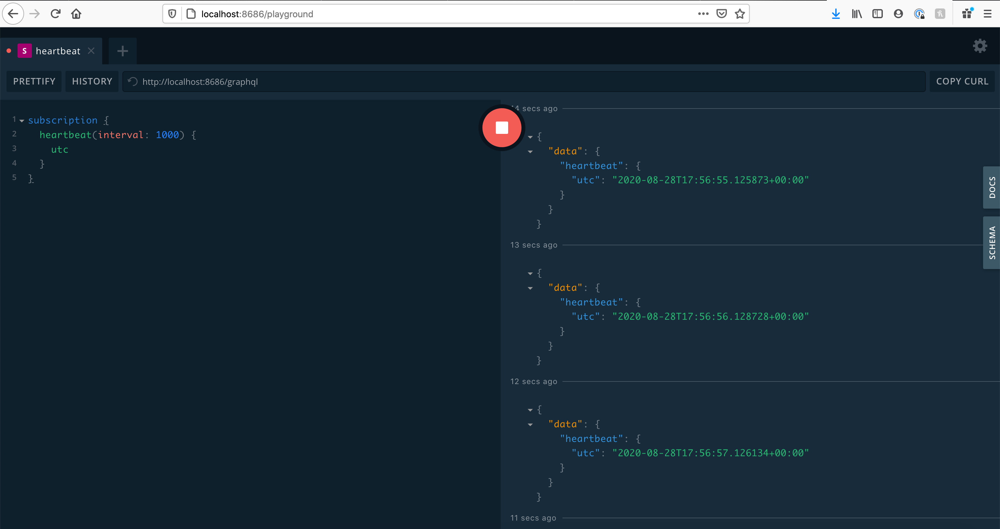
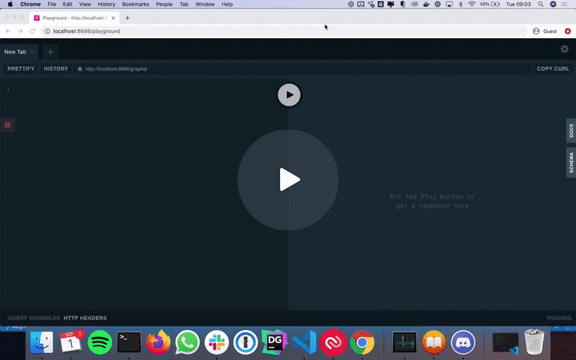

# 1. RFC 3645 - 2020-08-31 - GraphQL API

This RFC proposes using [GraphQL](https://graphql.org/) for the Vector observability API:

- [1. RFC 3645 - 2020-08-31 - GraphQL API](#1-rfc-3645---2020-08-31---graphql-api)
  - [1.1. Scope](#11-scope)
  - [1.2. Motivation](#12-motivation)
    - [1.2.1. Observability](#121-observability)
    - [1.2.2. Initial Clients](#122-initial-clients)
    - [1.2.3. Protocol](#123-protocol)
  - [1.3. Internal Proposal](#13-internal-proposal)
    - [1.3.1. Tooling](#131-tooling)
    - [1.3.2. Proof-of-Concept](#132-proof-of-concept)
    - [1.3.3. Declarative Syntax](#133-declarative-syntax)
    - [1.3.4. Server implementation with `async-graphql`](#134-server-implementation-with-async-graphql)
    - [1.3.5. GraphQL `heartbeat` Subscription](#135-graphql-heartbeat-subscription)
    - [1.3.6. UI Implementation With React + `Urql`](#136-ui-implementation-with-react--urql)
    - [1.3.7. Development Workflow](#137-development-workflow)
    - [1.3.8. Implicit Stack Benefits](#138-implicit-stack-benefits)
    - [1.3.9. Later -- Authorization](#139-later----authorization)
  - [1.4. Doc-level Proposal](#14-doc-level-proposal)
  - [1.5. Rationale](#15-rationale)
  - [1.6. Prior Art](#16-prior-art)
  - [1.7. Drawbacks](#17-drawbacks)
  - [1.8. Alternatives](#18-alternatives)
  - [1.9. Outstanding Questions](#19-outstanding-questions)
  - [1.10. Discussion](#110-discussion)
  - [1.11. Plan Of Attack](#111-plan-of-attack)

## 1.1. Scope

- Exposing a public API on port 8686, that can be connected to via API clients.
- Client requirements / considerations.
- Libraries and tooling.
- Merits and disadvantages of GraphQL vs. REST and gRPC.

## 1.2. Motivation

### 1.2.1. Observability

The Vector team is working on an observability dashboard that will enable users to:

- View Vector topology.
- Validate `vector.toml` configuration.
- Check the health and metrics that govern individual sources, transforms and sinks.
- Provide deep insight into Vector I/O.

The protocol used for communication between Vector and a connecting client is required to deliver data that is:

- High fidelity (captures all metrics.)
- High volume (multiple connecting clients.)
- Real-time (sent with minimal delay between Vector raising an event, and its delivery.)
- Efficient to parse/consume (the client shouldn't require heavy computation against a payload.)
- Semantically meaningful (to translate it to visual charts and dashboards.)

### 1.2.2. Initial Clients

The initial proposal is to provide observability via two clients:

1. `vector top` / `vector tap` CLI commands.
2. A real-time web UI

This RFC focuses on the web UI, but applies equally to the CLI client due to the possibility of observing a remote Vector instance.

### 1.2.3. Protocol

This section summarizes various communications protocols, and their disadvantages for Vector observability:

**REST:**

- It's not suited for streaming data.
- It requires polling and/or long-lived connections.
- Data will initially be read-only; many HTTP verbs don't apply to us.
- The API interface isn't typed by default, making it cumbersome to work on clients without additional tooling.

**gRPC:**

- The full gRPC spec is incompatible with current browsers (see [this article](https://grpc.io/blog/state-of-grpc-web/) for a useful summary.)
- gRPC-Web offers a subset of gRPC features, including a lack of two-way messaging.
- The TLS story is harder to solve.
- gRPC-Web support is currently lacking in Rust. There's an [open issue on tower-grpc](https://github.com/tower-rs/tower-grpc/issues/35) to track.
- Enabling gRPC-Web therefore presently requires a middle-tier proxy, such as [Envoy](https://www.envoyproxy.io/), to transform requests to the gRPC-Web spec.

**WebSockets:**

- Asynchronous data payloads that are suited to streaming data, but harder to reconcile for single requests.
- Related: The need to match up a 'request ID' with a 'response ID', to determine which payload belongs to a given request.
- Long-lived connections that require explicit (re)connection logic.
- Not intrinsically type-safe for the client to consume; high degree of runtime validation.
- Non-trivial for non-web clients to interact with; not a common protocol outside of the web.

## 1.3. Internal Proposal

I propose using GraphQL for API communications.

Advantages:

- A known spec with 5 years of history.
- Type safe.
- Dual HTTP + WebSockets model suits one-time and streaming queries.
- Production use at companies with heavy API workloads.
- Rich ecosystem of tooling, for server/clients.
- Trivial debugging story.
- No proxy/middle-tier required.
- Works over plain HTTP.
- Optional TLS.
- Flexible auth options (described below)
- No need to maintain separate schema. An 'introspection' query against a running Vector instance from the client provides a current view of type-safe schema.
- Trivial to document (Rust [doc comments](https://doc.rust-lang.org/stable/rust-by-example/meta/doc.html#doc-comments) become API field documentation.)
- Experience among the Vector / Timber team spanning over a year working with Alloy, covering full-stack schema design and front-end client tooling.
- I've been personally involved in GraphQL projects since 2015.

### 1.3.1. Tooling

- [async-graphql](https://github.com/async-graphql/async-graphql) (Vector). I initially tried Juniper, but subscriptions (i.e. real-time data) is still WIP and several key elements of the GraphQL spec (such as interfaces) are TBD. Source: [Feature comparison](https://github.com/async-graphql/async-graphql/blob/master/feature-comparison.md).

- [urql](https://formidable.com/open-source/urql/) (UI). We used the [React Apollo client](https://github.com/apollographql/apollo-client) in Alloy, which was mostly positive. We did run into some issues where data that lacks an `id` field would return `null`. Urql has a simpler caching story and may side-step these issues. Both clients use React hooks, which matches our [vector-ui](https://github.com/vectordotdev/vector-ui) tooling.

- [GraphQL Code Generator](https://graphql-code-generator.com/) (UI). We used this internally at Timber to generate Typescript types and React hooks. It offers an [urql plugin](https://graphql-code-generator.com/docs/plugins/typescript-urql) and builds type-safe/declarative React hooks which overlay urql to re-render the host React component with data and loading state.

### 1.3.2. Proof-of-Concept

I started work in #3514 to test [async-graphql](https://github.com/async-graphql/async-graphql), and expose internal metrics.

A playground is available in #3514 to test queries, including `subscription` queries:



### 1.3.3. Declarative Syntax

One of the major benefits of opting for the GraphQL ecosystem is enabling a more declarative style for defining the API, and consuming it.

In the following example, I will provide snippets of an example of our current 'heartbeat' subscription, which returns a UTC timestamp every `interval` milliseconds back to a connected WebSocket client.

In this example, I will demonstrate:

- Writing the server implementation
- Querying for it in the playground
- Writing the front-end client in React.

### 1.3.4. Server implementation with `async-graphql`

[async-graphql](https://github.com/async-graphql/async-graphql) is 'code first'; method implementations become GraphQL SDL and provide an implicit HTTP flow against an incoming request (in my PoC, I used [Warp](https://github.com/seanmonstar/warp), since we already depend on it.)

```rust
#[SimpleObject]
pub struct Heartbeat {  // <-- simple GraphQL object type to provide a `utc` field
    utc: DateTime<Utc>,
}
impl Heartbeat {
    fn new() -> Self {
        Heartbeat { utc: Utc::now() }
    }
}

#[derive(Default)]
pub struct HealthSubscription; // <-- 'root' subscription type to merge

#[Subscription]
impl HealthSubscription {
    /// Heartbeat, containing the UTC timestamp of the last server-sent payload
    async fn heartbeat(
        &self,
        #[arg(default = 1000, validator(IntRange(min = "100", max = "60_000")))] interval: i32,
        // ^^ `interval` param -- defaults to 1,000ms; validates between 100ms - 60 seconds
    ) -> impl Stream<Item = Heartbeat> {
        // Return a stream of heartbeats
        tokio::time::interval(Duration::from_millis(interval as u64)).map(|_| Heartbeat::new())
    }
}
```

In the GraphQL playground, this is surfaced as a strongly typed API. Doc comments become GraphQL API comments:


### 1.3.5. GraphQL `heartbeat` Subscription

The above example can be queried with:

```gql
subscription {
  heartbeat(interval: 1000) {
    utc
  }
}
```

Which returns data as JSON every `interval` milliseconds, e.g:

```json
{
  "data": {
    "heartbeat": {
      "utc": "2020-08-31T13:10:47.152412+00:00"
    }
  }
}
```

### 1.3.6. UI Implementation With React + `Urql`

After generating types and the web client with [GraphQL Code Generator](https://graphql-code-generator.com/), the (simplified) implementation looks similar to this:

```ts
import React from "react";

// This is generated for us by GraphQL Code Generator
import { useHeartbeatSubscription } from "@/vector/graphql";

// Example component that consumes it
const ExampleComponent: React.FC = () => {
  const [{ data, fetching }] = useHeartbeatSubscription({
    variables: { interval: 1000 },
  });
  return <pre>{data?.utc}</pre>;
};
```

This renders the HTML `<pre>2020-08-31T13:10:47.152412+00:00</pre>`, and auto-refreshes the data with a new UTC timestamp received from the server every `1000`ms.

### 1.3.7. Development Workflow

Many of the benefits we receive with GraphQL are felt during development.

Types and clients are auto-generated on introspection of a live endpoint.

Appreciating that advantage is hard to see in static code blocks. For that reason, I've recorded a 16-minute live coding session which demonstrates the typical dev workflow in the front-end. Use [this tree in `vector-ui` to follow along](https://github.com/vectordotdev/vector-ui/tree/96fe48c35259a48185a149c09190cd076db568d7):

[](https://www.loom.com/share/9ca38feb21bb488f92d729df0148e029)

### 1.3.8. Implicit Stack Benefits

In the above example, we side-stepped a lot of complexity that would otherwise have to be explicitly designed for:

- The method implementation becomes the public API. There's no additional schema to maintain.

- Compile-time type safety (both server and client). If the query included invalid data, it would fail to compile in Vector and in [GraphQL Code Generator](https://graphql-code-generator.com/) in the UI.

- Declarative client in the UI that handles the distinction between HTTP/WebSocket connections (for `query` / `mutation` and `subscription` queries, respectively), (re)connection handling, bookkeeping of parallel in-flight requests, response caching, request fetching status, matching responses with requests, and React component re-rendering. It shaves considerable off explicitly designing for those scenarios ourselves.

- A type system that accommodates interfaces, unions, enums, primitives and custom scalar types. async-graphql provides built-in abstractions for chrono `DateTime` types, uuid, and other popular crates.

- A known schema for errors. Snafu compatibility for `FieldResult<T>` custom errors.

### 1.3.9. Later -- Authorization

Initial Vector observability will be single-instance, and available to anyone that has access to the configured port.

Locking down access will initially rely on network configuration.

Later, as we move into multi-instance observability and more granular API permissions, the requirement for user auth and persistence will surface.

While those concerns are out-of-scope for this RFC, choosing a protocol that facilitates authentication is important to avoid backing ourselves into a corner.

GraphQL is not opinionated with auth. We have any authorization mechanism available to us at the intersection of HTTP and WebSockets.

In previous Timber projects, we appended an `Authorization: Bearer <jwt>` header for queries/mutations.

For subscription, we passed a JWT along with the initial WebSocket connection payload; browsers pass limited headers with `Upgrade` requests, so this provided a neat approach to sidestep the lack of a comparable header for WebSockets. The JWT persisted for the life of the open WS.

I anticipate doing something similar with the Vector API. async-graphql has a [Context](https://async-graphql.github.io/async-graphql/en/context.html) struct, which is typically used for passing in shared resources such as a database connection pool, or request-specific data such as the current user session.

This is largely TBD, but the basic mechanisms are there to allow for flexible auth when we need it.

## 1.4. Doc-level Proposal

A Vector observability layer has already been agreed internally. Work is underway.

This proposal discusses the protocol which will govern communications between a running Vector instance, and a web UI and CLI.

The result of this proposal won't directly impact user interaction with observability tooling.

## 1.5. Rationale

We have built a decent body of experience with GraphQL at Timber, albeit on non-Vector projects.

The tooling I am proposing here represents the same stack (save for swapping Apollo for Urql.)

In a previous Timber project, we used [gqlgen](https://github.com/99designs/gqlgen) as our server library, written in Go. The tooling with async-graphql is similar, though Rust's language features enable a more composable 'code first' approach using macros.

I believe the type of data we are consuming benefits from a strongly typed interface, and that compile-time client generation will significantly reduce the time-to-market of what will be already be a very complex front-end web app.

## 1.6. Prior Art

From relatively superficial searching, I've not been able to find a comparable approach to using GraphQL for internal metrics / observability. However, there are [plenty of large companies](https://graphql.org/users/) using GraphQL for public API and very possibly for internal machinery that isn't public facing.

Article refs: [GitHub](https://github.blog/2016-09-14-the-github-graphql-api/), [Facebook](https://www.apollographql.com/blog/graphql-at-facebook-by-dan-schafer-38d65ef075af/), [Shopify](https://shopify.dev/concepts/graphql), [Intuit](https://medium.com/intuit-engineering/graphql-intuits-path-to-one-api-system-b8495e4dd281), [Airbnb](https://medium.com/airbnb-engineering/how-airbnb-is-moving-10x-faster-at-scale-with-graphql-and-apollo-aa4ec92d69e2), [Trello / Atlassian](https://www.atlassian.com/engineering/a-look-at-trello-adopting-graphql-and-apollo-in-a-legacy-application).

I looked at [Rancher](https://rancher.com/products/rancher/) and the [Kubernetes web UI](https://kubernetes.io/docs/tasks/access-application-cluster/web-ui-dashboard/) for comparison, as both offer observability over an API that's intended for internal team use.

Both use JSON payloads. Rancher uses WebSockets to stream data, offering a comparable protocol as the GraphQL schema proposed in this RFC, albeit untyped.

Kubernetes uses OpenAPI v2. There are Typescript generation tools for OpenAPI such as [swagger-to-ts](https://github.com/manifoldco/swagger-to-ts) and [OpenAPI Generator](https://github.com/OpenAPITools/openapi-generator). I have no experience with these tools. Given the REST interface to each, I'm not sure this compares directly to typed messages over WebSockets for streaming data.

## 1.7. Drawbacks

- GraphQL is generally geared toward graph data (hence the name), although this isn't a hard requirement. IMO, it's a solid general-purpose API interface that mimics what we'd generally wind up creating internally anyway.
- Queries with unknown levels of nesting can't be queried statically; generally, a need for queries with flatter structures arise.
- Versioning is trickier, given the lack of distinct endpoints. Nothing stopping multiple endpoints representing versions, although typically this is done in the schema.
- Some annoying rough edges -- the lack of input unions, for example, typically worked around with more specific queries.
- Reliance on a relatively young library rather than a 'pure' client like a stdlib tcp server.
- A need to invest, longer-term, in understanding and contributing to an external library.

## 1.8. Alternatives

Essentially any browser-compatible protocol could be used, and any text/binary format. This could include other libs such as Protobuf, which might form of a hybrid of the aforementioned approaches.

The maturity of tooling would need further investigation, as well as the development experience of working with any given format.

## 1.9. Outstanding Questions

- What are the performance characteristics we care about?
- How many clients do we assume we will be serving across the total of all `vector top` and Vector UI requests?
- Is JSON an acceptable format for data exchange?
- What's the GraphQL Client tooling like in Rust, to enable UI-like comms with `vector top`?
- Is async-graphql performant and reliable in production?

## 1.10. Discussion

The following comprises links to relevant discussion in the original RFC PR:

- [Availability of tooling for GraphQL in Rust](https://github.com/vectordotdev/vector/pull/3648#discussion_r480370094)

- [Streaming performance](https://github.com/vectordotdev/vector/pull/3648#discussion_r480371934)
- [Exposing JSON payloads to a client](https://github.com/vectordotdev/vector/pull/3648#discussion_r480372935)

- [UI tooling / workflow for generating Typescript types + clients](https://github.com/vectordotdev/vector/pull/3648#discussion_r480381451)

## 1.11. Plan Of Attack

- [x] Determine whether there's consensus in choosing GraphQL
- [x] If yes, complete #3514 (separate RFC for observing topology required)
- [ ] If no, determine suitable alternatives
- [ ] (If applicable) create a new PoC with the alternatives
