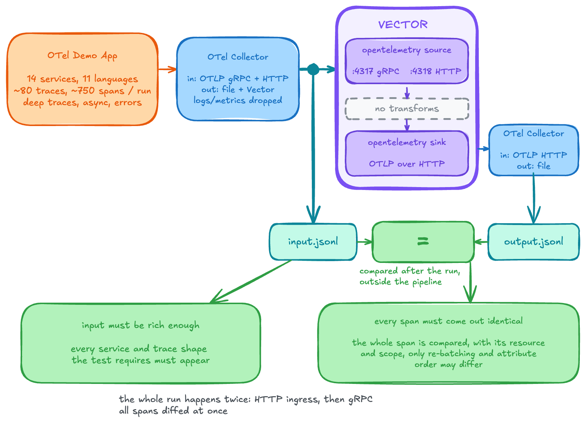

# Multiservice OpenTelemetry trace validation

This manual E2E test checks that Vector preserves multilingual, multiservice
traces from the
[OpenTelemetry Demo 3.1.0](https://github.com/open-telemetry/opentelemetry-demo/tree/3.1.0)
using the existing `vdev` Compose harness and
[OTel Collector](https://opentelemetry.io/docs/collector/) 0.159.0.

It provides realistic trace-preservation evidence for changes such as the
[trace model RFC](../../../rfcs/2026-04-29-25329-trace-data-model.md).
It runs manually because the full application setup is heavier than the
fixture-based trace tests.

## Input and destination



Trace and span counts in the diagram are examples from local runs, not assertions.

[scenario.py](data/scenario.py) runs one simulated shopper through three rounds of ad,
recommendation, cart, and multi-item checkout requests. Checkout also exercises
the Kafka accounting and fraud-detection consumers.

[demo.flagd.json](data/demo.flagd.json) uses the Demo's default flags except
`cartFailure: 100%`. This generates cart-emptying error spans while checkout
continues to email and Kafka.

The [ingress Collector](data/collector-source.yaml) writes `input.jsonl` and
forwards traces to Vector. The [matrix](config/test.yaml) runs each transport
separately with the same checks:

- HTTP (`otlphttp`): `http://vector:4318/v1/traces`.
- gRPC (`otlp`): `vector:4317`.

Application logs and metrics are not forwarded to Vector.

Vector runs [data/vector.yaml](data/vector.yaml), mounted as
`/etc/vector/vector.yaml`: an `opentelemetry` source with
`use_otlp_decoding: true` feeds `otel.traces` directly to an `opentelemetry`
sink, which sends OTLP/HTTP to `http://otel-collector-sink:4318/v1/traces`.

The destination is a [second local Collector](data/collector-sink.yaml) that
writes `output.jsonl`.

## Validations

The [Rust test](../opentelemetry/multiservice_traces/mod.rs) verifies:

- Completion: requires the workload marker, allows Kafka consumers to finish,
  stops the input, and waits up to 120 seconds for Vector to drain.
- Service coverage: requires spans from 14 services exercised by the workload.
- Trace shapes: requires roots, multi-span traces, children with captured
  parents, cross-service parent relationships, and error spans.
- Preservation: compares every span and its resource, scope, and schema URLs.
  Missing, extra, or changed spans and duplicate counts fail. Only batching,
  span order, and attribute-map order may differ.
- Capture format: fails on malformed IDs or unknown capture fields.

## Coverage and limitations

- Decoding: only `use_otlp_decoding: true` is tested.
- Optional coverage: events, links, and scope groups with multiple trace IDs
  are reported in `coverage.json` and compared when present. They are not required,
  so a run without them can pass.
- Edge cases: the workload does not guarantee all field values, such as byte
  attributes, missing scopes, or nonzero dropped counts.

## Running and results

With Docker available, run both transports:

```shell
cargo vdev e2e run opentelemetry-traces-multiservice --retries 0 --always-show-logs
```

To run one transport, add `-e 0.159.0-otlphttp` (HTTP) or `-e 0.159.0-otlp` (gRPC).

In CI, a Vector-team member can submit a PR review starting with
`/ci-run-e2e-opentelemetry-traces-multiservice` to test the reviewed commit.
Comments, “run all” commands, automatic PR CI, and schedules do not trigger it.

Read the results on the CI job's summary page. Download the
`otel-traces-multiservice-<commit>` artifact for input/output captures, `coverage.json`,
`differences.txt`, configs, and runner logs. Results are separated by transport;
failed runs may leave partial results.
