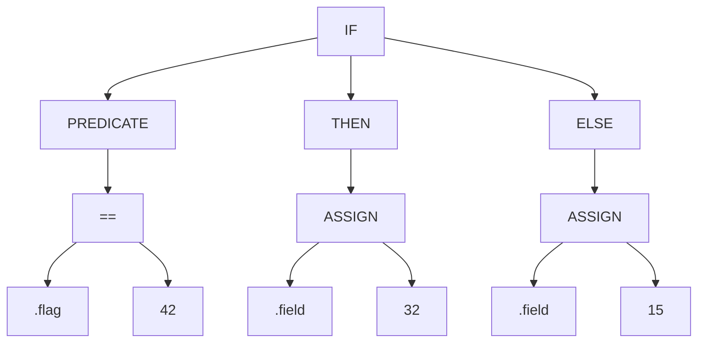

As part of our performance improvements in Vector, we have developed a new Virtual Machine for
running VRL programs.

In our soak tests we are getting performance improvements of between 10-15% depending on
the VRL program that is being run.

## Opting in

You can give the VM a try by adding the `runtime` configuration option to your Remap transform:

```toml
[transforms.remap]
type = "remap"
inputs = [ "..." ]
runtime = "vm"
source = '''
...
'''
```

## Let us know what you think!

We are excited about the performance improvements that using a Virtual Machine will bring to Vector.
If you have any feedback for us let us know on [Discord] or on [Twitter].

## Under the hood

Currently VRL is run using a Tree Walking interpreter. A VRL program is compiled into a tree of
program nodes. For example, given this simple VRL program:

```coffee
if .flag == 42 {
  .field = 32
} else {
  .field = 15
}
```

VRL compiles that into the nodes similar to this:



As the VRL program is run each node is interpreted which decides what actions need to be
taken and which node to execute next. The tree is walked in this manner until the program
reaches a node that has no further nodes to execute.

There are a number of advantages to running a program this way. It is fast to develop and the
code is easy to maintain and debug since each node manages its own state.

However, when it comes to performance there are a number of issues. Each node can take up a
significant amount of memory - especially with large VRL programs. This causes particular
issues when it comes to taking advantage of the CPU cache.

So we have developed a Virtual Machine to execute VRL programs instead. A Virtual Machine
is a simplified computer than is run in software rather than hardware. VRL programs are
compiled to an array of instructions. Rather than general instructions that a CPU will
execute we have defined a simple set of instructions specific to running VRL. Each instruction
and the parameters it needs will take up just a few bytes. The whole program can be loaded
into contiguous memory which allows us to take advantage of CPU caching.

The above program is compiled into the following set of instructions:

```json
 [
    "0000: GetPath",
    "0001: 0",
    "0002: Constant",
    "0003: 0",
    "0004: Equal",
    "0005: JumpIfFalse",
    "0006: 7",
    "0007: Pop",
    "0008: Constant",
    "0009: 1",
    "0010: SetPath",
    "0011: 1",
    "0012: Jump",
    "0013: 5",
    "0014: Pop",
    "0015: Constant",
    "0016: 2",
    "0017: SetPath",
    "0018: 1",
    "0019: Return",
]
```

The Virtual Machine steps through the list executing each instruction in turn.

[Discord]: https://discord.com/invite/dX3bdkF
[Twitter]: https://twitter.com/vectordotdev
